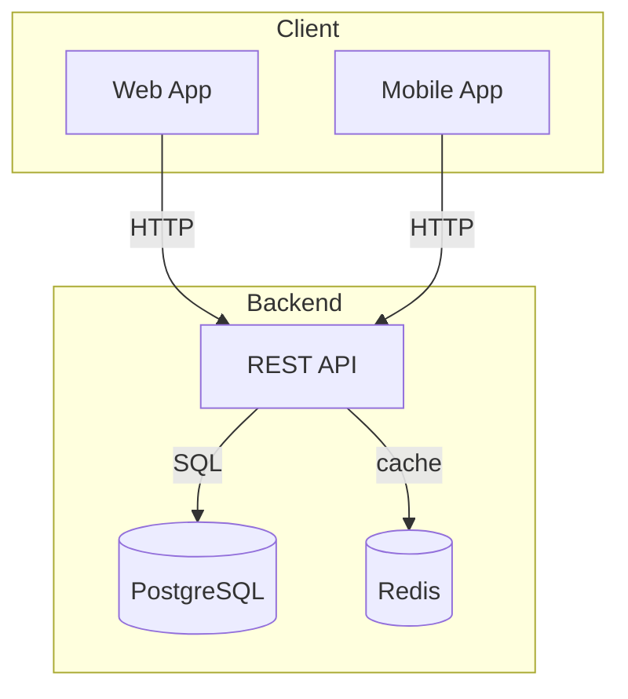

# Design Architecture

Produce a comprehensive software architecture proposal presenting three options — **Low Risk**, **Medium Risk**, and **High Risk** — each with detailed technology choices (including appropriate non-relational databases), thorough rationale for every decision, future impact analysis, Mermaid diagram, and risk table. Save the output as a timestamped markdown file in `docs/archimind/`.

## Workflow

### 1. Gather Requirements

Before generating options, ask clarifying questions to understand:

- **Scope**: What does the system do? What are the core features?
- **Scale**: Expected users (100 / 10k / 1M+)? Data volume? Read/write ratio?
- **Team**: Team size and existing technical skills?
- **Constraints**: Budget, time-to-market, compliance (GDPR, HIPAA)?
- **Integrations**: Third-party services, legacy systems, APIs?
- **Non-functionals**: Latency, uptime SLA, offline support?

Also assess the **data access pattern profile** — most backend applications need multiple database types. For each of the following, determine if it applies:

| Data need                              | Likely store needed                        |
|----------------------------------------|--------------------------------------------|
| Persistent entities, transactions      | Relational DB (PostgreSQL, MySQL)          |
| Hot data, session, rate limiting       | Cache (Redis)                              |
| Full-text or faceted search            | Search engine (Meilisearch, Elasticsearch) |
| Analytics, reporting, aggregations     | OLAP (ClickHouse, BigQuery, TimescaleDB)   |
| Files, images, video uploads           | Object storage (S3, MinIO, RustFS)         |
| Async tasks, background jobs           | Message queue / Redis Streams / Kafka      |
| Graph relationships, recommendations   | Graph DB (Neo4j) or recursive SQL          |
| IoT data, metrics, time-ordered events | Time-series DB (TimescaleDB, InfluxDB)     |

If sufficient context has already been provided, proceed directly to generating options.

### 2. Generate Three Architecture Options

Present three options as described below. Each option must contain **all required sections**. Do not skip any section.

#### Option 1: Low Risk
- **Profile**: Proven, well-understood patterns. Minimal infrastructure complexity. Best for MVPs, small teams, tight deadlines.
- **Typical patterns**: Monolith, Modular Monolith, Simple REST + Single DB.
- **Tone**: Conservative, straightforward, quick to market.

#### Option 2: Medium Risk
- **Profile**: Balanced between pragmatism and scalability. Some distributed elements where justified. Good for growing products.
- **Typical patterns**: Modular Monolith with clear service boundaries, BFF + separate services for key domains.
- **Tone**: Pragmatic, growth-oriented.

#### Option 3: High Risk
- **Profile**: Full distributed architecture, optimized for scale or flexibility. Requires expertise and operational maturity.
- **Typical patterns**: Microservices, Event-Driven + CQRS, Serverless-first, Hexagonal.
- **Tone**: Ambitious, forward-looking, higher upfront investment.

### 3. Required Sections Per Option

Each option must include all of these sections in order:

```
## Option N: {Risk Level} — {Architecture Name}

### Overview
One paragraph describing the core approach and why it fits this project.

### Architecture Diagram
Mermaid flowchart TD diagram.

### Key Components
Bulleted list of main services/modules with one-line descriptions.

### Technology Stack
| Layer           | Recommended       | Alternatives        | Reason                                     |
|-----------------|-------------------|---------------------|--------------------------------------------|
| Language        | ...               | ...                 | ...                                        |
| Backend         | ...               | ...                 | ...                                        |
| Frontend        | ...               | ...                 | ...                                        |
| Primary DB      | ...               | ...                 | relational / document / column-family / ... |
| Cache           | ...               | ...                 | ...                                        |
| Search          | ...               | N/A if not needed   | ...                                        |
| Analytics DB    | ...               | N/A if not needed   | ...                                        |
| Message Queue   | ...               | N/A if not needed   | ...                                        |
| Infra/Deploy    | ...               | ...                 | ...                                        |
| Observability   | ...               | ...                 | ...                                        |

(Omit rows that are genuinely not needed for this option.)

### Data Layer Design

**Backend applications almost always use more than one database.** A typical production backend has 3–5 different stores serving different access patterns. Do not limit the recommendation to a single DB unless it is a genuinely minimal MVP.

For each store type below, either specify the store chosen or explicitly state "Not applicable" with a one-line reason. Do not silently omit any store type.

- **Transactional store** (required for most backends): PostgreSQL / MySQL / CockroachDB.
  Schema approach, key entities, normalization level.
- **Cache layer** (required for any app with session or repeated reads): Redis / Memcached.
  What is cached (sessions, query results, rate limit counters), TTL strategy.
- **Search** (if full-text or faceted search is a feature): Meilisearch / Elasticsearch / Typesense.
  Which fields are indexed, sync strategy from primary DB.
- **Analytics / OLAP** (if dashboards, reports, or aggregations are needed): ClickHouse / BigQuery /
  TimescaleDB. What events/data flow into it, frequency of ingestion.
- **Object storage** (if user uploads, media, files): S3 / GCS / MinIO / RustFS.
  What is stored, access pattern (public CDN vs. signed URLs).
- **Message queue / stream** (if async processing is needed): Redis Streams / RabbitMQ / Kafka / SQS.
  What jobs/events flow through it.
- **Graph store** (only if graph traversal is core): Neo4j / Neptune.
- **Why each store**: One sentence per store explaining why it cannot be handled by the primary DB.
- **Data flow summary**: Describe how data moves between stores (e.g., primary DB → Kafka → ClickHouse for analytics pipeline).

### Observability Strategy

Cover all three pillars plus alerting. Even simple architectures need at minimum structured logging + metrics.

For each pillar, specify the tool chosen, instrumentation approach, and a one-sentence justification.
Required pillars: **Instrumentation** (OTel SDK recommended), **Logs**, **Metrics**, **Distributed Traces**, **Unified Backend**, **Alerting**.

Read `references/observability-guide.md` for tool comparison, sampling strategies, and recommended stacks per architecture tier.

### Technology Decision Rationale

For each major technology choice in the stack, provide a detailed explanation structured as:

**{Technology Name}**
- *Why chosen for this project*: Specific technical reason tied to the project's requirements (not "it's popular")
- *What it does better than alternatives*: Head-to-head for this specific use case
- *Required team skills*: What knowledge is needed to operate this effectively
- *Ecosystem & longevity*: Battle-tested? Community size? Vendor support? Risk of abandonment?

Cover at minimum: the backend language/framework, primary DB, and every non-relational store recommended in the Data Layer Design.

### Future Impact

Describe the long-term consequences of this choice — be honest about trade-offs:

| Timeframe | Impact                                                                      |
|-----------|-----------------------------------------------------------------------------|
| 6 months  | Team ramp-up cost, what works great immediately, first pain points likely   |
| 1 year    | First scaling or maintenance wall, where complexity starts to compound       |
| 3 years   | Total cost of ownership, architectural evolution required, hiring story      |

Also address:
- **Scalability ceiling**: What happens when load 10×? What breaks first?
- **Operational overhead**: Ongoing maintenance burden (backups, migrations, monitoring)
- **Reversibility**: How hard is it to migrate away from this stack later?
- **Vendor lock-in**: Which components create lock-in, and what is the escape hatch?

### Risks & Mitigations
| Risk                     | Likelihood | Impact | Mitigation                      |
|--------------------------|------------|--------|---------------------------------|
| ...                      | Low/Med/Hi | L/M/H  | ...                             |

### When to Choose This Option
2–3 bullet points describing the ideal scenario for this option.
```

### 4. Add a Recommendation Section

After presenting all three options, add:

```markdown
---

## Recommendation

State which option is recommended for the user's specific context and why. Reference their
actual requirements (team size, timeline, scale, data characteristics). Acknowledge the main
trade-off of the recommended choice. Keep to 4–6 sentences.
```

### 5. Save the Document

1. Compute timestamp in milliseconds via shell tool:
   - Linux: `date +%s%3N`
   - macOS: `node -e 'process.stdout.write(String(Date.now()))'`
2. Create `docs/archimind/` directory if it does not exist
3. Determine a short topic slug from the project name (e.g., `ecommerce-platform`, `iot-dashboard`)
4. Save the full document to: `docs/archimind/{timestamp_ms}_{topic}-architecture-design.md`
5. Inform the user of the saved path

### 6. Offer to Visualize

After saving, ask: "Would you like to open the architecture viewer to see the diagrams rendered? Use `/archimind:visualize` to start the server."

### 7. Require Architecture Selection (mandatory)

**The work is not complete until the user has explicitly chosen one option.** After presenting the options and offering visualization, prompt:

> "Which architecture would you like to proceed with — Option 1 (Low Risk), Option 2 (Medium Risk), or Option 3 (High Risk)? Request modifications to any option before deciding if needed."

Iterate freely if the user wants adjustments (e.g., "swap MongoDB for PostgreSQL in Option 2", "add Redis to Option 1"). Re-save the document after each significant change. Do not proceed to Step 8 until the user states an explicit choice.

### 8. Mark the Chosen Option

Once a choice is confirmed:

1. Read the saved design document
2. Insert a decision header block right after the `# Architecture Design: ...` title:
   ```markdown
   **Selected:** Option N — {Risk Level}: {Architecture Name}
   **Decision date:** {ISO date}
   ```
3. Append `✅ SELECTED` to the chosen option's heading so the static viewer's tab bar can highlight it:
   ```markdown
   ## Option 2: Medium Risk — Modular Monolith with Domain Services ✅ SELECTED
   ```
4. Append a brief `## Decision Notes` section at the end capturing any user-requested adjustments, prioritized next steps, or open questions to revisit during implementation.

### 9. Stop the Viewer Server

After the choice is finalized:

1. Check if the viewer is running: `[ -f .archimind.pid ]` in the user's project root
2. If running, ask: "Architecture finalized. Stop the diagram viewer now? (recommended)"
3. On confirmation, run: `bash "$CLAUDE_PLUGIN_ROOT/scripts/stop-server.sh"`
4. Report: "Decision saved to `{filepath}`. Viewer stopped." (or "Viewer was not running.")

This is the natural end of the workflow. The selected design document is now the source of truth for implementation.

## Document Structure Convention

The static site viewer parses the document by detecting headings that match `## Option N:`. Use this exact format for headings so the tabbar renders correctly. **If this format is not used, the visualizer will not render tab navigation — all options will appear as a single scrollable document.**

```markdown
## Option 1: Low Risk — Monolithic REST API
## Option 2: Medium Risk — Modular Monolith with Domain Services
## Option 3: High Risk — Event-Driven Microservices
```

## Mermaid Diagram Guidelines

- Use `flowchart TD` for system/service topology
- Use `sequenceDiagram` only for critical flows where the before/after comparison matters
- Use `erDiagram` only in database design (not here)
- Keep diagrams focused: 8–15 nodes maximum
- Label edges with action verbs ("calls", "publishes to", "reads from", "caches in")
- Group related nodes with subgraphs; show non-relational stores alongside relational ones

Include diagrams in responses using mermaid fenced code blocks:



## Additional Resources

All paths below are relative to this skill file's directory (`skills/design-architecture/`). Use the Read tool with the full resolved path when direct file access is needed.

- **`references/architecture-patterns.md`** — Detailed reference for each pattern (Monolith, Microservices, Serverless, Event-Driven, CQRS, Hexagonal) including database recommendations per pattern. Read when deciding which pattern fits each risk tier.
- **`references/database-selection-guide.md`** — Comprehensive database selection guide covering all categories: relational, document, key-value, column-family, time-series, graph, search, NewSQL, and polyglot persistence patterns. Read when choosing the data layer.
- **`references/observability-guide.md`** — Observability stack guide covering OpenTelemetry instrumentation, logging (Loki/ELK/ClickHouse), metrics (Prometheus/VictoriaMetrics), distributed tracing (Jaeger/Tempo), and unified backends (SigNoz, Uptrace, Grafana Stack, Datadog). Read when designing the observability strategy.
- **`references/output-template.md`** — Full blank template for the output document. Use as a scaffold when generating the design file.
