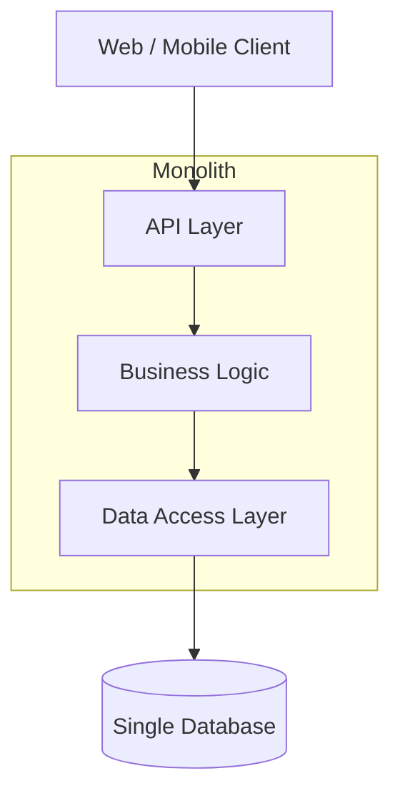
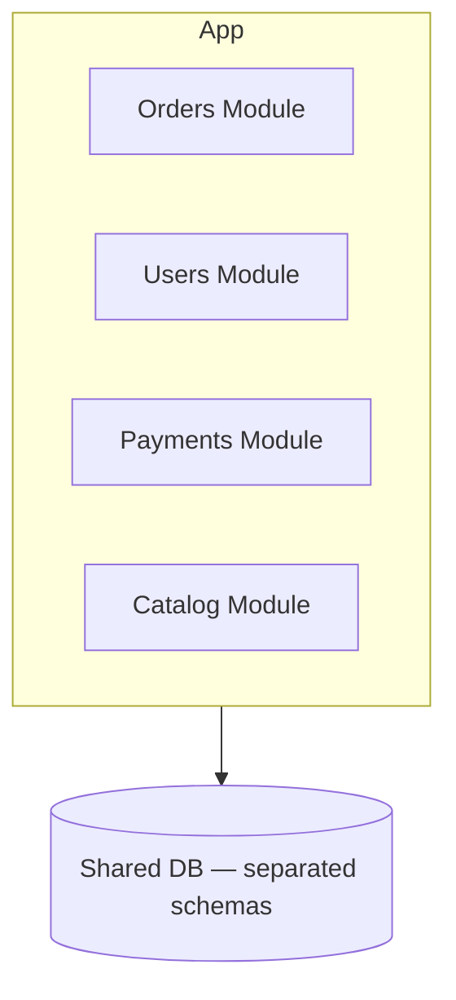
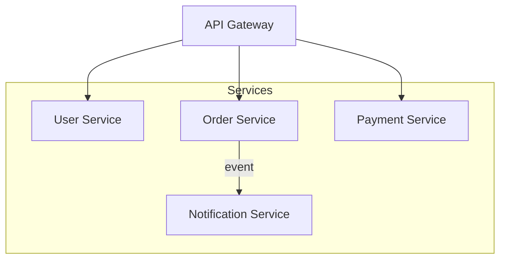

# Architecture Patterns Reference

A reference for selecting the right architecture pattern per risk tier. Use when deciding which pattern to recommend for each of the three options in `design-architecture`.

---

## Monolithic Architecture (Low Risk)

**Profile**: All components packaged and deployed as a single unit.

**Use when**:
- Team size < 8 engineers
- Project is an MVP or early-stage product
- Requirements are not fully understood
- Deployment simplicity is a priority

**Pros**: Simple to develop, test, debug, and deploy. Full transaction support across modules. Low operational overhead.

**Cons**: All-or-nothing deploys. Technology lock-in. Horizontal scaling requires replicating the entire app.

**Mermaid pattern**:

---

## Modular Monolith (Low–Medium Risk)

**Profile**: Single deployment unit, but code is organized into clearly bounded modules with explicit internal APIs.

**Use when**:
- Growing team (5–20 engineers), each owning a domain
- Anticipate need to extract services later
- Want to avoid premature distribution

**Pros**: Team autonomy within a single process. Can evolve toward microservices with less rewrite. Easier to refactor than a true monolith.

**Cons**: Still single deployment. Modules can erode boundaries over time without strict discipline.

**Mermaid pattern**:

---

## Backend-for-Frontend (BFF) Pattern (Medium Risk)

**Profile**: Separate lightweight API gateway per client type (web, mobile, admin), each aggregating downstream services.

**Use when**:
- Multiple client types with different data needs
- Want to keep backend services generic
- Teams aligned to client types

**Pros**: Tailored APIs for each client. Reduces over-fetching. Enables independent deployment per client team.

**Cons**: BFF duplication if teams don't coordinate. Adds a network hop.

---

## Microservices (High Risk)

**Profile**: Independently deployable services, each owning a bounded domain and its own data store.

**Use when**:
- Large team (20+ engineers)
- Domain is well-understood and stable
- Independent scaling of services is required
- Org has mature DevOps / platform engineering

**Pros**: Independent deployment and scaling. Technology diversity. Resilience (failure isolation).

**Cons**: Distributed system complexity (network failures, consistency, latency). Requires service mesh, observability stack, API gateway. Hard to get right initially.

**Mermaid pattern**:

---

## Event-Driven Architecture (High Risk)

**Profile**: Services communicate via events on a message broker (Kafka, RabbitMQ, SNS/SQS). Publishers and subscribers are decoupled.

**Use when**:
- Audit trails and event sourcing are required
- Async workflows (order processing, notifications)
- Multiple consumers of the same event

**Pros**: Loose coupling. Scalable consumers. Natural audit log (event log = source of truth).

**Cons**: Hard to trace flows (observability critical). Eventual consistency. Schema evolution complexity.

---

## CQRS (Command Query Responsibility Segregation) (High Risk)

**Profile**: Separate write model (commands) from read model (queries). Write path updates the source of truth; read path uses optimized read stores (e.g., Elasticsearch, Redis, materialized views).

**Use when**:
- Read and write workloads have very different performance requirements
- Complex domain requiring rich write-side logic (DDD)
- Analytics and search on operational data

**Pros**: Read models optimized for query. Write models focused on business rules. Scales read independently.

**Cons**: Eventual consistency between write and read models. More code to maintain. Steep learning curve.

---

## Serverless / FaaS (Medium–High Risk)

**Profile**: Functions deployed on-demand, billed per invocation. No server management.

**Use when**:
- Unpredictable or spiky traffic
- Event-triggered workloads (webhooks, file processing)
- Want to minimize operational overhead

**Pros**: Zero server management. Auto-scaling. Pay-per-use.

**Cons**: Cold start latency. Vendor lock-in. Hard to run locally. 15-minute execution limits (AWS Lambda). Complex for stateful workflows.

---

## Hexagonal / Clean Architecture (Any Risk Tier)

**Profile**: Domain logic isolated at the center; adapters connect to external systems (DB, API, UI) via ports.

**Use when**:
- Long-lived project requiring high testability
- Domain logic is complex and must be independent of frameworks
- Team values clean separation of concerns

**Pros**: Highly testable (domain has no external dependencies). Easy to swap adapters (e.g., change DB engine). Framework-agnostic domain code.

**Cons**: More boilerplate. Steeper upfront investment. Can feel over-engineered for simple CRUD apps.

---

## Typical Database Combinations Per Pattern

| Pattern           | Primary DB               | Cache       | Search         | Analytics        | Notes                                    |
|-------------------|--------------------------|-------------|----------------|------------------|------------------------------------------|
| Monolith          | PostgreSQL / MySQL       | Redis       | pg_trgm / None | None             | Single DB, keep it simple                |
| Modular Monolith  | PostgreSQL               | Redis       | Meilisearch    | None / PG views  | Separate schemas per module              |
| BFF + Services    | PostgreSQL + others      | Redis       | Elasticsearch  | ClickHouse       | Different services can use different DBs |
| Microservices     | Polyglot                 | Redis       | Elasticsearch  | ClickHouse / BQ  | Each service owns its own DB             |
| Event-Driven      | PostgreSQL + Kafka       | Redis       | Elasticsearch  | ClickHouse       | Event log as source of truth             |
| CQRS              | PostgreSQL (write)       | Redis       | Elasticsearch  | Materialized PG  | Read models: Redis, ES, ClickHouse       |
| Serverless        | DynamoDB / PlanetScale   | Elasticache | Elasticsearch  | BigQuery         | Managed services preferred               |
| IoT / Time-Series | TimescaleDB              | Redis       | —              | ClickHouse       | Time-series primary, OLAP for reporting  |
| Social / Graph    | PostgreSQL               | Redis       | Elasticsearch  | BigQuery + Neo4j | Graph DB for relationship traversal      |
| Fintech           | PostgreSQL / CockroachDB | Redis       | —              | ClickHouse       | Strong consistency + audit trail         |

## Typical Observability Stack Per Pattern

| Pattern           | Instrumentation      | Logs              | Metrics                      | Traces         | Unified Backend          |
|-------------------|----------------------|-------------------|------------------------------|----------------|--------------------------|
| Monolith          | OTel SDK             | Loki + Promtail   | Prometheus + Grafana         | Tempo          | Grafana                  |
| Modular Monolith  | OTel SDK             | Loki              | Prometheus + Grafana         | Tempo          | Grafana or SigNoz        |
| BFF + Services    | OTel SDK             | Loki              | Prometheus + VictoriaMetrics | Tempo          | SigNoz or Grafana Stack  |
| Microservices     | OTel SDK + Collector | Loki / ELK        | VictoriaMetrics / Mimir      | Jaeger / Tempo | SigNoz or Grafana Stack  |
| Event-Driven      | OTel SDK + Collector | ClickHouse / Loki | VictoriaMetrics              | Jaeger / Tempo | SigNoz                   |
| CQRS              | OTel SDK             | Loki / ClickHouse | Prometheus + Grafana         | Tempo          | Grafana or SigNoz        |
| Serverless        | OTel SDK             | CloudWatch / Loki | CloudWatch / Prometheus      | X-Ray / Tempo  | Managed cloud or Uptrace |
| IoT / Time-Series | OTel SDK             | Loki              | VictoriaMetrics              | Tempo          | Grafana                  |
| Social / Graph    | OTel SDK + Collector | Loki / ELK        | VictoriaMetrics / Mimir      | Tempo / Jaeger | SigNoz or Datadog        |
| Fintech           | OTel SDK             | ELK (compliance)  | Prometheus + VictoriaMetrics | Tempo / Jaeger | Datadog or SigNoz        |

**Key principle**: Always use OpenTelemetry SDK for instrumentation regardless of the backend chosen. This decouples code from the observability vendor and allows switching backends without re-instrumenting.

## Decision Matrix

| Pattern               | Team Size | Risk  | Scalability | Complexity | Time-to-Market |
|-----------------------|-----------|-------|-------------|------------|----------------|
| Monolith              | Small     | Low   | Low         | Low        | Fastest        |
| Modular Monolith      | Medium    | Low   | Medium      | Medium     | Fast           |
| BFF + Services        | Medium    | Med   | Medium      | Medium     | Medium         |
| Microservices         | Large     | High  | High        | High       | Slow           |
| Event-Driven          | Large     | High  | High        | Very High  | Slow           |
| CQRS                  | Large     | High  | High        | Very High  | Slow           |
| Serverless            | Any       | Med   | Auto        | Medium     | Fast for FaaS  |
| Hexagonal             | Any       | Low   | Depends     | Medium     | Medium         |
