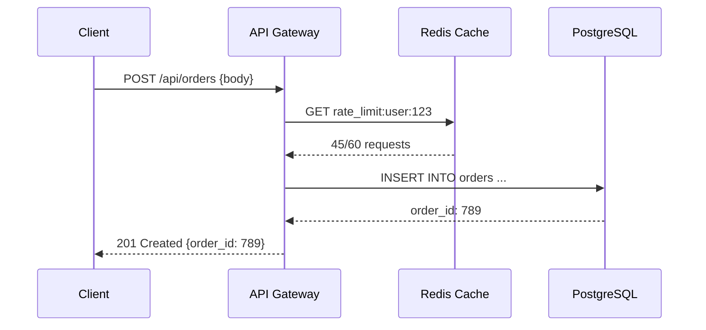

# Mermaid Diagram Guidelines

## Diagram Type Selection

| Use case                     | Diagram type      |
|------------------------------|-------------------|
| System / service topology    | `flowchart TD`    |
| Database entity-relationship | `erDiagram`       |
| Request / event flow         | `sequenceDiagram` |

## General Rules

- Keep diagrams focused: **8–15 nodes maximum**. Split into multiple diagrams rather than squeezing everything in.
- Label all edges with action verbs: "calls", "publishes to", "reads from", "caches in", "subscribes to"
- Use subgraphs to group related nodes (e.g., `subgraph "Client Tier"`)
- Every node label should be a noun (service, component, or store name)

## Required Diagrams Per Architecture Option

Each architecture option tab must contain **at minimum two diagrams**:

1. **System Topology** (`flowchart TD`) — shows all services, data stores, and their connections
2. **Request Flow** (`sequenceDiagram`) — shows the primary user-facing request end-to-end

A third diagram (e.g., a deployment topology or data flow) is optional but encouraged for complex options.

## sequenceDiagram Guidelines

- Show the primary user request: what the user triggers, and what happens all the way through the stack
- Cover at minimum: Client → API → (Cache check) → Primary DB → Response
- For microservices options, show inter-service calls and async events
- Label every arrow with the actual HTTP method + path or event name: `Client->>API: POST /api/orders`
- Show return arrows (`-->>`) with status or result: `API-->>Client: 201 Created {order_id}`
- Limit to 6–10 participants; group internal services if needed
- Use `activate`/`deactivate` for long-running processes to indicate blocking

## Architecture Diagrams (`flowchart TD`)

- Show all services/components and their primary communication paths
- Include non-relational stores (cache, search index, message queue, object storage) alongside relational ones
- Avoid showing internal implementation detail — only inter-component connections
- For review workflows: mark **changed or new** components with `[NEW]` or `[UPDATED]` suffixes in their labels
- For review workflows: mark **problematic** current-state nodes with `⚠` in the label (Before diagram only)

## ERD (`erDiagram`)

- Include every table in the final schema
- Show all relationships with correct cardinality notation (`||--o{`, `}o--||`, etc.)
- Annotate primary keys with `PK` and foreign keys with `FK`
- Place the ERD in the `## ERD` section only — not inside `## Architecture Diagram` options

## Syntax Checklist

- Use `[Label]` for rectangular nodes (services)
- Use `([Label])` for rounded rectangle (clients, end users)
- Use `[(Label)]` for database cylinder shape
- Use `{Label}` for decision diamond (rarely needed in topology diagrams)
- Wrap subgraph labels in double quotes if they contain spaces
