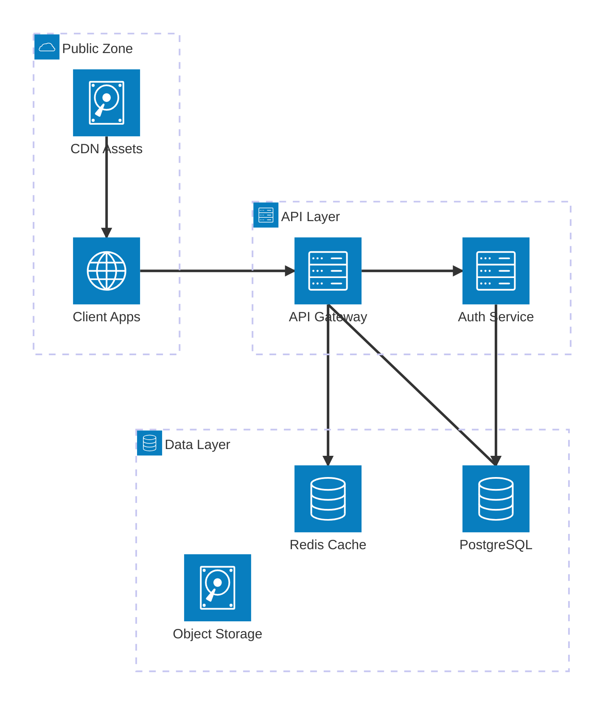
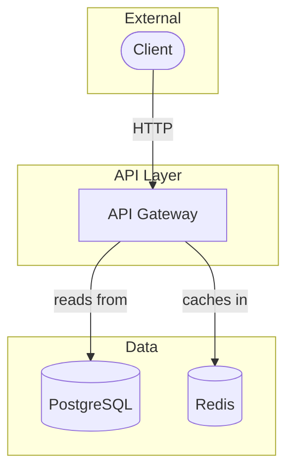

# Mermaid Diagram Guidelines

## Diagram Type Selection

| Use case                            | Diagram type         |
|-------------------------------------|----------------------|
| Component / data flow topology      | `flowchart TD`       |
| Cloud / infra service layout        | `architecture-beta`  |
| Database entity-relationship        | `erDiagram`          |
| Request / event flow                | `sequenceDiagram`    |

## Required Diagrams Per Architecture Option

Each architecture option tab must contain **three diagrams**:

1. **Infrastructure Layout** (`architecture-beta`) — cloud services, groups, and physical topology. **Required.**
2. **Request Flow** (`sequenceDiagram`) — the primary user-facing request end-to-end. **Required.**
3. **Component Flow** (`flowchart TD`) — logical data flow between components. **Required.**

---

## `architecture-beta` — Infrastructure Layout

Introduced in Mermaid v11.1.0. Renders cloud/service topology with built-in service icons, group containers, and directional edges. Use this as the **primary topology diagram** for each architecture option.

### Syntax

```
architecture-beta
  group {id}({icon})[{Label}]
  service {id}({icon})[{Label}]
  service {id}({icon})[{Label}] in {group_id}
  junction {id} in {group_id}

  {serviceId}:{direction} {arrow} {direction}:{serviceId}
```

**Directions:** `T` (top), `B` (bottom), `L` (left), `R` (right)

**Arrow types:**
- `-->` one-way (outgoing)
- `<-->` bidirectional

**Default icons** (no install needed): `cloud`, `database`, `disk`, `internet`, `server`

**Custom icons** (from iconify.design, requires internet): `"logos:postgresql"`, `"logos:redis"`, `"logos:kubernetes"`, `"logos:nginx"`, `"logos:docker-icon"`

### Rules

- Every `service` or `group` must have a unique `{id}` (no spaces, camelCase)
- Nest services inside a group with `in {group_id}`
- Edges connect service IDs with direction: `db:L --> R:api` means DB's left connects to API's right
- Use `junction` for 4-way splits (fan-out / fan-in patterns)
- Wrap labels in `[square brackets]`; use icons in `(parentheses)`

### Syntax Errors to Avoid

These patterns reliably cause `Parsing failed` errors in the Mermaid renderer:

**Nested brackets in labels** — the most common error. Never put `[` or `]` inside a label:
- ❌ `service api(server)[API Gateway [NEW]]` — `[` inside label breaks parsing
- ✅ `service apiNew(server)[API Gateway NEW]` — append text without inner brackets
- `[NEW]` / `[UPDATED]` markers are `flowchart TD`-only; never use them inside `architecture-beta` labels

**Spaces in service IDs** — IDs must be camelCase in both declarations and edge references:
- ❌ `service load balancer(server)[Load Balancer]` → space in declaration
- ❌ `load balancer:L --> R:api` → space in edge reference
- ✅ `service loadBalancer(server)[Load Balancer]` + `loadBalancer:L --> R:api`

**Labels ending with standalone "in"** — the parser reads `in` as the placement keyword:
- ❌ `service auth(server)[Sign in]` → parser treats trailing `in` as `in {groupId}`
- ✅ `service auth(server)[Sign-In]`

### Overlap Prevention

`architecture-beta` uses a grid-based auto-layout. When too many services share a group or labels are too long, nodes and icons collide. Apply these rules to every diagram:

**Keep labels short — 2 words maximum**
- ❌ `service lb(server)[Application Load Balancer]` — 3 words, extends into adjacent node
- ✅ `service lb(server)[Load Balancer]`
- ❌ `service queue(disk)[Message Queue Service]`
- ✅ `service queue(disk)[Msg Queue]`

**Limit services per group — max 3 per group**
- More than 3 services in one group forces the layout engine to stack nodes, causing icon overlap
- Split large groups into sub-groups (e.g., split `API Layer` into `API Gateway` group + `Services` group)
- Prefer more groups with fewer services over fewer groups with many services

**Limit edges per service — max 3 edges per node**
- Each additional edge adds routing lines that cross labels
- Use `junction` nodes to consolidate fan-out rather than connecting one service to 4+ others

**Prefer one-way edges (`-->`) over bidirectional (`<-->`)**
- Bidirectional edges in tight groups add label text on both sides of the line, causing collision
- Use `<-->` only when the data truly flows both ways AND there is visual space

**Total service cap per diagram**
- Lean: ≤ 5 services total
- Standard: ≤ 7 services total
- Advanced: ≤ 10 services total; if more are needed, omit internal implementation details and show only inter-service boundaries

### Complete Example



### Per-Tier Guidance

| Tier                     | Typical groups                        | Max services | Notes                                          |
|--------------------------|---------------------------------------|--------------|------------------------------------------------|
| Lean (Monolith)          | 2–3 groups: Client, App, Data         | 5 total      | Max 3 per group; no internal fan-out           |
| Standard (Modular)       | 3–4 groups; split App by domain       | 7 total      | Max 3 per group; one async worker node         |
| Advanced (Microservices) | 4–5 groups; gateway + service mesh    | 10 total     | Max 3 per group; omit internal service details |

### Infrastructure Mapping from Requirements

Derive service names and zone topology directly from the gathered requirements — do not use generic placeholder labels.

#### Deployment Preference (Q6) → Service Names

| Preference               | API / Compute                          | Database                                 | Cache                 | Object Storage | Load Balancer / Ingress                           |
|--------------------------|----------------------------------------|------------------------------------------|-----------------------|----------------|---------------------------------------------------|
| AWS                      | EC2 / EKS / Lambda                     | RDS (PostgreSQL/MySQL)                   | ElastiCache Redis     | S3             | ALB / CloudFront                                  |
| GCP                      | GCE / GKE / Cloud Run                  | Cloud SQL / Spanner                      | Memorystore Redis     | GCS            | Cloud Load Balancing / CDN                        |
| Azure                    | VM / AKS / Azure Functions             | Azure SQL / Cosmos DB                    | Azure Cache Redis     | Blob Storage   | Application Gateway / Azure CDN                   |
| Self-hosted / On-premise | Bare-metal / KVM VMs                   | PostgreSQL / MySQL (self-managed)        | Redis (self-managed)  | MinIO / Ceph   | NGINX / HAProxy                                   |
| Hybrid                   | Mix on-premise + cloud tier            | Primary on-premise, replica in cloud     | Redis in cloud        | Cloud provider | Cloud provider ingress + on-premise reverse proxy |
| Serverless               | API Gateway + Lambda / Cloud Functions | DynamoDB / Firestore / Aurora Serverless | ElastiCache / Momento | S3 / GCS       | API Gateway / CloudFront                          |

Use the exact product names from the matching row as service labels in the diagram.

#### Scale (Q2 + Q3) → Zone Topology

| Scale                   | Zones / Regions                              | Redundancy additions                                        |
|-------------------------|----------------------------------------------|-------------------------------------------------------------|
| Small / Low rps         | Single region, 1 AZ                          | None — keep topology minimal                                |
| Medium / Moderate rps   | Single region, 2 AZs                         | Read replica, CDN for static assets                         |
| Large / High rps        | Single region, multi-AZ + edge CDN           | Read replicas, cache cluster, async worker pool             |
| Massive / Very high rps | Multi-region active-active or active-passive | Global CDN, regional caches, database sharding / federation |

Add the matching zones as separate groups in the `architecture-beta` diagram.

#### Compliance (Q8) → Mandatory Extra Components

| Requirement     | Add to diagram                                                                       |
|-----------------|--------------------------------------------------------------------------------------|
| OWASP Top 10    | WAF group (in front of load balancer); HTTPS on all client-facing edges              |
| SOC 2 Type II   | Audit log service, secrets manager (Vault / AWS Secrets Manager), monitoring cluster |
| GDPR            | Single-region data residency label on database group; encryption-at-rest annotation  |
| PCI DSS / HIPAA | Private subnet group (isolate DB), bastion/jump host, HSM / KMS service, WAF         |

Include compliance components for the tier where they are relevant — all options should meet OWASP Top 10 minimum; higher-compliance requirements appear in Standard and Advanced tiers unless the user indicated they apply at all tiers.

---

## `sequenceDiagram` — Request Flow

- Show the primary user request all the way through the stack
- Cover at minimum: Client → API → (Cache check) → Primary DB → Response
- For microservices options, show inter-service calls and async events
- Label every arrow with the HTTP method + path or event name: `Client->>API: POST /api/orders`
- Show return arrows (`-->>`) with status or result: `API-->>Client: 201 Created`
- Limit to 6–10 participants
- Use `activate`/`deactivate` for long-running or blocking operations


---

## `flowchart TD` — Component / Data Flow

- Show logical data flow and component relationships
- Include non-relational stores (cache, search, queue, object storage) alongside relational ones
- Avoid internal implementation detail — only inter-component connections
- For review workflows: mark changed components with `[NEW]` or `[UPDATED]` node labels
- For review workflows: mark problematic current-state nodes with `⚠` in the label



**Node shape reference:**
- `[Label]` — rectangle (services)
- `([Label])` — rounded rectangle (clients, end users)
- `[(Label)]` — cylinder (databases)
- `{Label}` — diamond (decisions — avoid in topology diagrams)
- Wrap subgraph labels in double quotes if they contain spaces

---

## `erDiagram` — Entity Relationship

- Include every table in the final schema
- Show all relationships with correct cardinality (`||--o{`, `}o--||`, etc.)
- Annotate primary keys with `PK` and foreign keys with `FK`
- Place the ERD in the `## ERD` section only — never inside Architecture option tabs

---

## General Rules

- Keep each diagram focused. For `architecture-beta`: **10 nodes maximum** (see Overlap Prevention above). For `flowchart TD` and `sequenceDiagram`: **8–15 nodes**. Split into multiple diagrams rather than cramming everything in.
- Label all edges with action verbs: "calls", "publishes to", "reads from", "caches in", "subscribes to"
- Every node label should be a noun (service, component, or store name)
- Use groups / subgraphs to cluster related nodes into logical tiers
