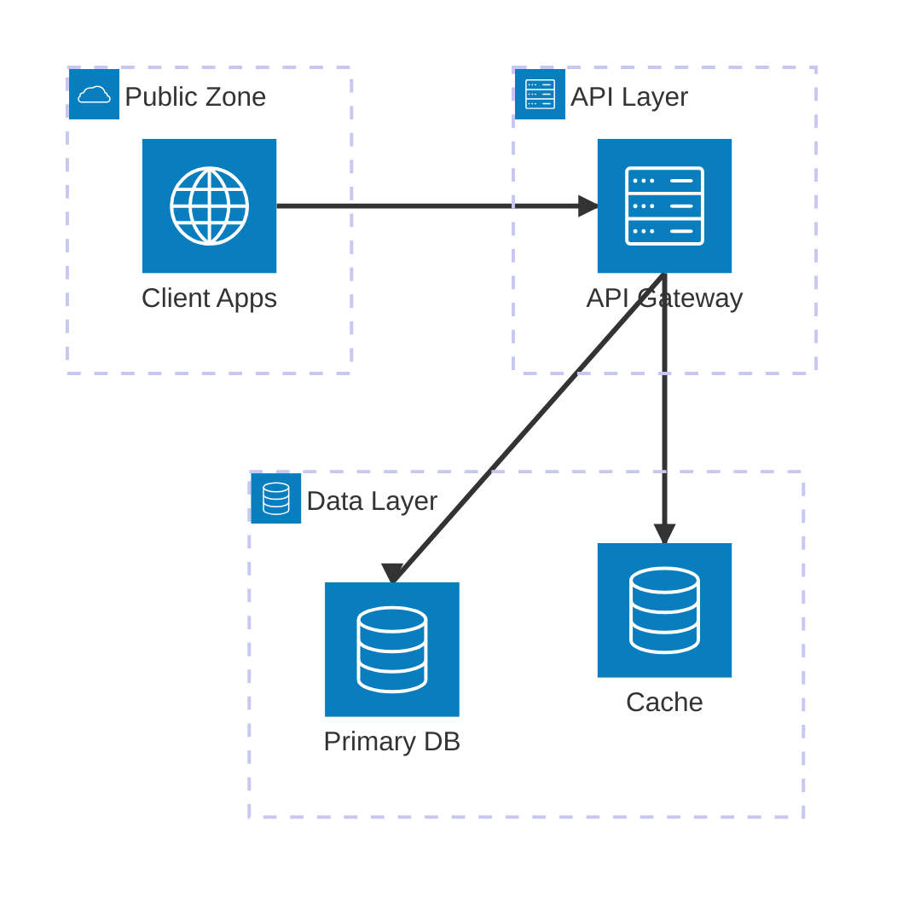
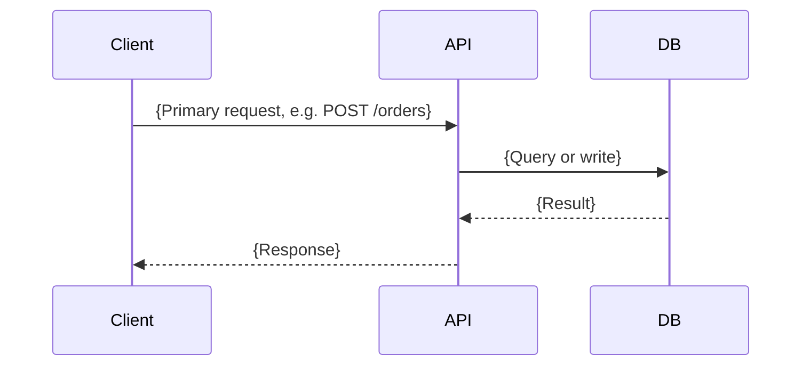
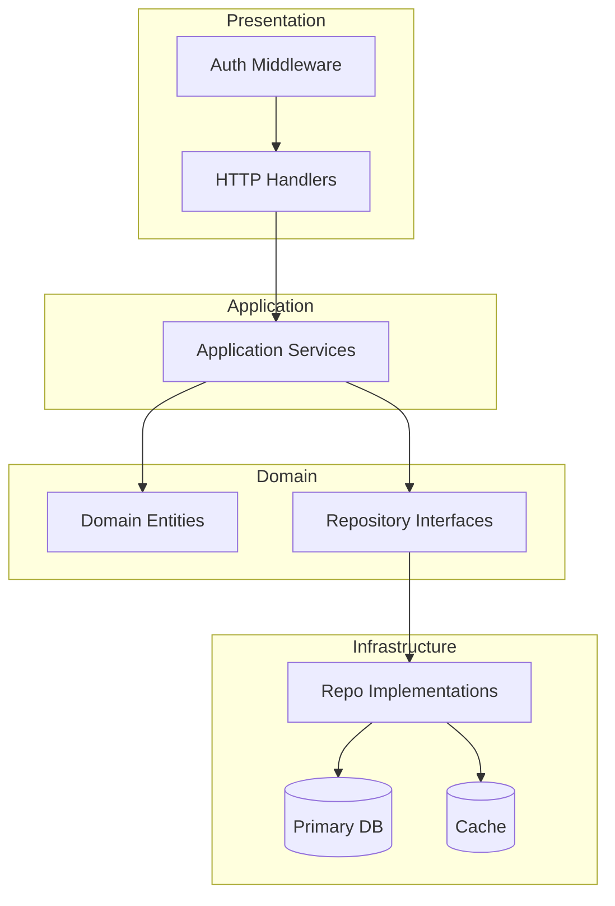
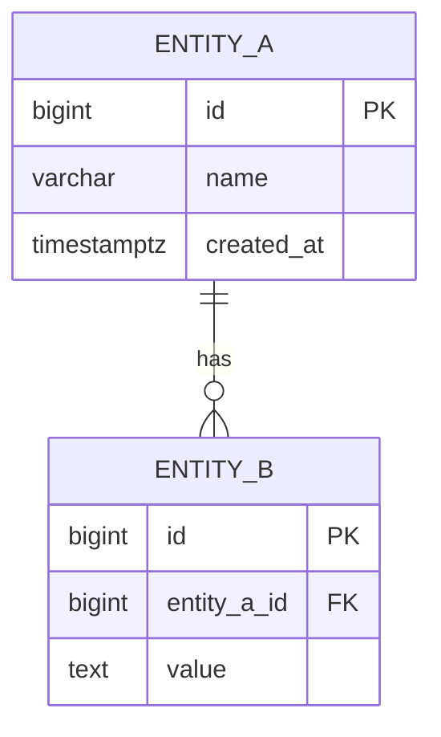

# Output Document Template

> **READ-ONLY REFERENCE — NEVER WRITE TO THIS FILE.**
> Output destinations:
> - Viewer draft → `/tmp/archimind-viewer/content.md`
> - Final saved doc → `docs/archimind/architecture/{timestamp_ms}-{topic}.md`
>
> Use this file only to read the scaffold structure. All writes go to the destinations above.

Use this template as a scaffold when generating the design file. Replace all placeholder text. Do not omit any section.

---

```markdown
# Architecture Design: {Project Name}

**Generated:** {ISO date}
**Summary:** {One-sentence description of the system}

<!-- Fill in after user confirms: -->
<!-- **Confirmed:** {Architecture Name} -->
<!-- **Decision date:** {ISO date} -->

## Project Overview

{2–4 sentences describing what the system does, who uses it, and its key characteristics (scale, domain, integrations).}

## Requirements Gathered

- **Core features:** {bullet list}
- **Scale target:** {e.g., ~10,000 DAU, ~1M records}
- **Team size:** {e.g., 3 engineers}
- **Key constraints:** {deadline, compliance, existing stack}
- **Data characteristics:** {structured / semi-structured / time-series / graph / search-heavy?}
- **Critical queries / operations:** {e.g., real-time search, large file uploads, heavy aggregations}

---

## System Context

> C4 Level 1 — drawn once for the whole document. Shows who uses the system and what external systems it integrates with. This view is audience-agnostic: share it with stakeholders before showing any architecture option.

```mermaid
flowchart TD
  User([{Primary User Role}])
  Admin([{Admin / Internal Role}])
  System[{System Name}]
  ExtSystem1[{External System 1}]
  ExtSystem2[{External System 2}]

  User -->|{primary action}| System
  Admin -->|{management action}| System
  System -->|{integration purpose}| ExtSystem1
  System -->|{integration purpose}| ExtSystem2
```

> {1–2 sentences: name the primary users, what they do with the system, and which external integrations are in scope.}

---

## Architecture Diagram

{One paragraph: the recommended pattern, why it fits the stated requirements, and the key trade-off accepted by choosing this approach over a simpler or more complex alternative.}

#### Infrastructure Layout



> {1–2 sentences: describe the zones, traffic entry point, and key data stores shown in this diagram.}

#### Request Flow



> {1–2 sentences: describe the happy-path request traced here and any notable steps such as cache checks or async branches.}

#### Logical Architecture



> {1–2 sentences: describe the layer structure — how the presentation layer delegates to application services, which call domain logic, which in turn use infrastructure implementations. Name the actual stores and frameworks used.}

#### Key Components

- **{Component}**: {One-line description}
- **{Component}**: {One-line description}

#### Technology Stack

| Layer           | Recommended       | Alternatives      | Reason                                   |
|-----------------|-------------------|-------------------|------------------------------------------|
| Language        |                   |                   |                                          |
| Backend         |                   |                   |                                          |
| Frontend        |                   |                   |                                          |
| Primary DB      |                   |                   |                                          |
| Cache           |                   |                   |                                          |
| Search          | N/A               | —                 | Not needed at this scale                 |
| Analytics DB    | N/A               | —                 | Not needed at this scale                 |
| Infra/Deploy    |                   |                   |                                          |
| Observability   |                   |                   |                                          |

#### Data Layer Design

- **Transactional store**: {Engine} — {category: relational / document / …}. {Why this category; what query patterns drive this choice.}
- **Cache**: {Redis / Memcached / none} — {what is cached, TTL strategy}
- **Search**: {Engine or "Not needed — {reason}"}
- **Analytics / OLAP**: {Engine or "Not needed — {reason}"}
- **Message queue**: {Engine or "Not needed — {reason}"}
- **Object storage**: {see Object Storage section or "Not needed"}
- **Why NOT alternatives**: {e.g., MongoDB not chosen because schema is stable and joins are frequent}

#### Object Storage

<!-- Omit this section if user answered "None" for file/object storage needs -->

- **Solution**: {MinIO / AWS S3 / GCS / Cloudflare R2 / Azure Blob / self-hosted}
- **What is stored**: {user uploads / media / backups / static assets / data lake}
- **Bucket organization**: {e.g., one bucket per env, prefixed by user-id}
- **Access control**: {signed URLs / public CDN / private IAM}
- **Encryption**: {server-side / client-side / KMS}
- **Lifecycle management**: {expiry rules, tiering}
- **Self-hosted vs. managed trade-off**: {why this choice}

#### Observability Strategy

- **Instrumentation**: {OpenTelemetry SDK — language/framework; auto-instrumentation: yes/no}
- **Logs**: {Loki + Promtail / ELK / ClickHouse} — {why; log shipping agent}
- **Metrics**: {Prometheus + Grafana / VictoriaMetrics} — {key dashboards: RED per service}
- **Distributed tracing**: {Grafana Tempo / Jaeger / N/A at this scale} — {sampling strategy}
- **Unified backend**: {Grafana Stack / SigNoz / Uptrace / Datadog} — {self-hosted vs. managed justification}
- **Alerting**: {Alertmanager / Grafana Alerting / PagerDuty} — {minimum: error rate > 1% → Slack}

#### Technology Decision Rationale

**{Backend Framework}**
- *Why chosen*: {Specific technical reason for this project}
- *Better than alternatives*: {Head-to-head for this use case}
- *Required skills*: {What team needs to operate}
- *Ecosystem*: {Maturity, community, longevity}

**{Primary Database}**
- *Why chosen*: {Specific technical reason}
- *Better than alternatives*: {Comparison for this use case}
- *Required skills*: {DBA knowledge needed}
- *Ecosystem*: {Maturity, managed options}

{Repeat for each major technology choice}

#### Future Impact

| Timeframe | Impact                                                                      |
|-----------|-----------------------------------------------------------------------------|
| 6 months  | {Team ramp-up, what works great, first pain points}                         |
| 1 year    | {First scaling or maintenance wall}                                         |
| 3 years   | {Total cost of ownership, evolution needed, hiring story}                   |

- **Scalability ceiling**: {What breaks first at 10× load?}
- **Operational overhead**: {Ongoing maintenance burden}
- **Reversibility**: {How hard to migrate away from this stack?}
- **Vendor lock-in**: {Which components create lock-in, escape hatch}

#### Risks & Mitigations

| Risk                     | Likelihood | Impact | Mitigation                      |
|--------------------------|------------|--------|---------------------------------|
|                          | Low        | Low    |                                 |

---

## Design Rationale

{4–6 sentences: why this specific architecture was chosen — what requirements drove it, what simpler or more complex alternatives were considered and ruled out, and what the key trade-off is. Be specific: cite team size, scale targets, compliance requirements, and timeline rather than generic "balancing" language. This section becomes the rationale in the ADR.}

---

## ERD



### Table Specifications

#### `{table_name}`

| Column     | Type        | Constraints             | Description     |
|------------|-------------|-------------------------|-----------------|
| id         | BIGSERIAL   | PRIMARY KEY             | Surrogate PK    |
| created_at | TIMESTAMPTZ | NOT NULL, DEFAULT now() | Creation time   |

**Indexes:**
| Name                 | Type   | Columns    | Reason                        |
|----------------------|--------|------------|-------------------------------|
| idx_{table}_{col}    | B-tree | {col}      | {query pattern this supports} |

---

## Revision

<!-- For fresh designs: leave Before/After empty or omit this section. -->
<!-- For architecture reviews: populate Before with current state, After with the selected redesign. -->

### Before

{Description of the current architecture (used in review workflows).}


**Identified Issues:**
- {Issue 1}

### After

{Description of the proposed architecture after the user selects an option.}


**Key Improvements:**
- {How identified issues are resolved}

---

## Architecture Decision Record

<!-- Fill in after user confirms. Read $CLAUDE_PLUGIN_ROOT/skills/design-architecture/references/adr-guide.md for format guidance. -->

**ADR ID:** {timestamp_ms}-{topic}
**Date:** {ISO date}
**Status:** Accepted

### Context

{2–4 sentences: the problem being solved, the stakeholders, and the key constraints active at the time of the decision — team size, timeline, scale, compliance. Future readers need this to judge whether the decision still applies.}

### Decision

**Chosen:** {Architecture Name}

{2–3 sentences on exactly what was decided — the specific pattern chosen and its key characteristics.}

### Consequences

**Positive:**
- {Benefit 1}
- {Benefit 2}

**Trade-offs accepted:**
- {Scalability ceiling: what breaks first at 10× load}
- {Operational overhead or reversibility cost}

**Watch list:**
- {Signal to revisit this decision — e.g., "reconsider caching layer when DAU exceeds 50k"}

### Rejected Alternatives

| Alternative | Reason Rejected                                                              |
|-------------|------------------------------------------------------------------------------|
| {Name}      | {Specific reason citing the constraint that made it unsuitable at this time} |
| {Name}      | {Specific reason}                                                            |

### Review Trigger

{One sentence: the metric or event that should prompt re-opening this ADR.}

---

## Final Documentation

### Overview

{2–4 sentences: what the system does, who uses it, and its key characteristics (scale, domain, integrations).}

### Architecture Decision

**Architecture:** {Architecture Name}
**Reason:** {2–3 sentences on why this approach was chosen, referencing actual requirements (team size, scale, compliance).}

> See `## Architecture Diagram` above for the full Infrastructure Layout, Request Flow, and Logical Architecture diagrams.

### Technology Stack

| Layer          | Technology | Reason |
|----------------|------------|--------|
| Language       |            |        |
| Backend        |            |        |
| Frontend       |            |        |
| Primary DB     |            |        |
| Cache          |            |        |
| Message Queue  |            |        |
| Infra / Deploy |            |        |
| Observability  |            |        |

### Data Architecture

{DB choices and rationale — why the primary DB was chosen, what workloads each store handles.}

#### ERD

```mermaid
erDiagram
  {Repeat the erDiagram from the ## ERD section for standalone readability}
```

#### Migration Strategy

- **Schema versioning tool**: {Flyway / Liquibase / Prisma Migrate / Alembic / etc.}
- **Rollback approach**: {migration-level rollback or feature-flag toggle}
- **Zero-downtime**: {expand-contract pattern if schema changes affect production}

### Observability

- **Logs**: {tool + shipping agent — e.g., Loki + Promtail}
- **Metrics**: {tool + key dashboards — e.g., Prometheus + Grafana, RED metrics per service}
- **Tracing**: {tool + sampling strategy — e.g., Tempo with 10% tail sampling}
- **Alerting**: {tool + minimum thresholds — e.g., error rate > 1% → Slack}

### Security

#### Application Security
- **Authentication**: {mechanism — e.g., JWT / OAuth2 / OIDC / session-based}
- **Authorization**: {model — e.g., RBAC, ABAC, policy-as-code}
- **Secrets management**: {Vault / AWS Secrets Manager / GCP Secret Manager — never env vars in code}
- **OWASP coverage**: {input validation, XSS protection, CSRF tokens, rate limiting, dependency scanning}

#### Threat Model (STRIDE)

<!-- Include for systems with compliance requirements beyond OWASP Top 10 (SOC 2, GDPR, PCI DSS, HIPAA, multi-tenant).
     For standard OWASP-only systems, replace this table with: "STRIDE analysis not performed at this compliance tier."
     Read $CLAUDE_PLUGIN_ROOT/skills/design-architecture/references/threat-model-guide.md for methodology. -->

| Threat                     | Attack Vector                     | Affected Components       | Likelihood     | Impact         | Mitigation         |
|----------------------------|-----------------------------------|---------------------------|----------------|----------------|--------------------|
| **Spoofing**               | {e.g., stolen session token}      | {e.g., Auth Service, API} | {Low/Med/High} | {Low/Med/High} | {concrete control} |
| **Tampering**              | {e.g., MITM request modification} | {e.g., All API endpoints} | {Low/Med/High} | {Low/Med/High} | {concrete control} |
| **Repudiation**            | {e.g., user denies action}        | {e.g., Order Service}     | {Low/Med/High} | {Low/Med/High} | {concrete control} |
| **Info Disclosure**        | {e.g., verbose error messages}    | {e.g., All services}      | {Low/Med/High} | {Low/Med/High} | {concrete control} |
| **DoS**                    | {e.g., auth endpoint flood}       | {e.g., Auth Service}      | {Low/Med/High} | {Low/Med/High} | {concrete control} |
| **Elevation of Privilege** | {e.g., IDOR on resource}          | {e.g., Resource API, DB}  | {Low/Med/High} | {Low/Med/High} | {concrete control} |

#### Database Connectivity Security
- **DB users**: Separate roles — `app_rw` (application), `app_ro` (analytics), `migrator` (schema changes only), `backup_user`; superuser never used from application code
- **Credential storage**: {Vault dynamic secrets / Secrets Manager} — credentials fetched at runtime, not hardcoded or committed to version control
- **Credential rotation**: {Dynamic short-lived (Vault DB engine) / static rotation every 90 days}; connection pool `maxLifetime` set below rotation interval
- **TLS enforcement**: `sslmode=verify-full` (PostgreSQL) / `REQUIRE SSL` (MySQL) / `requireTLS` (MongoDB) on all connections; plaintext connections rejected at DB level
- **Network isolation**: DB in private subnet; security groups restrict DB port to app-server security group only; no public IP on DB instance
- **Connection pooling**: {PgBouncer / HikariCP / other} with TLS on both client↔pooler and pooler↔DB sides; pool auth via `scram-sha-256`

#### Data Protection
- **Encryption at rest**: {DB-level tablespace encryption / cloud-managed (RDS, Cloud SQL)} + backup encryption (AES-256, key stored separately)
- **Sensitive column encryption**: {application-layer encryption via pgcrypto / Vault Transit for PII and PCI fields; or "N/A"}
- **Encryption in transit**: TLS 1.2+ enforced on all DB connections and internal service-to-service calls
- **SQL injection prevention**: Parameterized queries or ORM used throughout; no string-concatenated SQL; dynamic `ORDER BY` validated against allowlist

#### Audit & Compliance
- **Audit logging**: {pgaudit / MySQL Audit Plugin} for DDL and write events; application-level `security_audit_log` table for sensitive data access
- **Compliance requirements**: {OWASP Top 10 / SOC 2 / GDPR / HIPAA / PCI DSS — applicable controls and how the design satisfies them}
- **GDPR erasure**: {PII scrubbing strategy on soft-delete or explicit erasure request; or "N/A"}
- **PCI DSS**: {CVV/CVC never stored; cardholder data encrypted at column level; or "N/A"}

### Trade-offs & Next Steps

**Trade-offs accepted:**
- {Scalability ceiling: what breaks first at 10× load}
- {Operational overhead: ongoing burden}
- {Reversibility: cost of switching away from this stack}

**First implementation milestones:**
1. {Milestone 1 — e.g., scaffold service + CI/CD}
2. {Milestone 2 — e.g., core data model + auth}
3. {Milestone 3 — e.g., first production deployment}

**Open questions:**
- {Anything to revisit during implementation}
```

---

After the user selects an option:
1. Fill in the `**Selected:**` and `**Decision date:**` lines in the header
2. Populate the `## Revision / ### After` section with the chosen architecture diagram
3. Fill in `## Decision Notes`
4. Write the `## Final Documentation` sections
