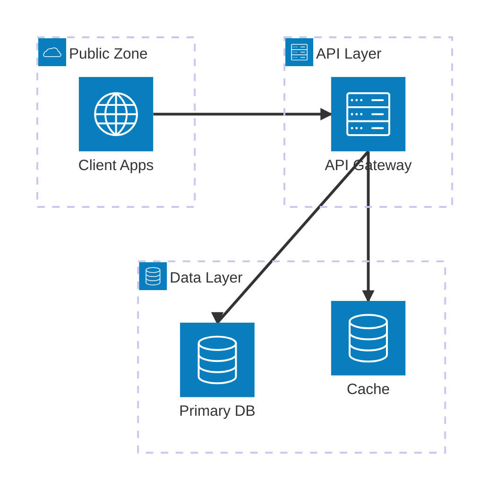
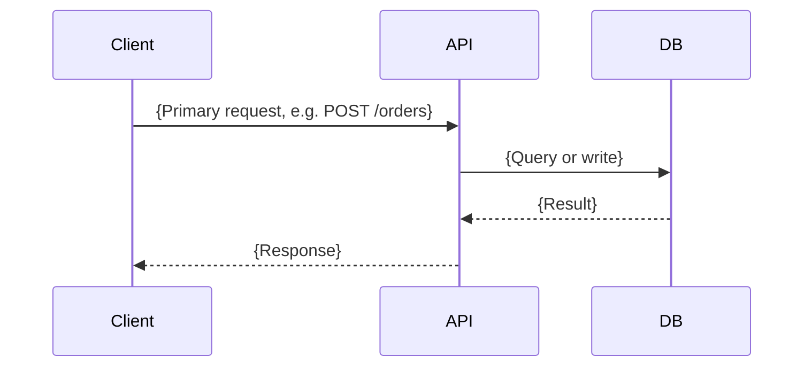
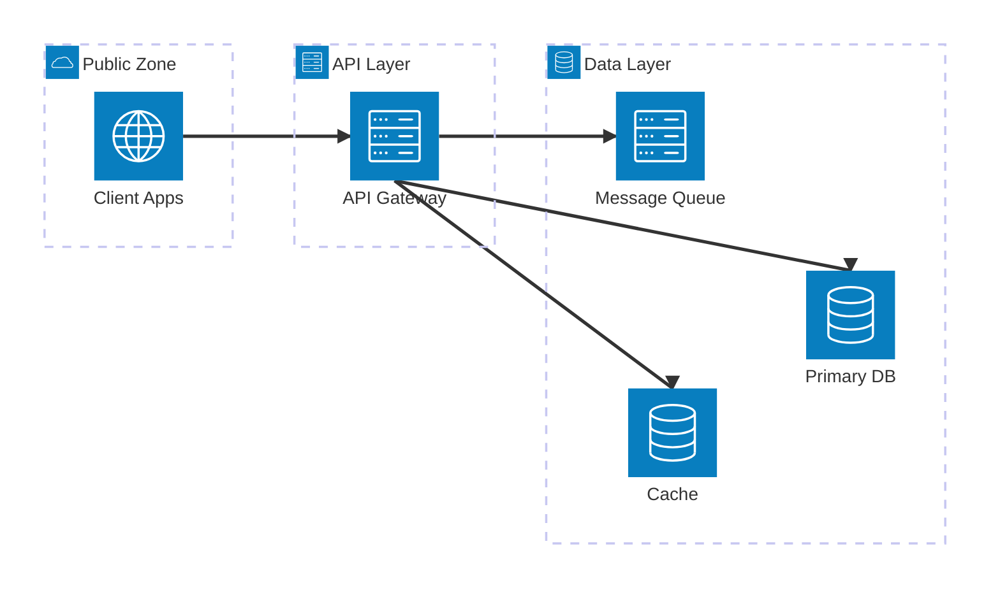
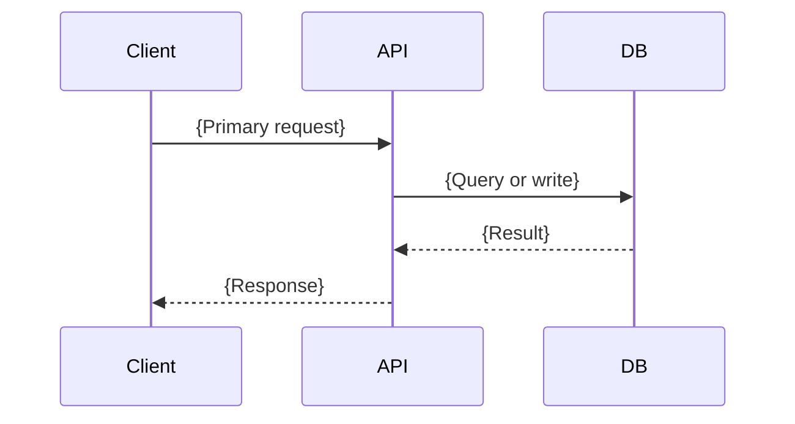
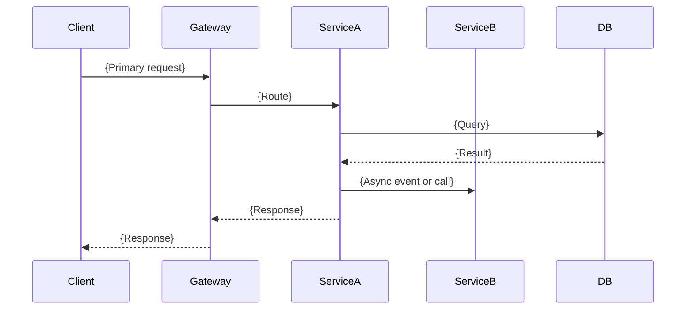
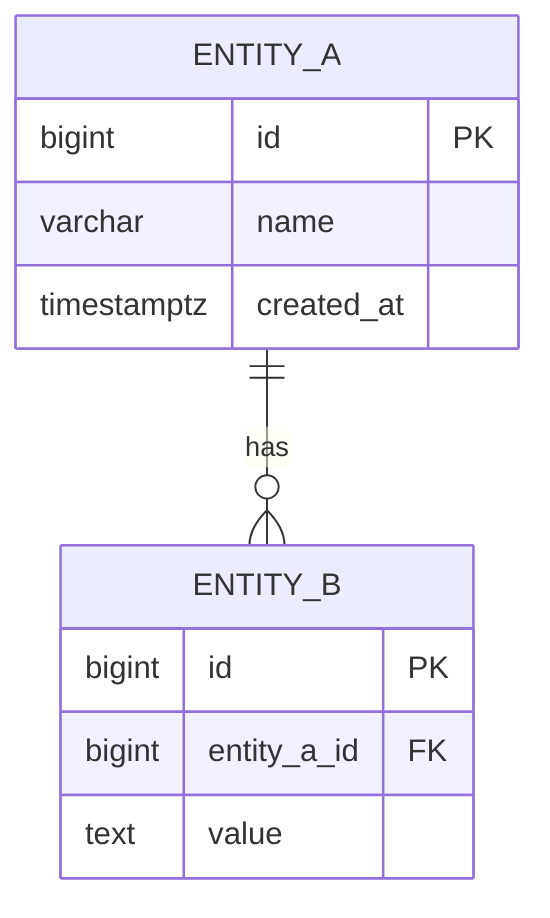

```mermaid
architecture-beta
  group internet(cloud)[Public Zone]
    service client(internet)[Client Apps] in internet
    service cdn(disk)[CDN] in internet

  group gateway(server)[API Gateway Layer]
    service gw(server)[API Gateway] in gateway
    service mesh(server)[Service Mesh] in gateway

  group services(server)[Microservices]
    service svcA(server)[Service A] in services
    service svcB(server)[Service B] in services
    service worker(server)[Worker] in services

  group data(database)[Data Layer]
    service db(database)[Primary DB] in data
    service cache(database)[Cache] in data
    service queue(server)[Message Broker] in data
    service storage(disk)[Object Storage] in data

  client:R --> L:gw
  cdn:B --> T:client
  gw:R --> L:svcA
  gw:R --> L:svcB
  svcA:B --> T:db
  svcA:B --> T:cache
  svcA:R --> L:queue
  queue:R --> L:worker
```

# Output Document Template

<!-- Viewer: /tmp/archimind-viewer/content.md | Final docs: docs/archimind/architecture/{timestamp_ms}-{topic}.md -->

Use this template as a scaffold when generating the design file. Replace all placeholder text. Do not omit any section.

---

```markdown
# Architecture Design: {Project Name}

**Generated:** {ISO date}
**Summary:** {One-sentence description of the system}

<!-- Fill in after user selects: -->
<!-- **Selected:** Option N — {Risk Level}: {Architecture Name} -->
<!-- **Decision date:** {ISO date} -->

## Project Overview

{2–4 sentences describing what the system does, who uses it, and its key characteristics (scale, domain, integrations).}

## Requirements Gathered

- **Core features:** {bullet list}
- **Scale target:** {e.g., ~10,000 DAU, ~1M records}
- **Team size:** {e.g., 3 engineers}
- **Key constraints:** {deadline, compliance, existing stack}
- **Data characteristics:** {structured / semi-structured / time-series / graph / search-heavy?}
- **Critical queries / operations:** {e.g., real-time search, large file uploads, heavy aggregations}

---

## Architecture Diagram

### Option 1: Low Risk — {Architecture Name}

{One paragraph describing the core approach and why it is appropriate for the conservative tier.}

#### Infrastructure Layout



#### Request Flow



#### Component Flow


#### Key Components

- **{Component}**: {One-line description}
- **{Component}**: {One-line description}

#### Technology Stack

| Layer           | Recommended       | Alternatives      | Reason                                   |
|-----------------|-------------------|-------------------|------------------------------------------|
| Language        |                   |                   |                                          |
| Backend         |                   |                   |                                          |
| Frontend        |                   |                   |                                          |
| Primary DB      |                   |                   |                                          |
| Cache           |                   |                   |                                          |
| Search          | N/A               | —                 | Not needed at this scale                 |
| Analytics DB    | N/A               | —                 | Not needed at this scale                 |
| Infra/Deploy    |                   |                   |                                          |
| Observability   |                   |                   |                                          |

#### Data Layer Design

- **Transactional store**: {Engine} — {category: relational / document / …}. {Why this category; what query patterns drive this choice.}
- **Cache**: {Redis / Memcached / none} — {what is cached, TTL strategy}
- **Search**: {Engine or "Not needed — {reason}"}
- **Analytics / OLAP**: {Engine or "Not needed — {reason}"}
- **Message queue**: {Engine or "Not needed — {reason}"}
- **Object storage**: {see Object Storage section or "Not needed"}
- **Why NOT alternatives**: {e.g., MongoDB not chosen because schema is stable and joins are frequent}

#### Object Storage

<!-- Omit this section if user answered "None" for file/object storage needs -->

- **Solution**: {MinIO / AWS S3 / GCS / Cloudflare R2 / Azure Blob / self-hosted}
- **What is stored**: {user uploads / media / backups / static assets / data lake}
- **Bucket organization**: {e.g., one bucket per env, prefixed by user-id}
- **Access control**: {signed URLs / public CDN / private IAM}
- **Encryption**: {server-side / client-side / KMS}
- **Lifecycle management**: {expiry rules, tiering}
- **Self-hosted vs. managed trade-off**: {why this choice}

#### Observability Strategy

- **Instrumentation**: {OpenTelemetry SDK — language/framework; auto-instrumentation: yes/no}
- **Logs**: {Loki + Promtail / ELK / ClickHouse} — {why; log shipping agent}
- **Metrics**: {Prometheus + Grafana / VictoriaMetrics} — {key dashboards: RED per service}
- **Distributed tracing**: {Grafana Tempo / Jaeger / N/A at this scale} — {sampling strategy}
- **Unified backend**: {Grafana Stack / SigNoz / Uptrace / Datadog} — {self-hosted vs. managed justification}
- **Alerting**: {Alertmanager / Grafana Alerting / PagerDuty} — {minimum: error rate > 1% → Slack}

#### Technology Decision Rationale

**{Backend Framework}**
- *Why chosen*: {Specific technical reason for this project}
- *Better than alternatives*: {Head-to-head for this use case}
- *Required skills*: {What team needs to operate}
- *Ecosystem*: {Maturity, community, longevity}

**{Primary Database}**
- *Why chosen*: {Specific technical reason}
- *Better than alternatives*: {Comparison for this use case}
- *Required skills*: {DBA knowledge needed}
- *Ecosystem*: {Maturity, managed options}

{Repeat for each major technology choice}

#### Future Impact

| Timeframe | Impact                                                                      |
|-----------|-----------------------------------------------------------------------------|
| 6 months  | {Team ramp-up, what works great, first pain points}                         |
| 1 year    | {First scaling or maintenance wall}                                         |
| 3 years   | {Total cost of ownership, evolution needed, hiring story}                   |

- **Scalability ceiling**: {What breaks first at 10× load?}
- **Operational overhead**: {Ongoing maintenance burden}
- **Reversibility**: {How hard to migrate away from this stack?}
- **Vendor lock-in**: {Which components create lock-in, escape hatch}

#### Deployment Strategy

- **Environments**: dev → staging → production
- **CI/CD**: {GitHub Actions / GitLab CI / Jenkins — pipeline steps}
- **Containerization**: {Docker — base images, multi-stage builds}
- **Orchestration**: {Kubernetes / ECS / Nomad / Docker Compose — choice and reason}
- **Scaling strategy**: {horizontal / vertical / auto-scaling rules}
- **Rollback strategy**: {blue-green / canary / feature flags}
- **Disaster recovery**: {RTO/RPO targets, backup cadence}
- **Observability deployment**: {OTel Collector, Prometheus, Grafana — self-hosted or managed}
- **Object storage deployment**: {self-hosted MinIO / managed S3 — ops implications}

#### Risks & Mitigations

| Risk                     | Likelihood | Impact | Mitigation                      |
|--------------------------|------------|--------|---------------------------------|
|                          | Low        | Low    |                                 |

#### When to Choose This Option

- {Bullet 1: team/timeline scenario}
- {Bullet 2: scale/budget scenario}
- {Bullet 3: specific use case}

---

### Option 2: Medium Risk — {Architecture Name}

{One paragraph for the balanced tier.}

#### Infrastructure Layout



#### Request Flow



#### Component Flow


#### Key Components

- **{Component}**: {One-line description}

#### Technology Stack

| Layer           | Recommended       | Alternatives      | Reason                                   |
|-----------------|-------------------|-------------------|------------------------------------------|
| Language        |                   |                   |                                          |
| Backend         |                   |                   |                                          |
| Frontend        |                   |                   |                                          |
| Primary DB      |                   |                   |                                          |
| Cache           |                   |                   |                                          |
| Search          |                   |                   |                                          |
| Analytics DB    |                   |                   |                                          |
| Message Queue   |                   |                   |                                          |
| Infra/Deploy    |                   |                   |                                          |
| Observability   |                   |                   |                                          |

#### Data Layer Design

- **Transactional store**: {Engine + category + reasoning}
- **Cache**: {Redis — what's cached, TTL}
- **Search**: {Engine if added — why at this tier}
- **Analytics / OLAP**: {Engine if added}
- **Message queue**: {Engine if added}
- **Object storage**: {see Object Storage section or "Not needed"}
- **Why NOT alternatives**: {Ruled-out options}

#### Object Storage

<!-- Omit if not needed -->
- **Solution**: ...
- **What is stored**: ...
- **Access control**: ...
- **Lifecycle**: ...

#### Observability Strategy

- **Instrumentation**: {OTel SDK — language + auto-instrumentation}
- **Logs**: {Loki / ELK — agent, why}
- **Metrics**: {Prometheus + Grafana / VictoriaMetrics}
- **Distributed tracing**: {Tempo / Jaeger — sampling strategy}
- **Unified backend**: {SigNoz / Grafana Stack / Datadog}
- **Alerting**: {Alertmanager / Grafana}

#### Technology Decision Rationale

**{Technology}**
- *Why chosen*: ...
- *Better than alternatives*: ...
- *Required skills*: ...
- *Ecosystem*: ...

{Repeat for each major technology}

#### Future Impact

| Timeframe | Impact |
|-----------|--------|
| 6 months  |        |
| 1 year    |        |
| 3 years   |        |

- **Scalability ceiling**: ...
- **Operational overhead**: ...
- **Reversibility**: ...
- **Vendor lock-in**: ...

#### Deployment Strategy

- **Environments**: dev → staging → production
- **CI/CD**: ...
- **Containerization**: ...
- **Orchestration**: ...
- **Scaling strategy**: ...
- **Rollback strategy**: ...
- **Disaster recovery**: ...
- **Observability deployment**: ...

#### Risks & Mitigations

| Risk | Likelihood | Impact | Mitigation |
|------|------------|--------|------------|

#### When to Choose This Option

- {Bullet 1}
- {Bullet 2}

---

### Option 3: High Risk — {Architecture Name}

{One paragraph for the ambitious tier.}

#### Infrastructure Layout



#### Request Flow



#### Component Flow


#### Key Components

- **{Component}**: {One-line description}

#### Technology Stack

| Layer              | Recommended       | Alternatives      | Reason                                   |
|--------------------|-------------------|-------------------|------------------------------------------|
| Language           |                   |                   |                                          |
| Backend            |                   |                   |                                          |
| Frontend           |                   |                   |                                          |
| Primary DB         |                   |                   |                                          |
| Cache              |                   |                   |                                          |
| Search             |                   |                   |                                          |
| Analytics DB       |                   |                   |                                          |
| Message Broker     |                   |                   |                                          |
| Service Mesh       |                   |                   |                                          |
| Object Storage     |                   |                   |                                          |
| Observability      |                   |                   |                                          |
| Infra/Deploy       |                   |                   |                                          |

#### Data Layer Design

- **Transactional store**: {Engine + category + reasoning}
- **Cache**: {Redis — scope and TTL strategy}
- **Search**: {Engine — why needed at this scale}
- **Analytics / OLAP**: {ClickHouse / BigQuery — why over simpler approach}
- **Message queue / stream**: {Kafka / Pulsar — why at this scale}
- **Object storage**: {see Object Storage section}
- **Graph store**: {Neo4j / Neptune or "Not needed"}
- **Polyglot persistence rationale**: {justify each additional DB — why the primary DB cannot handle this workload}
- **Why NOT alternatives**: {Ruled-out options}

#### Object Storage

- **Solution**: {MinIO / RustFS / Ceph / AWS S3 / GCS}
- **What is stored**: ...
- **Bucket organization**: ...
- **Access control**: ...
- **Encryption**: ...
- **Lifecycle management**: ...
- **Replication strategy**: ...
- **Self-hosted vs. managed trade-off**: {total cost, ops complexity}

#### Observability Strategy

- **Instrumentation**: OTel SDK + OTel Collector — {tail-based or head-based sampling, ratio}
- **Logs**: {Loki / ELK / ClickHouse — high-volume choice, log shipping agent}
- **Metrics**: {VictoriaMetrics / Mimir — long-term storage, multiservice dashboards}
- **Distributed tracing**: {Jaeger / Tempo — full trace sampling for microservices}
- **Unified backend**: {SigNoz / Grafana Stack / Datadog — self-hosted vs. managed, cost at scale}
- **Alerting**: {Alertmanager + PagerDuty — multichannel incident response}
- **Profiling** (optional): {Pyroscope / Parca for continuous CPU/memory profiling}

#### Technology Decision Rationale

**{Technology}**
- *Why chosen*: ...
- *Better than alternatives*: ...
- *Required skills*: ...
- *Ecosystem*: ...

{Repeat for EVERY major technology — this tier requires the most justification}

#### Future Impact

| Timeframe | Impact                                  |
|-----------|-----------------------------------------|
| 6 months  | {High upfront investment}               |
| 1 year    | {First distributed systems pain points} |
| 3 years   | {ROI realized or not, evolution needed} |

- **Scalability ceiling**: {Near-infinite if designed correctly — remaining limits?}
- **Operational overhead**: {High — team/tooling required?}
- **Reversibility**: {Low — outline cost of unwinding}
- **Vendor lock-in**: {Multiple vendors — each dependency and escape hatch}

#### Deployment Strategy

- **Environments**: dev → staging → production
- **CI/CD**: {GitOps / ArgoCD / Flux — pipeline steps}
- **Containerization**: {Docker — multi-stage builds, image registry}
- **Orchestration**: {Kubernetes — cluster topology, namespaces, RBAC}
- **Scaling strategy**: {HPA / KEDA / cluster autoscaler}
- **Rollback strategy**: {canary / blue-green, automated rollback on error SLO breach}
- **Disaster recovery**: {multi-region, active-active / active-passive, RTO/RPO}
- **Object storage deployment**: {MinIO operator / Ceph Rook — HA setup}
- **Observability deployment**: {OTel Collector DaemonSet, Prometheus operator, Grafana stack}

#### Risks & Mitigations

| Risk | Likelihood | Impact | Mitigation |
|------|------------|--------|------------|
|      | High       | High   |            |

#### When to Choose This Option

- {Bullet 1}
- {Bullet 2}

---

## Recommendation

### Confidence Scores

| Option | Team Fit | Timeline | Scale | Cost | Overall |
|--------|----------|----------|-------|------|---------|
| Option 1 — Low Risk: {Name}    | /10 | /10 | /10 | /10 | **/10** |
| Option 2 — Medium Risk: {Name} | /10 | /10 | /10 | /10 | **/10** |
| Option 3 — High Risk: {Name}   | /10 | /10 | /10 | /10 | **/10** |

{4–6 sentences stating which option is recommended, why, referencing actual requirements (team size, scale, data characteristics). Cite the option with the highest Overall score. Acknowledge the main trade-off.}

---

## ERD



### Table Specifications

#### `{table_name}`

| Column     | Type        | Constraints             | Description     |
|------------|-------------|-------------------------|-----------------|
| id         | BIGSERIAL   | PRIMARY KEY             | Surrogate PK    |
| created_at | TIMESTAMPTZ | NOT NULL, DEFAULT now() | Creation time   |

**Indexes:**
| Name                 | Type   | Columns    | Reason                        |
|----------------------|--------|------------|-------------------------------|
| idx_{table}_{col}    | B-tree | {col}      | {query pattern this supports} |

---

## Revision

<!-- For fresh designs: leave Before/After empty or omit this section. -->
<!-- For architecture reviews: populate Before with current state, After with the selected redesign. -->

### Before

{Description of the current architecture (used in review workflows).}


**Identified Issues:**
- {Issue 1}

### After

{Description of the proposed architecture after the user selects an option.}


**Key Improvements:**
- {How identified issues are resolved}

---

## Decision Notes

<!-- Fill in after user selects an option -->
- **Chosen option:** Option N — {Risk Level}: {Architecture Name}
- **User-requested adjustments:** {if any}
- **Prioritized next steps:** {first implementation milestones}
- **Open questions:** {anything to revisit during implementation}

---

## Final Documentation

<!-- Write this section after user selects and confirms. -->

### Overview

### Goals

### Non-Goals

### Architecture Decision

### Technology Stack

### Programming Languages and Frameworks

### Database Architecture

### ERD

### Object Storage Architecture

### Database Optimization Strategy

### Database Migration Strategy

### System Components

### Data Flow

### Security Considerations

### Scalability Strategy

### Deployment Strategy

### Infrastructure Design

### Observability

### Monitoring and Alerting Strategy

### Distributed Tracing Strategy

### Trade-offs

### Future Improvements
```

---

After the user selects an option:
1. Fill in the `**Selected:**` and `**Decision date:**` lines in the header
2. Append `✅ SELECTED` to the chosen option's `### Option N:` heading (e.g., `### Option 2: Medium Risk — Modular Monolith ✅ SELECTED`)
3. Populate the `## Revision / ### After` section with the chosen architecture diagram
4. Fill in `## Decision Notes`
5. Write the `## Final Documentation` sections
