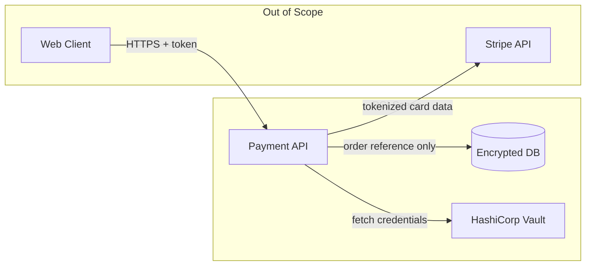

# Threat Modeling Guide — STRIDE

Use this guide when the system has compliance requirements beyond standard OWASP Top 10 (i.e., Q8 = SOC 2 / GDPR / PCI DSS / HIPAA), or when the user explicitly asks for a security review. For greenfield systems with standard web security, the security checklist in the output template is sufficient.

---

## When to include a full STRIDE model

Include a STRIDE table in the Final Documentation Security section when **any** of the following apply:
- The system handles payment data, health records, or PII at scale
- Compliance requirement is PCI DSS, HIPAA, SOC 2, or GDPR
- The system is multi-tenant (tenant isolation failures are a critical threat class)
- External APIs or third-party integrations are in scope

For standard OWASP-only systems, note "STRIDE analysis not performed at this compliance tier — revisit if requirements change."

---

## STRIDE categories

| Threat                     | Property Violated | Question to ask                                                  |
|----------------------------|-------------------|------------------------------------------------------------------|
| **S**poofing               | Authentication    | Can an attacker impersonate a user, service, or component?       |
| **T**ampering              | Integrity         | Can an attacker modify data in transit or at rest?               |
| **R**epudiation            | Non-repudiation   | Can an attacker deny having performed an action?                 |
| **I**nformation Disclosure | Confidentiality   | Can an attacker access data they are not authorized to see?      |
| **D**enial of Service      | Availability      | Can an attacker disrupt or exhaust the system?                   |
| **E**levation of Privilege | Authorization     | Can an attacker gain capabilities beyond what they were granted? |

---

## STRIDE Threat Model Table Template

Include this table in the `#### Threat Model (STRIDE)` subsection under `### Security` in Final Documentation.

```markdown
#### Threat Model (STRIDE)

| Threat                               | Attack Vector                                        | Affected Components       | Likelihood         | Impact | Mitigation                                                                  |
|--------------------------------------|------------------------------------------------------|---------------------------|--------------------|--------|-----------------------------------------------------------------------------|
| **Spoofing** — token theft           | Stolen JWT used to impersonate user                  | API Gateway, Auth Service | Medium             | High   | Short-lived tokens (15 min), refresh token rotation, device fingerprinting  |
| **Tampering** — payload manipulation | MITM modifies request body                           | All API endpoints         | Low (TLS in place) | High   | TLS 1.3 enforced end-to-end; request signing for critical mutations         |
| **Repudiation** — action denial      | User denies placing order                            | Order Service, Audit Log  | Low                | Medium | Immutable audit log with user ID, timestamp, IP, and action hash            |
| **Info Disclosure** — data leak      | Overly verbose error messages expose stack traces    | All services              | Medium             | Medium | Sanitized error responses in prod; detailed errors to structured logs only  |
| **DoS** — auth endpoint flood        | Brute force on /login                                | Auth Service              | High               | Medium | Rate limiting (5 req/min/IP), CAPTCHA after 3 failures, account lockout     |
| **EoP** — IDOR on resource           | User accesses another user's resource by guessing ID | Order API, DB             | Medium             | High   | Authorization check on every resource fetch; RBAC enforced at service layer |
```

Adapt the rows to the specific components and data flows of the system being designed. Do not use these exact rows verbatim — they are examples. Every row must name:
- The specific attack vector (not just the category)
- Which components are in scope
- A concrete mitigation tied to this architecture (not a generic best practice)

---

## Data Flow Diagram (optional, for high-risk systems)

For PCI DSS or HIPAA systems, add a brief Data Flow Diagram before the STRIDE table that shows which components touch sensitive data (cardholder data, PHI). This makes the STRIDE analysis auditable — a reviewer can trace each threat back to a specific data flow.

Use a `flowchart LR` to show:
- Which components receive, store, or transmit sensitive data
- Trust boundaries (annotate with dashed borders or a subgraph label like "PCI Scope")
- External integrations that cross trust boundaries



---

## Threat modeling resources

- OWASP Threat Modeling Cheat Sheet: https://cheatsheetseries.owasp.org/cheatsheets/Threat_Modeling_Cheat_Sheet.html
- Microsoft STRIDE: https://learn.microsoft.com/en-us/azure/security/develop/threat-modeling-tool-threats
- OWASP Top 10: https://owasp.org/www-project-top-ten/
