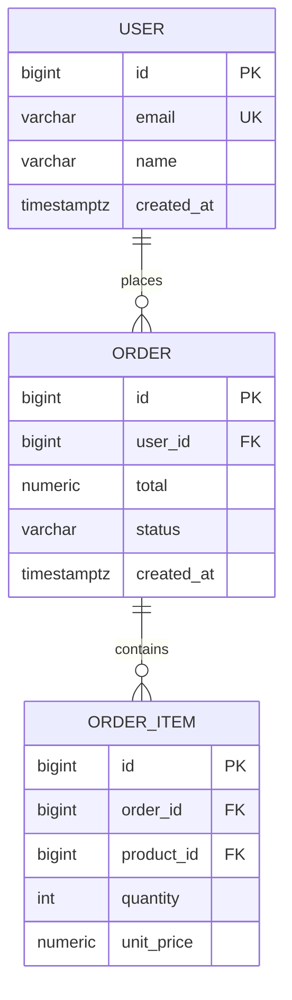

# Design Database

Design a new database schema from requirements, or analyze and normalize an existing schema. Produce an Entity-Relationship Diagram (Mermaid), detailed table specifications (columns, data types, constraints, indexes), normalization analysis, and a concise rationale for every decision. Open a static HTML viewer so the user can see the ERD rendered with Mermaid JS.

## Workflow

**Tools — create tasks and use structured questions throughout:**

At the very start, call **TaskCreate** to create one task per step:
1. Clarify goal and database context
2. Design schema (or analyze existing schema)
3. Produce ER diagram
4. Produce table specifications
5. Write content.md, open viewer, save final docs

Mark each task `in_progress` when starting it and `completed` when done.

### 1. Clarify the Goal

Determine which mode applies:

- **Design from scratch**: User describes requirements (entities, relationships, expected queries)
- **Normalize existing schema**: User pastes SQL DDL (`CREATE TABLE` statements) or describes the existing tables

If the mode or context is unclear, use **AskUserQuestion** to ask (up to 4 questions at once):
- What is the target database engine? (PostgreSQL, MySQL, SQLite, MongoDB, etc.)
- Approximate data volume and read/write ratio?
- Most critical queries (search, reporting, real-time lookups)?
- Any existing data that needs migrating?

### 2A. Design from Scratch

#### Identify Entities and Relationships

From the user's requirements:
1. Extract nouns → candidate entities/tables
2. Identify verbs/relationships between entities (one-to-many, many-to-many)
3. Identify attributes of each entity
4. Determine natural vs. surrogate primary keys

#### Apply Normal Forms

Design directly to at least **3NF** (Third Normal Form). Apply BCNF where applicable. Do not over-normalize into 4NF/5NF unless there is a clear reason (multivalued dependencies, explicit analytics use case). Refer to `$CLAUDE_PLUGIN_ROOT/skills/design-database/references/normalization-guide.md` for rules and examples.

#### Choose Data Types

For each column, choose the most appropriate data type. Key principles:

- Use the **smallest type that fits** the domain (e.g., `SMALLINT` not `BIGINT` for a status flag)
- Use `UUID` for distributed PKs, `BIGSERIAL`/`BIGINT AUTO_INCREMENT` for sequential PKs
- Use `TEXT` over `VARCHAR(n)` in PostgreSQL (no performance difference); use `VARCHAR(n)` in MySQL when length is meaningful
- Use `TIMESTAMPTZ` (PostgreSQL) or `DATETIME` + UTC convention for timestamps
- Use `NUMERIC(p,s)` or `DECIMAL` for money, never `FLOAT`/`DOUBLE`
- Use `JSONB` (PostgreSQL) for semi-structured data only when querying inside the JSON

Refer to `$CLAUDE_PLUGIN_ROOT/skills/design-database/references/data-types-guide.md` for engine-specific recommendations.

#### Define Indexes

After finalizing the schema, determine indexes based on query patterns:
1. Primary key indexes (automatic)
2. Foreign key indexes (always index FK columns)
3. Query-pattern indexes (columns in WHERE, JOIN ON, ORDER BY, GROUP BY)
4. Unique constraints (acts as unique index)

For each index, specify:
- Type (B-tree, Hash, GiST, GIN, BRIN, Full-text)
- Columns (single or composite — order matters for composites)
- Justification tied to a specific query pattern

Refer to `$CLAUDE_PLUGIN_ROOT/skills/design-database/references/index-guide.md` for index type selection rules.

### 2B. Normalize Existing Schema

#### Parse and Analyze

Read the provided DDL. For each table:
1. Identify the functional dependencies
2. Check violation of 1NF, 2NF, 3NF, BCNF (use `$CLAUDE_PLUGIN_ROOT/skills/design-database/references/normalization-guide.md`)
3. List repeating groups, partial dependencies, transitive dependencies

#### Produce Analysis Summary

```
### Normalization Analysis

#### {TableName}
- **Current normal form**: 1NF / 2NF / not normalized
- **Issues found**: [list violations with column names]
- **Proposed fix**: [specific restructuring action]
```

#### Apply Fixes

Propose the normalized schema. Show:
- Tables that need to be split
- Columns that should move
- Junction tables for M:N relationships
- New FK relationships introduced

#### Data Migration Notes

For each structural change, include a brief SQL migration hint:
```sql
-- Extract repeating group into separate table
CREATE TABLE order_items (...);
INSERT INTO order_items SELECT ... FROM orders;
ALTER TABLE orders DROP COLUMN ...;
```

### 3. Produce the ER Diagram

Generate a Mermaid `erDiagram` for the final (proposed) schema. Include:
- All tables
- All relationships with cardinality (`||--o{`, `}o--||`, etc.)
- Primary key and foreign key annotations

Example — include the ER diagram in the response using this syntax:



### 4. Produce Table Specifications

For each table, provide a spec block:

```markdown
### `{table_name}`

| Column         | Type              | Constraints                 | Description              |
|----------------|-------------------|-----------------------------|--------------------------|
| id             | BIGSERIAL         | PRIMARY KEY                 | Surrogate PK             |
| email          | VARCHAR(255)      | NOT NULL, UNIQUE            | User email               |
| created_at     | TIMESTAMPTZ       | NOT NULL, DEFAULT now()     | Record creation time     |

**Indexes:**
| Name                        | Type   | Columns           | Reason                                     |
|-----------------------------|--------|-------------------|--------------------------------------------|
| idx_users_email             | B-tree | email             | Login lookup, uniqueness enforcement       |
| idx_users_created_at        | BRIN   | created_at        | Range queries on large sequential data     |
```

### 5. Write Content, Open Viewer, and Save Final Docs

1. Use the **Write tool** to write the full design content to `/tmp/archimind-viewer/content.md`. Follow the **Document Structure for Database Design** below.
2. Start the viewer server and open the URL:

```bash
URL=$(bash "$CLAUDE_PLUGIN_ROOT/scripts/start-server.sh")
open "$URL"
```

Inform the user: "The viewer is open at `$URL` — the ERD is rendered with Mermaid JS. Click **↺ Reload** in the sidebar after any changes."

3. Compute timestamp: `node -e 'process.stdout.write(String(Date.now()))'` (macOS) or `date +%s%3N` (Linux). Determine topic slug (e.g., `ecommerce`, `user-management`).
4. Save permanent technical documentation to the user's project:

```bash
mkdir -p docs/archimind/database
```

Then use the **Write tool** to write the full content to `docs/archimind/database/{timestamp_ms}-{topic}.md`.

5. Stop the viewer server:

```bash
bash "$CLAUDE_PLUGIN_ROOT/scripts/stop-server.sh"
```

## Document Structure for Database Design

Database design docs do not use the 3-option tabbar format (single design output). The viewer renders the ERD and table specs as a single scrollable document. Structure the document clearly:

```markdown
# Database Design: {Topic}

## ERD
{mermaid erDiagram}

## Normalization Analysis (if normalizing existing schema)
...

## Table Specifications
...

## Index Strategy Summary
...

## Migration Notes (if applicable)
...
```

## Additional Resources

- **`$CLAUDE_PLUGIN_ROOT/skills/design-database/references/normalization-guide.md`** — Complete 1NF → BCNF rules with SQL examples. Read when analyzing existing schemas.
- **`$CLAUDE_PLUGIN_ROOT/skills/design-database/references/index-guide.md`** — Index type matrix (B-tree, Hash, GiST, GIN, BRIN, Full-text) with use cases and when to avoid. Read when deciding index strategy.
- **`$CLAUDE_PLUGIN_ROOT/skills/design-database/references/data-types-guide.md`** — Data type recommendations for PostgreSQL, MySQL, and SQLite. Read when choosing column types.
