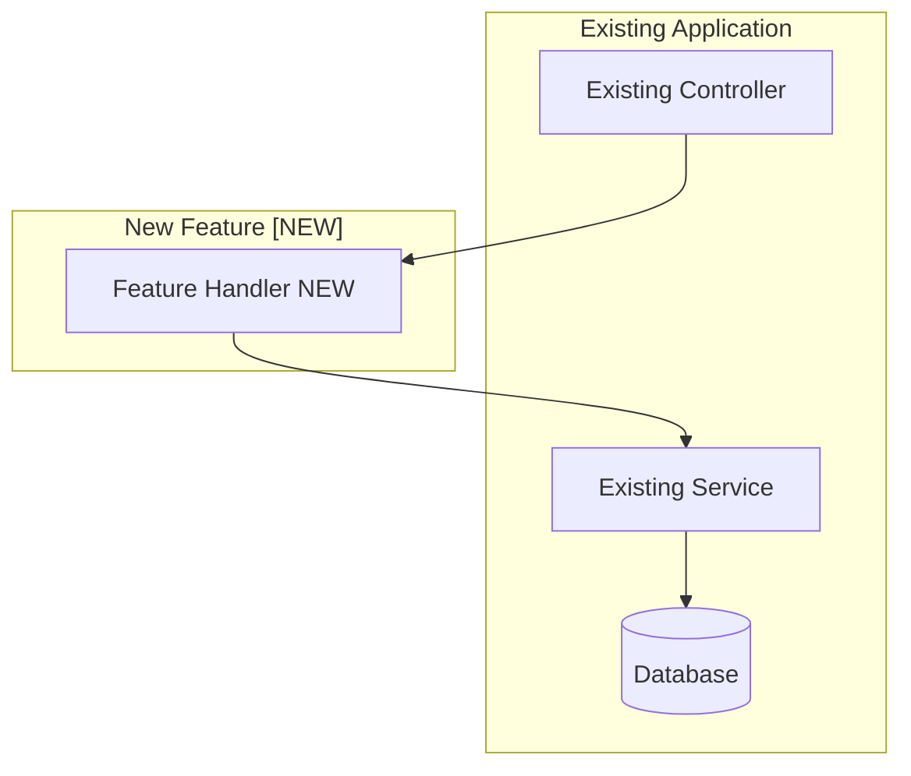
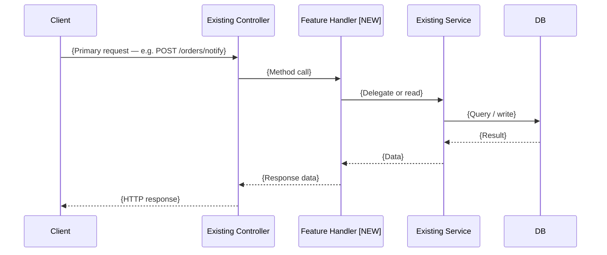
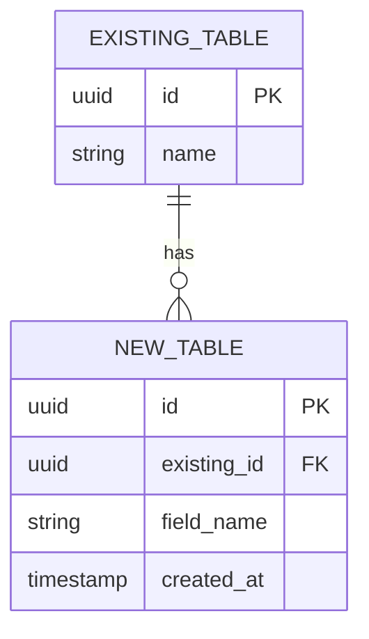

# Feature Design Output Template

> **READ-ONLY REFERENCE — NEVER WRITE TO THIS FILE.**
> Output destinations:
> - Viewer draft → `/tmp/archimind-viewer/content.md`
> - Final saved doc → `docs/archimind/features/{timestamp_ms}-{topic}.md`
>
> Use this file only to read the scaffold structure. All writes go to the destinations above.

Use this template as a scaffold when generating the feature design document. Replace all placeholder text. Do not omit any section.

---

```markdown
# Feature Design: {Feature Name}

**Generated:** {ISO date}
**Application:** {Application name / type}
**Summary:** {One-sentence description of the feature}

<!-- Fill in after user confirms: -->
<!-- **Confirmed:** {Approach Name} -->
<!-- **Decision date:** {ISO date} -->

## Feature Overview

{2–4 sentences describing the feature: what problem it solves, who uses it, and how it fits into the existing application.}

## Requirements Gathered

- **Feature goal:** {What the feature must achieve}
- **Users / actors:** {Who initiates or is affected by this feature}
- **Core functionality:** {Bullet list of capabilities}
- **Existing app context:** {Architecture style, language/framework, relevant existing modules}
- **Integration points:** {Which existing modules/services this feature touches}
- **Schema changes:** {Yes — new tables / Minor — columns only / No / TBD}
- **Quality priority:** {Speed / Testability / Extensibility / Performance}
- **Key constraints:** {Team size, deadline, non-negotiable tech choices}

---

## Architecture Diagram

{One paragraph: the recommended implementation approach, where it lives in the existing codebase, and why this level of structure is right for the stated requirements — specifically referencing team size, quality priority, and coupling risk.}

#### Feature Integration



> {1–2 sentences: describe how the new feature connects to the existing codebase and what entry points are used.}

#### Feature Flow



> {1–2 sentences: describe the happy-path flow traced here and what the feature does with the data.}

#### Key Components

- `{FileName/ClassName}` — {one-line description of what it does}
- `{FileName/ClassName}` — {one-line description}

#### Technology Stack

| Layer       | Approach                | Reason                              |
|-------------|-------------------------|-------------------------------------|
| {Layer}     | {Existing / New choice} | {Why — reuse, performance, fit}     |

#### Data Layer Design

{Which existing tables are read from or written to. List any new columns or indexes required.}

#### Testing Strategy

- **Unit tests:** {What can be tested in isolation — pure functions, service methods}
- **Integration tests:** {What needs real DB / HTTP — e.g., full request cycle}
- **Mocking:** {What must be mocked — external services, clock, file system}

#### Extension Points

{How other modules can build on top of this feature later, or "None — this approach is intentionally direct; refactor to a modular pattern if extension requirements emerge."}

#### Risks & Mitigations

| Risk               | Likelihood   | Impact       | Mitigation       |
|--------------------|--------------|--------------|------------------|
| {Risk description} | Low/Med/High | Low/Med/High | {How to address} |

---

## ERD

> Include this section only if requirements indicate schema changes (Q4: A or B). Omit entirely if no schema changes are needed.



**New table specifications:**

**`new_table`**

| Column        | Type         | Constraints             | Notes          |
|---------------|--------------|-------------------------|----------------|
| `id`          | UUID         | PK                      | Auto-generated |
| `existing_id` | UUID         | FK → existing_table.id  | Required       |
| `field_name`  | VARCHAR(255) | NOT NULL                | {Purpose}      |
| `created_at`  | TIMESTAMP    | NOT NULL, DEFAULT now() | Audit field    |

**Key indexes:**
- `idx_new_table_existing_id` on `(existing_id)` — for FK lookup performance

---

## Design Rationale

{4–6 sentences: why this specific implementation approach was chosen — what requirements drove it (team size, quality priority, coupling risk, timeline), what simpler or more complex alternatives were considered and ruled out, and what the key trade-off is.}

---

## Architecture Decision Record

<!-- Read $CLAUDE_PLUGIN_ROOT/skills/design-architecture/references/adr-guide.md for format guidance. -->

**ADR ID:** {timestamp_ms}-{topic}
**Date:** {ISO date}
**Status:** Accepted

### Context
{Requirements active at decision time.}

### Decision
**Chosen:** {Approach Name}
{What was decided.}

### Consequences
**Positive:** {Benefits}
**Trade-offs accepted:** {What becomes harder}
**Watch list:** {When to revisit}

### Rejected Alternatives
| Alternative | Reason Rejected   |
|-------------|-------------------|
| {Name}      | {Specific reason} |

### Review Trigger
{Signal that should prompt re-opening this ADR.}

---

## Final Documentation

### Overview

{3–5 sentences: what the feature does, who uses it, and what problem it solves. Written for a future engineer unfamiliar with the original design session.}

### Feature Design Decision

**Approach:** {Approach Name}

**Rationale:** {3–4 sentences: why this approach was chosen, what simpler or more complex alternatives were considered and ruled out, referencing specific requirements.}

### Implementation Guide

**Entry point:** {Where to start — file path, class, or route}

**Step-by-step implementation order:**
1. {First thing to build — e.g., data model / migration}
2. {Second — e.g., repository}
3. {Third — e.g., service logic}
4. {Fourth — e.g., controller / handler}
5. {Fifth — e.g., tests}
6. {Sixth — e.g., wire up routing / DI}

**Key decisions:**
- {Decision 1: e.g., "Use soft-delete for audit trail — set deleted_at instead of removing rows"}
- {Decision 2: e.g., "Validate at service boundary, not controller — allows reuse without HTTP layer"}

### Data Design

{Description of any schema changes. Table names, key columns, indexes. If no schema changes: "No schema changes required."}

### Testing Plan

| Test type      | Coverage target                 | Key scenarios                            |
|----------------|---------------------------------|------------------------------------------|
| Unit           | {Service, handler logic}        | {Happy path, error cases, edge cases}    |
| Integration    | {DB reads/writes, API contract} | {End-to-end request, schema correctness} |
| E2E (optional) | {Full user flow}                | {Only if UI or critical user journey}    |

### Integration Notes

{How this feature plugs into the existing codebase — which files to modify, which DI registrations to add, which routes to wire up. Be specific about the touch points in the existing code.}

### Trade-offs & Next Steps

**Trade-offs accepted:**
- {Trade-off 1 — e.g., "Inline approach means no independent test suite; acceptable given 2-person team"}
- {Trade-off 2}

**Next steps:**
- [ ] {Immediate: e.g., "Create DB migration for new_table"}
- [ ] {Short-term: e.g., "Write unit tests for FeatureService"}
- [ ] {Later: e.g., "Monitor query performance after launch and add index if needed"}
```
