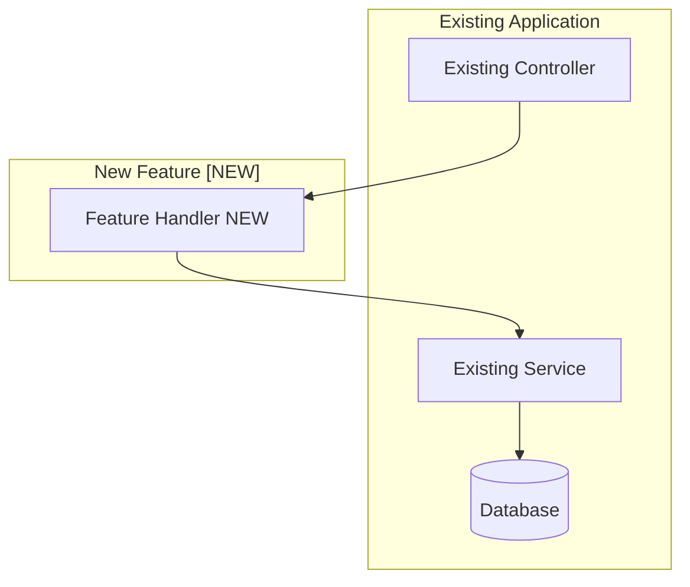
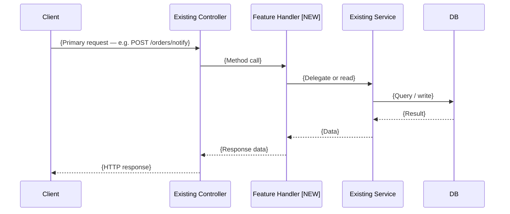
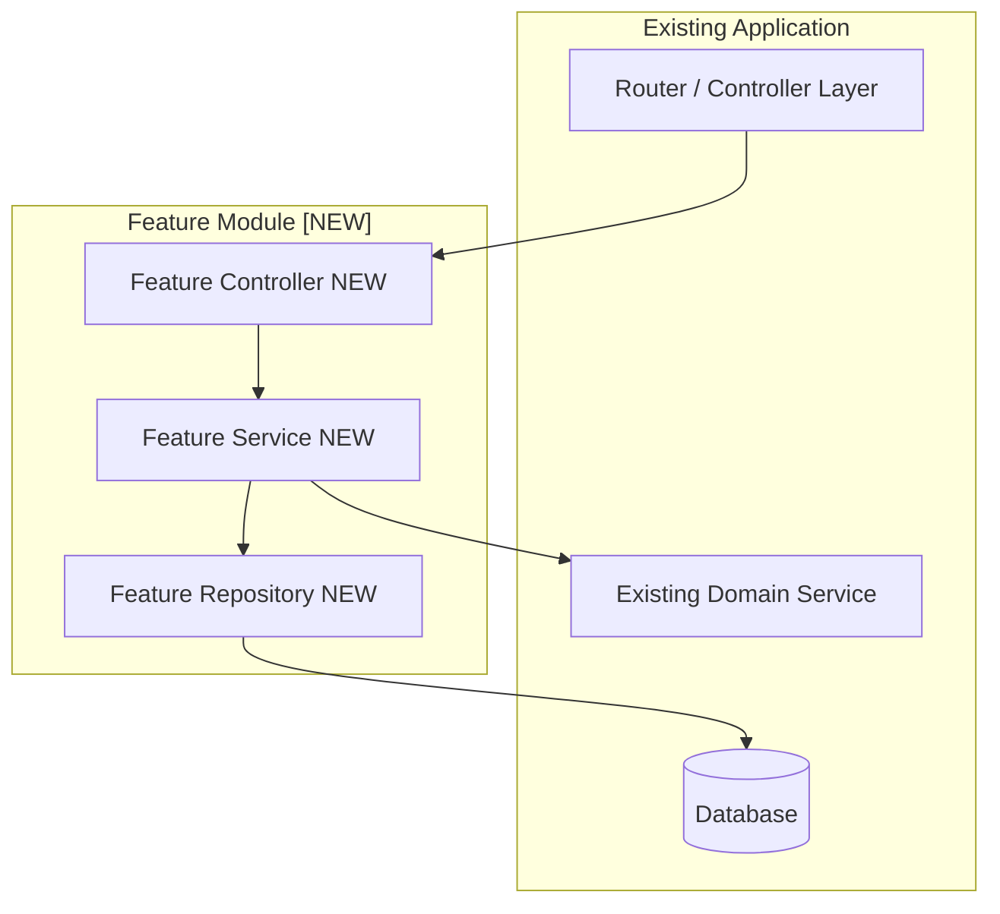
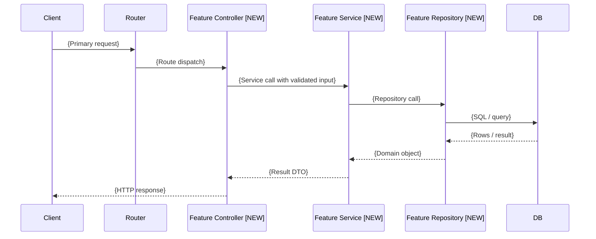
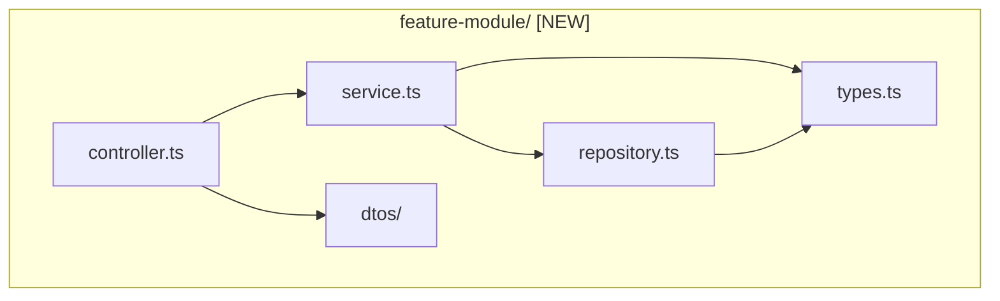
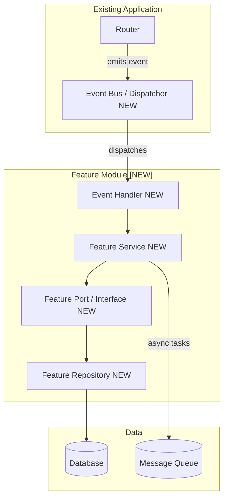
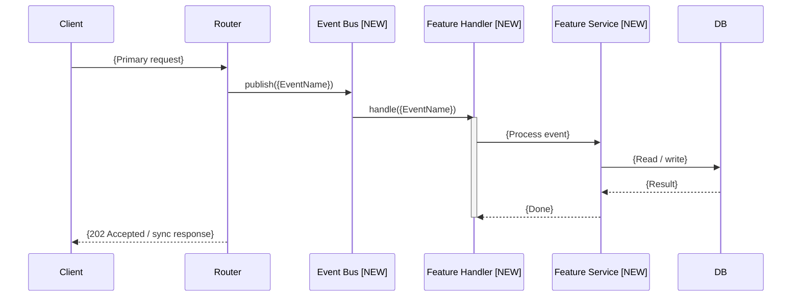
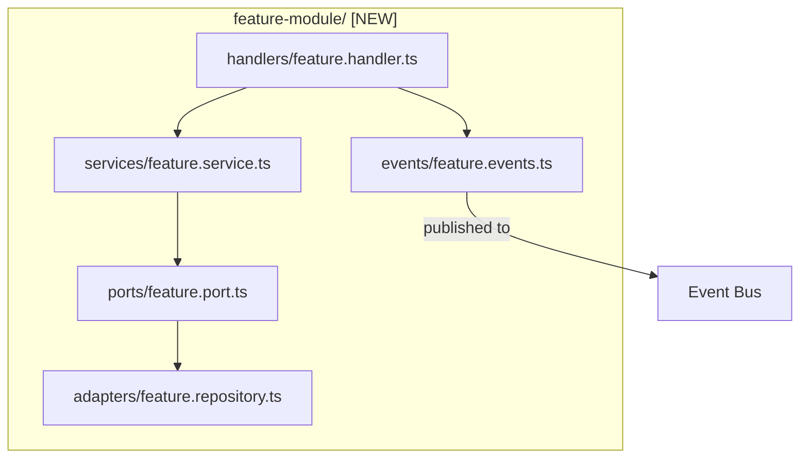
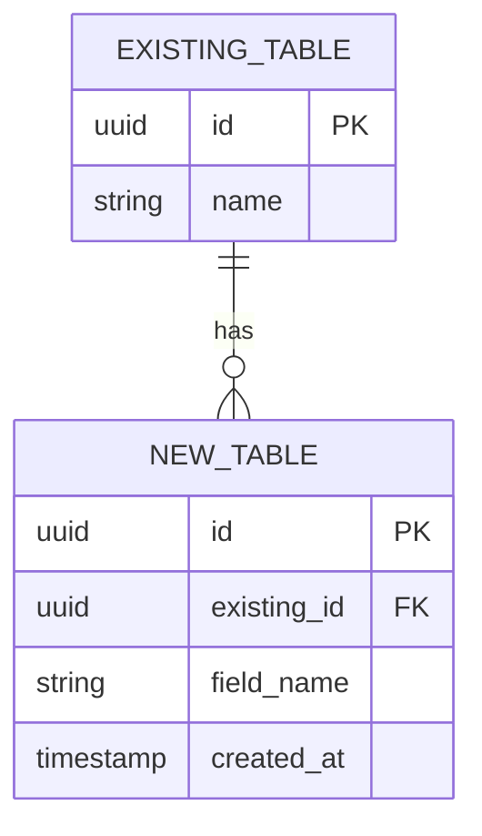

# Feature Design Output Template

> **READ-ONLY REFERENCE — NEVER WRITE TO THIS FILE.**
> Output destinations:
> - Viewer draft → `/tmp/archimind-viewer/content.md`
> - Final saved doc → `docs/archimind/features/{timestamp_ms}-{topic}.md`
>
> Use this file only to read the scaffold structure. All writes go to the destinations above.

Use this template as a scaffold when generating the feature design document. Replace all placeholder text. Do not omit any section.

---

```markdown
# Feature Design: {Feature Name}

**Generated:** {ISO date}
**Application:** {Application name / type}
**Summary:** {One-sentence description of the feature}

<!-- Fill in after user selects: -->
<!-- **Selected:** Option N — {Tier}: {Approach Name} -->
<!-- **Decision date:** {ISO date} -->

## Feature Overview

{2–4 sentences describing the feature: what problem it solves, who uses it, and how it fits into the existing application.}

## Requirements Gathered

- **Feature goal:** {What the feature must achieve}
- **Users / actors:** {Who initiates or is affected by this feature}
- **Core functionality:** {Bullet list of capabilities}
- **Existing app context:** {Architecture style, language/framework, relevant existing modules}
- **Integration points:** {Which existing modules/services this feature touches}
- **Schema changes:** {Yes — new tables / Minor — columns only / No / TBD}
- **Quality priority:** {Speed / Testability / Extensibility / Performance}
- **Key constraints:** {Team size, deadline, non-negotiable tech choices}

---

## Architecture Diagram

### Option 1: Inline — {Approach Name}

{One paragraph describing the core approach: what gets added, where it lives in the existing codebase, and why this is the minimal viable design.}

#### Feature Integration



> {1–2 sentences: describe how the new feature connects to the existing codebase and what entry points are used.}

#### Feature Flow



> {1–2 sentences: describe the happy-path flow traced here and what the feature does with the data.}

#### Key Components

- `{FileName/ClassName}` — {one-line description of what it does}
- `{FileName/ClassName}` — {one-line description}

#### Technology Stack

| Layer       | Approach                | Reason                              |
|-------------|-------------------------|-------------------------------------|
| {Layer}     | {Existing / New choice} | {Why — reuse, performance, fit}     |

#### Data Layer Design

{Which existing tables are read from or written to. List any new columns or indexes required.}

#### Testing Strategy

- **Unit tests:** {What can be tested in isolation — pure functions, service methods}
- **Integration tests:** {What needs real DB / HTTP — e.g., full request cycle}
- **Mocking:** {What must be mocked — external services, clock, file system}

#### Extension Points

{None — this option is not designed for extension. To add capabilities later, migrate to Option 2 or 3.}

#### Risks & Mitigations

| Risk               | Likelihood   | Impact       | Mitigation       |
|--------------------|--------------|--------------|------------------|
| {Risk description} | Low/Med/High | Low/Med/High | {How to address} |

#### When to Choose This Option

- {Ideal scenario 1 — e.g., "Solo or 2-person team with a 1-week deadline"}
- {Ideal scenario 2 — e.g., "Feature is unlikely to require future extension"}
- {Ideal scenario 3 — e.g., "Existing codebase already handles similar logic nearby"}

---

### Option 2: Modular — {Approach Name}

{One paragraph describing the core approach: what module is created, how its public contract is defined, and why this level of structure is warranted.}

#### Feature Integration



> {1–2 sentences: describe how the feature module integrates with the existing app and what its public boundary looks like.}

#### Feature Flow



> {1–2 sentences: describe the layered request path and where domain logic lives.}

#### Module Structure



> {1–2 sentences: describe the internal file organization and which layer owns which responsibility.}

#### Key Components

- `feature/controller.{ext}` — HTTP handler, input validation, response mapping
- `feature/service.{ext}` — Business logic, orchestration
- `feature/repository.{ext}` — Data access, query abstraction
- `feature/dtos.{ext}` — Input/output data shapes
- `feature/types.{ext}` — Domain types and interfaces

#### Technology Stack

| Layer       | Approach                | Reason                              |
|-------------|-------------------------|-------------------------------------|
| {Layer}     | {Choice}                | {Why}                               |

#### Data Layer Design

{New tables, columns, or indexes required. Which existing entities are referenced via FK.}

#### Testing Strategy

- **Unit tests:** {Service layer with mocked repository; controller with mocked service}
- **Integration tests:** {Full request cycle through real DB; test the public HTTP contract}
- **Mocking:** {External services injected via interface — easy to swap in tests}

#### Extension Points

- {How another module can call into this feature — via the service interface}
- {Whether the feature exposes events that other modules can subscribe to}

#### Risks & Mitigations

| Risk               | Likelihood   | Impact       | Mitigation   |
|--------------------|--------------|--------------|--------------|
| {Risk description} | Low/Med/High | Low/Med/High | {Mitigation} |

#### When to Choose This Option

- {Ideal scenario 1 — e.g., "Feature will be called from 2+ other modules"}
- {Ideal scenario 2 — e.g., "Team prioritizes testability and code clarity"}
- {Ideal scenario 3 — e.g., "Feature is complex enough to warrant its own test suite"}

---

### Option 3: Decoupled — {Approach Name}

{One paragraph describing the decoupling strategy: whether event-driven, plugin pattern, or interface abstraction — and which specific requirement drives this level of design.}

#### Feature Integration



> {1–2 sentences: describe how the decoupling mechanism (events / interfaces / DI) removes direct dependencies.}

#### Feature Flow



> {1–2 sentences: describe the async or decoupled flow and what the caller receives immediately vs. eventually.}

#### Module Structure



> {1–2 sentences: describe the hexagonal / ports-and-adapters or event structure and how it isolates the domain from infrastructure.}

#### Key Components

- `ports/feature.port.ts` — Abstract interface defining the feature's capabilities
- `handlers/feature.handler.ts` — Event listener / command handler entry point
- `services/feature.service.ts` — Domain logic, orchestrates ports
- `adapters/feature.repository.ts` — Concrete implementation of the port
- `events/feature.events.ts` — Domain event definitions

#### Technology Stack

| Layer       | Approach                      | Reason                                              |
|-------------|-------------------------------|-----------------------------------------------------|
| Integration | Domain events / DI interfaces | Decouples feature from callers; enables mocking     |
| {Layer}     | {Choice}                      | {Why}                                               |

#### Data Layer Design

{New tables, columns, or indexes. Specify if the feature owns its own schema or shares with the existing domain.}

#### Testing Strategy

- **Unit tests:** {Service with mocked port; handler with mocked service — no DB needed}
- **Integration tests:** {Full event-to-persistence cycle; test the port contract against a real DB adapter}
- **Contract tests:** {If multiple consumers exist, contract testing the event schema}

#### Extension Points

- {How to add a new implementation of the port without changing the feature logic}
- {How other modules subscribe to the domain events emitted by this feature}
- {How to extract this feature into a separate service with minimal code changes}

#### Risks & Mitigations

| Risk                                    | Likelihood   | Impact       | Mitigation                                                              |
|-----------------------------------------|--------------|--------------|-------------------------------------------------------------------------|
| {Over-engineering for the current need} | Medium       | Medium       | {Justify with a specific future requirement; otherwise choose Option 2} |
| {Risk description}                      | Low/Med/High | Low/Med/High | {Mitigation}                                                            |

#### When to Choose This Option

- {Ideal scenario 1 — e.g., "Multiple teams will extend this feature independently"}
- {Ideal scenario 2 — e.g., "Feature may need to be extracted into its own service in 6 months"}
- {Ideal scenario 3 — e.g., "Feature is on a critical path and must be independently testable"}

---

## ERD

> Include this section only if requirements indicate schema changes (Q4: A or B). Omit entirely if no schema changes are needed.



**New table specifications:**

**`new_table`**

| Column        | Type         | Constraints             | Notes          |
|---------------|--------------|-------------------------|----------------|
| `id`          | UUID         | PK                      | Auto-generated |
| `existing_id` | UUID         | FK → existing_table.id  | Required       |
| `field_name`  | VARCHAR(255) | NOT NULL                | {Purpose}      |
| `created_at`  | TIMESTAMP    | NOT NULL, DEFAULT now() | Audit field    |

**Key indexes:**
- `idx_new_table_existing_id` on `(existing_id)` — for FK lookup performance

---

## Recommendation

{4–6 sentences: which option is recommended and why, referencing the specific requirements that drove this decision (team size, quality priority, integration complexity, timeline). Acknowledge the main trade-off between the options. Be explicit if the Inline option is sufficient — do not default to Modular or Decoupled without a specific justification.}

---

## Decision Notes

{User-requested adjustments, timeline, next implementation steps.}

---

## Final Documentation

### Overview

{3–5 sentences: what the feature does, who uses it, and what problem it solves. Written for a future engineer unfamiliar with the original design session.}

### Feature Design Decision

**Selected option:** Option N — {Tier}: {Approach Name}

**Rationale:** {3–4 sentences: why this option was chosen over the alternatives, referencing specific requirements.}

**Rejected options:**
- Option N: {Why it was not chosen — in one sentence}
- Option N: {Why it was not chosen — in one sentence}

### Implementation Guide

**Entry point:** {Where to start — file path, class, or route}

**Step-by-step implementation order:**
1. {First thing to build — e.g., data model / migration}
2. {Second — e.g., repository}
3. {Third — e.g., service logic}
4. {Fourth — e.g., controller / handler}
5. {Fifth — e.g., tests}
6. {Sixth — e.g., wire up routing / DI}

**Key decisions:**
- {Decision 1: e.g., "Use soft-delete for audit trail — set deleted_at instead of removing rows"}
- {Decision 2: e.g., "Validate at service boundary, not controller — allows reuse without HTTP layer"}

### Data Design

{Description of any schema changes. Table names, key columns, indexes. If no schema changes: "No schema changes required."}

### Testing Plan

| Test type      | Coverage target                 | Key scenarios                            |
|----------------|---------------------------------|------------------------------------------|
| Unit           | {Service, handler logic}        | {Happy path, error cases, edge cases}    |
| Integration    | {DB reads/writes, API contract} | {End-to-end request, schema correctness} |
| E2E (optional) | {Full user flow}                | {Only if UI or critical user journey}    |

### Integration Notes

{How this feature plugs into the existing codebase — which files to modify, which DI registrations to add, which routes to wire up. Be specific about the touch points in the existing code.}

### Trade-offs & Next Steps

**Trade-offs accepted:**
- {Trade-off 1 — e.g., "Inline approach means no independent test suite; acceptable given 2-person team"}
- {Trade-off 2}

**Next steps:**
- [ ] {Immediate: e.g., "Create DB migration for new_table"}
- [ ] {Short-term: e.g., "Write unit tests for FeatureService"}
- [ ] {Later: e.g., "Monitor query performance after launch and add index if needed"}
```
