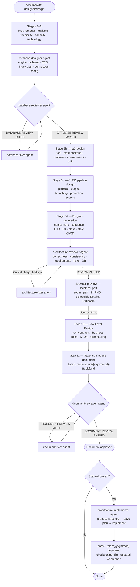

# architecture-designer

Guided architecture and infrastructure design workflow for Claude Code — from requirements gathering to code implementation, with interactive Mermaid diagrams, browser preview, and structured documentation.

## Skills

### `/architecture-designer:design`

Runs the full seven-stage design process:

1. **Requirements gathering** — application goals, stakeholders, business processes, success criteria
2. **Requirements analysis** — functional vs non-functional requirements (performance, security, scalability, availability)
3. **Feasibility study and constraints** — budget, timeline, regulations, team competencies, legacy integrations
4. **Capacity planning** — users, TPS, data volume, peak load, growth projections
5. **Technology selection** — stack, architecture pattern, database, infrastructure, observability strategy, and DR approach; every choice justified against stages 1–4
6. **Architecture and infrastructure design** — Database schema (ERD, index plan, engine selection), IaC tool selection and module structure, CI/CD pipeline design (platform, stages, branching strategy, environment promotion), and Mermaid diagrams rendered in the browser with zoom/pan/download
7. **Low-Level Design** — API contracts (per sequence diagram endpoint), business rules (pseudocode for non-trivial logic), DTOs, inter-service contracts (microservices/event-driven only), and error catalog

Produced artifacts:
- Browser preview at `http://localhost:<port>` with zoomable, downloadable 2× resolution PNG diagrams
- Per-diagram collapsible **Details** and **Design Rationale** blocks in the preview
- ERD diagrams include an inline **Index Plan** table in the preview
- `docs/architecture-designer/architecture/{yyyymmdd}-{topic}.md` — complete, reviewed, and approved architecture document including IaC plan, CI/CD pipeline design, and LLD section

### `/architecture-designer:review`

Reviews and revises an existing architecture:
- Document-based review (reads `docs/architecture-designer/architecture/`)
- Codebase-based review (scans project structure, reconstructs actual architecture)
- Drift detection (compares document against codebase)
- Revision flow with new versioned document, preserving full history

### `/architecture-designer:implement`

Turns an approved architecture document into a working project skeleton. Can be invoked standalone (after a design session, or independently by picking a document from `docs/architecture-designer/architecture/`):

1. Locates the architecture document — from session context or lets you choose from saved documents
2. Scans the working directory for an existing project structure
3. Asks how to proceed: merge into existing code, fresh start, or work around a described layout
4. Spawns `architecture-implementer` to propose a folder structure and wait for your confirmation
5. Saves an implementation plan to `docs/architecture-designer/plan/{yyyymmdd}-{topic}.md` — a markdown checklist of every file to be created, grouped by category (models, routes, config, infrastructure, scripts)
6. Generates all files; updates the plan checkboxes to `[x]` / `[~]` when done

## Design workflow



The `/architecture-designer:review` skill follows the same reviewer → fixer loop for any diagrams or database changes, then saves a new versioned document through the same document-reviewer pass.

`/architecture-designer:implement` can be invoked standalone — it finds the architecture document, checks for an existing project structure, and delegates to `architecture-implementer` after you confirm the folder layout.

## Sub-agents

Each reviewer has a paired fixer agent. When a reviewer returns findings, the skill spawns the fixer to apply targeted corrections, then re-runs the reviewer. This loop runs until the reviewer passes — no manual editing required.

| Agent                                            | Role                                                                                                                                                                        |
|--------------------------------------------------|-----------------------------------------------------------------------------------------------------------------------------------------------------------------------------|
| `architecture-designer:architecture-reviewer`    | Validates diagrams for technical correctness, cross-diagram consistency, requirements traceability, risks, observability, and DR; returns Critical / Major / Minor findings |
| `architecture-designer:architecture-fixer`       | Applies targeted fixes to Mermaid diagrams based on reviewer findings; updates `diagrams.json` in place and returns a fix log                                               |
| `architecture-designer:database-designer`        | Designs schema, ERD, index plan, engine selection, and secure connection config for SQL and NoSQL                                                                           |
| `architecture-designer:database-reviewer`        | Audits database design: engine fit, schema/3NF, ERD accuracy, index completeness, security config; returns DATABASE REVIEW PASSED / FAILED                                  |
| `architecture-designer:database-fixer`           | Corrects schema, ERD, index plan, `companionTable` JSON, and connection config based on database-reviewer findings                                                          |
| `architecture-designer:document-reviewer`        | Audits saved documents for format compliance (F1–F7) and content completeness (C1–C6); returns DOCUMENT REVIEW PASSED / FAILED                                              |
| `architecture-designer:document-fixer`           | Fixes specific format and content failures in the document based on reviewer findings; overwrites the draft in place                                                        |
| `architecture-designer:architecture-implementer` | Implements project skeleton, data models, routes, and infrastructure files from an approved document                                                                        |

## Scripts

All scripts are Node.js ESM (`.mjs`) with no npm dependencies. They run identically on Windows, macOS, and Linux. The preview server loads Mermaid v11 and the ELK layout engine from CDN — an internet connection is required while the browser preview is open.

```bash
# Find a free port in 3000–9000
node scripts/find-port.mjs

# Start the preview server (opens browser automatically)
node scripts/preview-server.mjs <port>
```

The preview server reads `docs/architecture-designer/diagrams.json` on every request. Reload the browser page to see diagram updates without restarting the server.

## `diagrams.json` schema

```json
{
  "title": "Project Title",
  "topic": "project-topic-kebab",
  "generatedAt": "2026-07-06T10:00:00.000Z",
  "diagrams": [
    {
      "id": "erd",
      "title": "Entity Relationship Diagram",
      "description": "One-sentence summary shown above the diagram.",
      "details": "Multi-paragraph explanation (paragraphs separated by \\n\\n). Rendered as a collapsible block.",
      "rationale": "Why this diagram type was chosen and what design decisions it encodes. Collapsible block.",
      "companionTable": [
        { "name": "idx_users_email", "table": "users", "columns": "email", "type": "UNIQUE B-TREE", "reason": "Login lookup" }
      ],
      "code": "erDiagram\n  USERS { uuid id PK }\n..."
    }
  ]
}
```

`companionTable` is optional and only used for `erDiagram` entries — it renders as an inline index plan table below the ERD.

## Document format

Architecture documents are saved to:
```
docs/architecture-designer/architecture/{yyyymmdd}-{topic}.md
```

`{yyyymmdd}` is the ISO-ordered date — year, then month, then day (e.g., `20260705` for 5 July 2026). This order ensures files sort chronologically when listed alphabetically.

Every document begins with a metadata table:

| Date        | Version | Status   | Reason | Previous Document |
|-------------|---------|----------|--------|-------------------|
| 05-Jul-2026 | 1.0     | Approved | -      | -                 |

Revisions create new files (never overwrite), with `Version` incremented, `Reason` filled, and `Previous Document` pointing to the revised file.

## Diagram types

| Diagram          | Mermaid type                       | When created                     |
|------------------|------------------------------------|----------------------------------|
| Use case         | `flowchart LR`                     | Multiple user roles              |
| Business process | `flowchart TD`                     | Complex multi-step workflows     |
| ERD              | `erDiagram`                        | SQL databases                    |
| Sequence         | `sequenceDiagram`                  | Auth flow + main transaction     |
| Class            | `classDiagram`                     | Rich domain model                |
| State            | `stateDiagram-v2`                  | Entities with status lifecycles  |
| C4 Context       | `C4Context`                        | External actors and integrations |
| C4 Container     | `C4Container`                      | Multiple deployable components   |
| Deployment       | `flowchart` or `architecture-beta` | Cloud/infrastructure layout      |
| CI/CD pipeline   | `flowchart TD`                     | 2+ deployment environments       |

All diagrams support zoom in/out/reset (mouse wheel, pinch, buttons) and 2× resolution PNG download.
