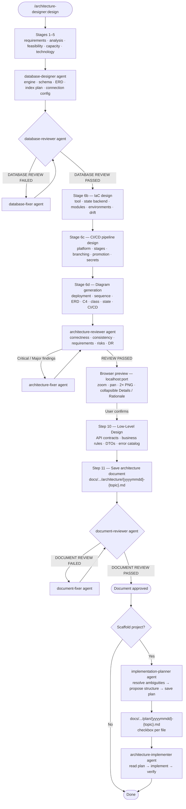

# architecture-designer

Guided architecture and infrastructure design workflow for Claude Code — from requirements gathering to code implementation, with interactive Mermaid diagrams, browser preview, and structured documentation.

## Skills

### `/architecture-designer:design`

Runs the full design process — six requirements/design stages followed by review, preview, and low-level design steps — highlights below:

- **Stage 1 — Requirements gathering** — application goals, stakeholders, business processes, success criteria
- **Stage 2 — Requirements analysis** — functional vs non-functional requirements (performance, security, scalability, availability)
- **Stage 3 — Feasibility study and constraints** — budget, timeline, regulations, team competencies, legacy integrations
- **Stage 4 — Capacity planning** — users, TPS, data volume, peak load, growth projections
- **Stage 5 — Technology selection** — stack, architecture pattern, database, infrastructure, observability strategy, DR approach, and error handling/resilience strategy (retry, circuit breaker, timeouts, graceful degradation); every choice justified against stages 1–4; optionally records which MCP servers/Skills available in the environment match the chosen stack, for use during implementation
- **Stage 6 — Architecture and infrastructure design** — Database schema (ERD, index plan, engine selection), IaC tool selection and module structure, CI/CD pipeline design (platform, stages, branching strategy, environment promotion), and Mermaid diagrams rendered in the browser with zoom/pan/download
- **Step 10 — Low-Level Design** — API contracts (per sequence diagram endpoint), business rules (pseudocode for non-trivial logic), DTOs, inter-service contracts (microservices/event-driven only), and error catalog (Steps 7–9 in between run architecture review, browser preview, and user confirmation)

Produced artifacts:
- Browser preview at `http://localhost:<port>` with zoomable, downloadable 2× resolution PNG diagrams
- Per-diagram collapsible **Details** and **Design Rationale** blocks in the preview
- ERD diagrams include an inline **Index Plan** table in the preview
- `docs/architecture-designer/architecture/{yyyymmdd}-{topic}.md` — complete, reviewed, and approved architecture document including IaC plan, CI/CD pipeline design, and LLD section

### `/architecture-designer:review`

Reviews and revises an existing architecture:
- Document-based review (reads `docs/architecture-designer/architecture/`)
- Codebase-based review (scans project structure, reconstructs actual architecture)
- Drift detection (compares document against codebase)
- Revision flow with new versioned document, preserving full history

### `/architecture-designer:implement`

Turns an approved architecture document into a working project skeleton. Can be invoked standalone (after a design session, or independently by picking a document from `docs/architecture-designer/architecture/`):

1. Locates the architecture document — from session context or lets you choose from saved documents
2. Scans the working directory for an existing project structure
3. Asks how to proceed: merge into existing code, fresh start, or work around a described layout
4. Spawns `implementation-planner` to propose a folder structure, wait for confirmation, and save an implementation plan to `docs/architecture-designer/plan/{yyyymmdd}-{topic}.md` — a markdown checklist of every file to be created, grouped by category (models, routes, config, infrastructure, scripts, tests). For large projects (more than 40 checklist items), the plan is split into a `{yyyymmdd}-{topic}-part{n}-of-{N}.md` sequence instead, each part linked to its neighbor via `Previous plan`/`Next plan` metadata rows
5. Spawns `architecture-implementer`, which reads the confirmed plan and generates all files, flipping each checkbox to `[x]` / `[~]` / `[ ] FAIL` immediately as that file is written and verified (write-through checkpointing, so the plan file stays an accurate resume point if the run is interrupted), then marks `Status: Complete` after a final verification pass

## Design workflow



The `/architecture-designer:review` skill follows the same reviewer → fixer loop for any diagrams or database changes, then saves a new versioned document through the same document-reviewer pass.

`/architecture-designer:implement` can be invoked standalone — it finds the architecture document, checks for an existing project structure, delegates to `implementation-planner` to confirm the folder layout and save the plan, then delegates to `architecture-implementer` to build it. `architecture-implementer` refuses to run without a confirmed plan from `implementation-planner` — and a `PreToolUse` hook on the `Task` tool (see "Hooks" below) enforces this mechanically, blocking the spawn outright if no plan file with `Status: In progress` exists on disk, rather than relying solely on the agent's own prompt compliance.

## Sub-agents

Each reviewer has a paired fixer agent. When a reviewer returns findings, the skill spawns the fixer to apply targeted corrections, then re-runs the reviewer. This loop runs until the reviewer passes — no manual editing required. Implementation follows a similar two-step split: `implementation-planner` produces and confirms the plan, then `architecture-implementer` executes it — the implementer never runs without a plan the planner has already saved.

| Agent                                            | Role                                                                                                                                                                                                                                                                                                                                                           |
|--------------------------------------------------|----------------------------------------------------------------------------------------------------------------------------------------------------------------------------------------------------------------------------------------------------------------------------------------------------------------------------------------------------------------|
| `architecture-designer:architecture-reviewer`    | Validates diagrams for technical correctness, cross-diagram consistency, requirements traceability, risks, observability, and DR; returns Critical / Major / Minor findings with REVIEW PASSED / CONDITIONALLY PASSED / FAILED verdict                                                                                                                         |
| `architecture-designer:architecture-fixer`       | Applies targeted fixes to Mermaid diagrams based on reviewer findings; updates `diagrams.json` in place and returns a fix log                                                                                                                                                                                                                                  |
| `architecture-designer:database-designer`        | Designs schema, ERD, index plan, engine selection, and secure connection config for SQL and NoSQL                                                                                                                                                                                                                                                              |
| `architecture-designer:database-reviewer`        | Audits database design: engine fit, schema/3NF, ERD accuracy, index completeness, security config, and (when decentralized) Web3 data-modeling checks; returns DATABASE REVIEW PASSED / FAILED                                                                                                                                                                 |
| `architecture-designer:database-fixer`           | Corrects schema, ERD, index plan, and connection config; writes the corrected ERD and `indexPlan` directly into `diagrams.json` (same pattern as `architecture-fixer`), and returns the corrected schema, ERD, index plan, and connection config for document embedding                                                                                        |
| `architecture-designer:document-reviewer`        | Audits saved documents for format compliance (F1–F7) and content completeness (C1–C9, including IaC, CI/CD, and decentralized-architecture sections); returns DOCUMENT REVIEW PASSED / FAILED                                                                                                                                                                  |
| `architecture-designer:document-fixer`           | Fixes specific format and content failures in the document based on reviewer findings; overwrites the draft in place                                                                                                                                                                                                                                           |
| `architecture-designer:implementation-planner`   | Resolves implementation ambiguities, proposes a folder structure, waits for confirmation, and saves the implementation plan; does not write application code                                                                                                                                                                                                   |
| `architecture-designer:architecture-implementer` | Reads the confirmed implementation plan and the approved document, then implements project skeleton, data models, routes, and infrastructure files; checkpoints each file's checkbox in the plan immediately as it's written (write-through), and auto-detects/rewrites files left behind by an interrupted prior run; refuses to run without a confirmed plan |

## Scripts

`preview-server.mjs` and `validate-diagrams.mjs` are Node.js ESM (`.mjs`), since both depend on npm packages (Mermaid parsers, the ELK layout engine); `validate-session.py`, `find-port.py`, and `hash-file.py` are standalone Python 3 scripts (stdlib only, no dependencies) invoked with `python3` — the latter two need no Node.js runtime at all. They run identically on Windows, macOS, and Linux, given both a Node.js and a Python 3 runtime on `PATH`. The preview server loads Mermaid v11 and the ELK layout engine from CDN — an internet connection is required while the browser preview is open.

`validate-diagrams.mjs` uses a two-tier strategy: the `mermaid` package (Jison parsers) for legacy types (flowchart, ERD, sequence, C4, class, state) and `@mermaid-js/parser` for new types (architecture-beta). If packages are missing it degrades gracefully to heuristics rather than crashing. Run `npm install` once in the `scripts/` directory before first use:

```bash
# Install validation dependency (once)
cd scripts && npm install

# Validate diagrams.json syntax before opening the preview (exits 0/1)
node scripts/validate-diagrams.mjs

# Check that session.json's required fields (schemaVersion, project, description)
# and stages 1-5 are complete before Stage 6, then validate the whole file's
# structure against scripts/session-schema.json (exits 0/1) and print any
# referential-integrity warnings (non-blocking)
python3 scripts/validate-session.py

# Find a free port in 3000–9000
python3 scripts/find-port.py

# Start the preview server (opens browser automatically)
node scripts/preview-server.mjs <port>

# Print the sha256 hex digest of a file (used to detect a stale reviewer verdict on resume)
python3 scripts/hash-file.py docs/architecture-designer/diagrams.json
```

The preview server reads `docs/architecture-designer/diagrams.json` on every request — reload the page to see diagram updates without restarting the server.

`validate-diagrams.mjs` catches real Mermaid syntax errors using the mermaid package for legacy types and `@mermaid-js/parser` for new types. Diagrams validated only by heuristics (when parsers are unavailable) are marked `✓ (heuristics only)` in the output. The design skill runs it before launching the preview, and a `PostToolUse` hook (see "Hooks" below) also runs it automatically the moment `diagrams.json` is written or edited by any skill or agent — so a Mermaid syntax error surfaces immediately, not only at the next skill-level gate. `validate-session.py` is run automatically at the start of Stage 6 to confirm all requirement stages are on disk before sub-agents are spawned, and the same `PostToolUse` hook runs it automatically on every write/edit to `session.json`. The review and implement skills also run it as a hard gate whenever `session.json` exists — a failed check blocks progression until the missing fields/stages are completed, or the structural violation printed is fixed (a missing `session.json` entirely is unaffected, since both skills can still work from the document or codebase alone).

`validate-session.py` checks three layers: field/stage completeness (recursively — a stage object holding only an empty string fails, not just a missing/absent one), the file's structure against `scripts/session-schema.json` (a JSON Schema for the fixed-shape parts of `session.json` — the `documents`/`remediationPlans`/`implementationPlans` array-of-objects-or-legacy-string shape, the `split` object, `agentTools[].type`'s enum), and referential integrity between those three arrays' link fields (`document`, `remediationPlan`, `supersedes`, `split.previousPlan`/`nextPlan`) — printed as non-blocking warnings, since some links are legitimately still pending at the moment the gate runs. Only the first two layers affect the exit code. It remains a standalone, stdlib-only script — no `jsonschema` package or other dependency — applying a small purpose-built subset of JSON Schema (`type`/`properties`/`required`/`items`/`oneOf`/`enum`/`minimum`) rather than a general-purpose validator.

## Hooks

`hooks/hooks.json` registers six hooks. Five are command hooks — deterministic, no model judgment involved; one is a prompt hook — best-effort, LLM-driven:

| Event | Matcher | Script | Enforces |
|-------|---------|--------|----------|
| `SessionStart` | `resume` | `hooks/resume-context.sh` | On every conversation resume, checks `docs/architecture-designer/session.json`'s `progress.lastCompletedStep`. If it names a step before `step13` (mid Stage 6a–Step 13, not yet at its natural end), injects `additionalContext` naming the exact step and owning skill (`design`/`review`) — so a half-finished pipeline surfaces even if the resumed conversation never re-invokes the skill explicitly and just continues with unrelated chat. Silent (`exit 0`, no output) when no session exists, no `progress` key exists, or `lastCompletedStep` is already `step13`. |
| `UserPromptSubmit` | `*` | `hooks/checkpoint-reminder.sh` | On every user turn, runs the same `progress.lastCompletedStep` check as `resume-context.sh` and, only while it's genuinely mid Stage 6a–Step 13, injects a short `additionalContext` reminder to keep checkpointing `session.json`'s `progress`/`lld`/`pending` keys and `last-review.md` incrementally. This is a real disk check gating a command hook, not an LLM guessing whether to fire, so it stays silent on every prompt unrelated to an active pipeline (including every project not using this plugin at all). Documented as more reliable than `PreCompact` for this purpose — see "Mid-workflow persistence" below. |
| `PreToolUse` | `Task` | `hooks/check-implementer-plan.sh` | Blocks (`exit 2`) any `Task` call spawning `architecture-implementer` unless a plan file under `docs/architecture-designer/plan/` actually has `Status: In progress` on disk. If the spawning prompt names a specific plan file, that exact file's `Status` row is checked; otherwise it falls back to checking whether any plan file in the directory is still `In progress`. |
| `PostToolUse` | `Write\|Edit` | `hooks/validate-on-write.sh` | Runs `validate-diagrams.mjs` on every write/edit to `docs/architecture-designer/diagrams.json`, and `validate-session.py` on every write/edit to `docs/architecture-designer/session.json`. A nonzero exit feeds the validator's stderr straight back into the model's context (`exit 2`), so a Mermaid syntax error or a broken `session.json` structure is caught the moment it's written — not deferred to the next skill-level gate. No-ops for any other file. |
| `SubagentStop` | `*` (see note below) | `hooks/verify-implementer-completion.sh` | Before letting a subagent stop, greps its own transcript for any `docs/architecture-designer/plan/*.md` path it touched. If that plan's `Status` row currently reads `Complete` on disk, re-verifies every `- [x]` item's file actually exists (skipping the "Setup and run commands" section, whose entries are npm script names) and that no plain unresolved `- [ ]` item (one without `FAIL`) was left unaccounted for. A mismatch blocks the stop (`exit 2`) with the specific discrepancies, instead of trusting architecture-implementer's self-reported `Status: Complete` at face value. |
| `PreCompact` | `*` | prompt-based | Reminds Claude to persist mid-workflow state before compaction discards conversation-only context. Kept as a secondary layer alongside `checkpoint-reminder.sh` — see "Mid-workflow persistence" below for why it's no longer the primary mechanism. |

**Note on `SubagentStop`'s matcher**: unlike `PreToolUse`'s `Task` matcher (a real tool-name match, with `subagent_type` then read from `tool_input` inside the script), there is no confirmed subagent-type field on the `SubagentStop` event to matcher against directly — so the config-level matcher stays `*` and `verify-implementer-completion.sh` does the actual targeting itself: only a plan file whose on-disk `Status` currently reads `Complete` is re-verified, and only architecture-implementer's own verification pass ever writes that value (`implementation-planner` always saves `Status: In progress`; every other agent never touches a plan file at all). This makes the script self-limiting to the one completion claim worth re-checking, without depending on a platform capability that isn't confirmed to exist for this event.

The five command hooks close a gap the skill/agent instructions alone couldn't: instructions describe what *should* happen ("architecture-implementer refuses to run without a confirmed plan", "validation is run automatically before preview", "an unfinished session gets picked back up", "here's what I built"), but a model that skips or misreads its own instructions, self-reports a completion that doesn't match disk, or a resumed conversation that never re-invokes the skill at all, can still fall through. Each hook makes its rule mechanical — a `Task` call, a file write, a subagent stop, a session resume, or a new user turn either passes a real disk check or triggers a deterministic, narrowly-gated response, independent of whether the calling skill or agent remembered to do it itself. The `PreCompact` hook stays prompt-based, since there's no tool call or on-disk state to check for "context is about to be compacted" — it's an LLM judgment call by nature.

All five command hooks require `jq` on `PATH` (to parse the hook's JSON stdin, and in `resume-context.sh`/`checkpoint-reminder.sh`'s case, to also build the JSON `additionalContext` output) in addition to the Node.js/Python 3 runtimes `validate-diagrams.mjs`/`validate-session.py` already need — see "Scripts" above. Every command hook degrades to a silent no-op (`exit 0`) rather than failing when a required runtime, `session.json`, or a referenced plan file is missing, so a project not using this plugin's workflow — or missing `jq`/`node`/`python3` — never sees spurious output or a blocked tool call from it.

## `diagrams.json` schema

```json
{
  "title": "Project Title",
  "topic": "project-topic-kebab",
  "generatedAt": "2026-07-06T10:00:00.000Z",
  "diagrams": [
    {
      "id": "erd",
      "title": "Entity Relationship Diagram",
      "description": "One-sentence summary shown above the diagram.",
      "details": "Multi-paragraph explanation (paragraphs separated by \\n\\n). Rendered as a collapsible block.",
      "rationale": "Why this diagram type was chosen and what design decisions it encodes. Collapsible block.",
      "indexPlan": [
        { "name": "idx_users_email", "table": "users", "columns": "email", "type": "UNIQUE B-TREE", "reason": "Login lookup" }
      ],
      "code": "erDiagram\n  USERS { uuid id PK }\n..."
    }
  ]
}
```

`indexPlan` is optional and only used for `erDiagram` entries — it renders as an inline index plan table below the ERD. Every row must be an index (five keys: `name`, `table`, `columns`, `type`, `reason`) — `validate-diagrams.mjs` rejects rows that aren't. See `skills/design/references/diagrams-guide.md` for the field guide, including the deprecated `companionTable` legacy key.

## `session.json` schema

`docs/architecture-designer/session.json` is the requirements-and-history file every skill and agent reads and writes throughout a project's lifetime. It holds the confirmed answers from Stages 1–6c (`stage1`–`stage6c`), an optional `agentTools` list, an optional `web3` object (the Web3/decentralized track's confirmed dimension answers — see `skills/design/references/web3-guide.md` — present only when the application is decentralized), and three history arrays: `documents` (every saved architecture document, oldest first), `remediationPlans` (every saved remediation plan from a review session), and `implementationPlans` (every saved implementation plan). Each array entry is an object — `{ path, createdAt }` for documents, plus `document`/`remediationPlan`/`supersedes` link fields on the plan arrays that tie a plan back to the document it targets, the remediation plan it consumed, and (if it replaced an earlier plan) the plan it superseded. Files written before this schema (v1) may still have plain path strings instead of objects; every reader treats a bare string as `{ path: <string>, ...other fields: null }` rather than failing.

`agentTools` is optional and, unlike the history arrays above, is overwritten in full at each Stage 5 confirmation rather than appended to. It records MCP servers or Skills actually available in the current environment that match the confirmed stack — e.g. a Go language-server MCP for a Go backend — as `{ name, type, purpose }` entries, so `implementation-planner` and `architecture-implementer` can use them later instead of a generic `Read`/`Bash` approach. Selection rules and the category-to-tool mapping live in `skills/design/references/agent-tools.md`. An absent or empty list is the normal case and never blocks any step.

`pending`, `progress`, and `lld` checkpoint everything between Stage 1 and Step 13 so a session that dies or gets compacted mid-workflow doesn't lose the expensive parts — see "Mid-workflow persistence" below.

Full schema, the single-writer-per-key rule (each key has exactly one skill/agent that may mutate it, with five exceptions: `documents` is append-only, legitimately appended to by both `design` and `review` since neither ever touches the other's entries; `web3`, `stage6b`, `stage6c`, `progress`, and `pending` each have one authorized second writer — `review` overwrites them (in full, or field-by-field for `progress`) on a revision that changes decentralization status, infrastructure provider, IaC tool, CI/CD platform, or that resumes/gathers a mid-pipeline step — safe because `design` and `review` never run concurrently within one conversation, not because they're append-only), and the no-CAS read-fresh-modify-write-whole discipline are documented in `skills/design/references/session-schema.md`.

## Mid-workflow persistence

Stage 1–6c answers were always checkpointed to `session.json` after each stage's confirmation, but everything from Stage 6a (database review) through Step 13 (implementation offer) used to live only in conversation context until the document was saved — a session that died anywhere in that window lost reviewer verdicts, the reviewer–fixer cycle count, and the entire five-group Low-Level Design. Three additions close that gap:

- **`session.json`'s `progress` key** tracks an `owner` (`design` or `review` — whichever skill's pipeline pass this snapshot belongs to, so a resuming skill doesn't mistake the other skill's in-flight state for its own), `lastCompletedStep` (one shared vocabulary across `design` and `review`, from `step6a` through `step13`), and, per reviewer type (`database`/`architecture`/`document`), the last verdict and cycle count. For `architecture`/`document`, it also stores a hash of the artifact that verdict was recorded against — on resume, the hash is recomputed (`python3 scripts/hash-file.py <path>`) and compared, and a mismatch means the artifact changed since, treating that verdict as stale rather than trusted. `database` is the exception: since neither `diagrams.json` nor the document exists yet when Stage 6a runs, its entry holds the actual approved schema/ERD/index plan/connection-config text directly (`approvedOutput`) instead of a hash of an external file — durable and unambiguous rather than resting on a moving target.
- **`session.json`'s `lld` key** persists each of Step 10's five Low-Level Design artifact groups as soon as it's confirmed, not batched until the document is saved — a `confirmedGroups` list lets a resumed session skip straight to the next unconfirmed group.
- **`session.json`'s `pending` key** checkpoints partial answers within whatever stage/step is currently being gathered, deleted once that stage's real key is confirmed — so a session that dies mid-question doesn't lose everything answered so far in that stage.
- **`docs/architecture-designer/last-review.md`** holds the most recent unresolved reviewer report (whichever reviewer–fixer cycle hasn't yet passed), overwritten each cycle iteration, so a fixer cycle can resume across a dead session without re-spawning the reviewer from scratch.
- **`diagrams.json`** is now written incrementally — one diagram at a time as each is generated/updated — rather than as a single batch write at the end of diagram generation.

Full mechanics (the `lastCompletedStep` label table, hash-invalidation rule, and resume procedure) are in `skills/design/references/session-schema.md` sections "Recording `progress.lastCompletedStep`" and "Resuming Steps 6a–13 via `progress`".

**Checkpoint backstop**: the checkpoints above are already written incrementally throughout the workflow regardless of any hook — the hooks below exist for the two ways that discipline can still be undermined from outside the skill's own control:

- **`hooks/checkpoint-reminder.sh`** (`UserPromptSubmit`, matcher `*`) is the primary backstop. It re-checks `progress.lastCompletedStep` on every user turn and, only while it's genuinely mid Stage 6a–Step 13, injects a reminder to keep checkpointing rather than deferring it. This event is documented as more reliable than `PreCompact` specifically, and — being a command hook that reads `session.json` itself rather than an LLM guessing from transcript context — it doesn't depend on Claude noticing on its own that a checkpoint is due.
- **`hooks/hooks.json`**'s prompt-based `PreCompact` hook remains as a secondary layer for the one moment `UserPromptSubmit` can't cover: compaction happening mid-turn, before the next user prompt arrives. It stays prompt-based since there's no on-disk state change to gate a command hook on for "compaction is about to happen" — but prompt-based hooks are not confirmed fully reliable on the `PreCompact` event specifically (unlike `Stop`/`SubagentStop`/`UserPromptSubmit`/`PreToolUse`), which is exactly why it's no longer the only backstop.
- **`hooks/resume-context.sh`** (`SessionStart`, matcher `resume`) covers a different gap than persistence: even with everything above checkpointed correctly, a resumed conversation that never re-invokes `/architecture-designer:design`/`review`/`implement` would otherwise just drift into unrelated chat without anyone noticing a pipeline is sitting unfinished. This hook reads the same `progress.lastCompletedStep` on resume and surfaces it proactively.

See "Hooks" above for the full table of all five hooks.

## Resuming implementation plans

Implementation plans are checklists, not one-shot scripts — a run can be interrupted, or finish with some files marked `[ ] FAIL: {reason}`. Every time `/architecture-designer:design`, `/architecture-designer:review`, or `/architecture-designer:implement` is about to spawn `implementation-planner` for a document, it first checks whether an earlier plan for that same document is still actionable (`Status: In progress`, or `Status: Complete` with at least one `[ ] FAIL` item — `architecture-implementer` always finalizes a run as `Complete` even when some files failed). If one is found, you're offered the choice to resume it or start fresh.

Resuming carries the old plan's state forward: completed files become `[~]` (skip, already built — verified against disk before trusting it), pending files stay `[ ]`, and failed files stay `[ ]` with the failure reason embedded so the retry has context. The new plan supersedes the old one — the old plan file's `Status` is updated to `Superseded by {new plan path}` so it's never offered again. If the underlying architecture document itself gets revised in the meantime, any plan still tied to the prior revision is surfaced separately as an orphaned plan you can mark superseded manually, rather than being silently forgotten.

**Write-through checkpointing**: `architecture-implementer` flips a file's checkbox to `[x]` (or `[ ] FAIL: {reason}`) in the plan immediately after writing and verifying it, rather than batching all updates until the run finishes — the plan file is a write-ahead log, accurate at every point in the run, not just at the end. Each checkbox flip also updates two metadata-table rows, `Last updated` and `Last verified item`, so opening the plan mid-run shows exactly how far it got and how recently. `Status` itself still only flips to `Complete` at the very end, after a final verification pass re-confirms everything — and the `SubagentStop` hook `hooks/verify-implementer-completion.sh` (see "Hooks" above) independently re-runs that same existence check against disk before the subagent is allowed to stop, rather than trusting the self-reported `Status: Complete` unconditionally.

**Interrupted-run detection**: because a checkbox and its file are written together, a plain `[ ]` item whose file already exists on disk is a specific, narrow signal — a crash between the file write and the checkbox flip, not a real collision. `architecture-implementer`'s own Step 1 detects this and rewrites the file automatically, no confirmation prompt. When resuming through `implementation-planner` instead, its Step 2 carry-over tags the same case with `— interrupted run left this file partially written, will be rewritten` and excludes it from Step 3's overwrite/skip/decide-one-by-one collision prompt — so a crashed implementer run is never mistaken for a foreign file the user needs to arbitrate.

A remediation plan (`docs/architecture-designer/plan/{yyyymmdd}-{topic}-remediation.md`, produced by `/architecture-designer:review` step 4e — format documented in `skills/design/references/remediation-plan-guide.md`) can be resumed the same way, and can be in play at the same time as a resumed implementation plan; `implementation-planner` reconciles the two if they both touch the same file.

**Split plans for large projects**: once a plan's checklist exceeds 40 items (files plus setup/run commands), `implementation-planner` saves it as a sequence of parts instead of one file (`{yyyymmdd}-{topic}-part1-of-3.md`, `-part2-of-3.md`, ...), each with `Split` / `Previous plan` / `Next plan` metadata-table rows, targeting 25 items per part. For stacks with heavier per-file boilerplate (e.g. Java/Spring, NestJS), `implementation-planner` may lower both thresholds — e.g. 25/15 — so each part, and thus each crash's worst-case loss, stays smaller. The calling skill spawns `architecture-implementer` once per part, in order, using each part's `Next plan` row to find the next file until the final part reports `None — final part`.

## Document format

Architecture documents are saved to:
```
docs/architecture-designer/architecture/{yyyymmdd}-{topic}.md
```

`{yyyymmdd}` is the ISO-ordered date — year, then month, then day (e.g., `20260705` for 5 July 2026). This order ensures files sort chronologically when listed alphabetically.

Every document begins with a metadata table:

| Date        | Version | Status   | Reason | Previous Document |
|-------------|---------|----------|--------|-------------------|
| 05-Jul-2026 | 1.0     | Approved | -      | -                 |

Revisions create new files (never overwrite), with `Version` incremented, `Reason` filled, and `Previous Document` pointing to the revised file.

## Diagram types

| Diagram          | Mermaid type                       | When created                                 |
|------------------|------------------------------------|----------------------------------------------|
| Use case         | `flowchart LR`                     | Multiple user roles                          |
| Business process | `flowchart TD`                     | Complex multi-step workflows                 |
| ERD              | `erDiagram`                        | SQL databases                                |
| Sequence         | `sequenceDiagram`                  | Auth flow + one per core feature             |
| Class            | `classDiagram`                     | Rich domain model                            |
| State            | `stateDiagram-v2`                  | Entities with status lifecycles              |
| C4 Context       | `C4Context`                        | External actors and integrations             |
| C4 Container     | `C4Container`                      | Multiple deployable components               |
| Deployment       | `flowchart` or `architecture-beta` | Cloud/infrastructure layout                  |
| CI/CD pipeline   | `flowchart TD`                     | 2+ deployment environments or staged release |

All diagrams support zoom in/out/reset (mouse wheel, pinch, buttons) and 2× resolution PNG download.

## Reference files

Detailed, less-frequently-needed content lives under `skills/design/references/` rather than inline in the skill files, and is loaded only when a step needs it:

| File                           | Covers                                                                                                                                                                                                                                 |
|--------------------------------|----------------------------------------------------------------------------------------------------------------------------------------------------------------------------------------------------------------------------------------|
| `session-schema.md`            | Full `session.json` schema, array-of-objects shape, single-writer rule, resumable-plan and orphaned-plan detection procedures, plus the session-completeness gate and Proposed-Additions rejection handling shared by all three skills |
| `diagrams-guide.md`            | `diagrams.json` schema, Mermaid v11.16 compatibility rules, node-overlap prevention rules, per-diagram-type templates                                                                                                                  |
| `document-template.md`         | The 10-section architecture document body template (Step 11), plus an optional 11th decentralized-architecture section                                                                                                                 |
| `document-review-checklist.md` | The F1–F7 / C1–C9 document review item catalog and literal formats shared by `document-reviewer` and `document-fixer`                                                                                                                  |
| `remediation-plan-guide.md`    | The remediation plan markdown format and checkbox/suffix conventions                                                                                                                                                                   |
| `discovery-questions.md`       | The full Stage 1–4 requirements-gathering question banks                                                                                                                                                                               |
| `tech-stacks.md`               | Concrete technology stack recommendations by architecture pattern and scale                                                                                                                                                            |
| `agent-tools.md`               | Selection guide for the optional `agentTools` field — matching a confirmed stack against MCP servers/Skills actually available in the environment                                                                                      |
| `iac-guide.md`                 | Infrastructure-as-Code tool selection and module breakdown guidance                                                                                                                                                                    |
| `cicd-guide.md`                | CI/CD platform selection and pipeline stage guidance                                                                                                                                                                                   |
| `lld-guide.md`                 | Low-Level Design artifact formats (API contracts, business rules, DTOs, error catalog)                                                                                                                                                 |
| `web3-guide.md`                | Optional Web3/decentralized track — the eight invariant dimensions to ask about a target blockchain network, network-agnostic and never a source of network-specific facts                                                              |
