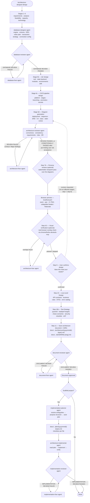

# architecture-designer

Guided architecture and infrastructure design workflow for Claude Code — from requirements gathering to code
implementation, with interactive Mermaid diagrams, browser preview, and structured documentation.

## Skills

### `/architecture-designer:design`

Runs the full design process — six requirements/design stages followed by review, preview, and low-level design steps —
highlights below:

- **Stage 1 — Requirements gathering** — application goals, stakeholders, business processes, success criteria
- **Stage 2 — Requirements analysis** — functional vs non-functional requirements (performance, security, scalability,
  availability), formalized into testable Quality Attribute Scenarios (source, stimulus, environment, artifact,
  response, response measure) per `quality-driven-design-guide.md`; closes with a domain edge-case elicitation pass
  (`domain-edge-cases-guide.md`) that matches stated features against common domain categories (auth, payments,
  inventory/fulfillment, scheduling, messaging, multi-tenancy, file upload, search) and asks targeted follow-up
  questions for whichever actually apply — a deliberate mitigation for the fact that a syntactically-correct diagram can
  still miss a domain nuance nobody thought to mention
- **Stage 3 — Feasibility study and constraints** — budget, timeline, regulations, team competencies, legacy
  integrations
- **Stage 4 — Capacity planning** — users, TPS, data volume, peak load, growth projections
- **Stage 5 — Technology selection** — opens by selecting 3–6 ranked Architectural Drivers from the Quality Attribute
  Scenarios and stages 1–4 (per `quality-driven-design-guide.md`), then proposes architecture pattern (plus, once
  chosen, the applicable POSA architectural pattern (s) for each deployable unit's internal structure and inter-service
  communication — see `design-patterns-guide.md`), backend, frontend, database, infrastructure, supporting services,
  authentication approach, observability strategy, DR approach, error handling/resilience strategy (retry, circuit
  breaker, timeouts, graceful degradation), and rate-limiting strategy (algorithm, middleware library, enforcement
  layer, per-tier limits, distributed store if horizontally scaled); every choice justified against stages 1–4 and the
  driver ID (s) it satisfies; includes an ATAM-style Trade-off and Risk Analysis pass recording where drivers conflict
  and what risks the decisions carry, and a Cost Estimation pass producing a per-component monthly/annual infrastructure
  cost breakdown — WebSearch-verified against current cloud pricing when available, or labeled "estimate — verify at
  implementation time" otherwise, reconciled against Stage 3's budget (see `cost-estimation-guide.md`); optionally
  records which MCP servers/Skills available in the environment match the chosen stack, for use by downstream
  design-review and implementation sub-agents (see `agent-tools.md` below)
- **Stage 6 — Architecture and infrastructure design** — Domain-Driven Design bounded-context/aggregate modeling (see
  `ddd-guide.md`), database schema (ERD, index plan, engine selection, migration strategy, and — for any high-contention
  aggregate — an explicit isolation level/concurrency-control strategy per `transaction-guide.md`), IaC tool selection
  and module structure, CI/CD pipeline design (platform, stages, branching strategy, environment promotion — both
  skipped for a project with no deployment target at all, e.g. a library or CLI tool), and Mermaid diagrams rendered in
  the browser with zoom/pan/download — the Class Diagram gets a design-principle pass (SOLID, DRY, YAGNI, Tell Don't
  Ask, Hollywood Principle, Law of Demeter — see `design-principles-guide.md`) and a GoF-pattern pass (see
  `design-patterns-guide.md`) before it's finalized
- **Step 10 — Low-Level Design** — API contracts (per sequence diagram endpoint), business rules (pseudocode for
  non-trivial logic, checked against DRY/YAGNI/Tell-Don't-Ask per `design-principles-guide.md`, written as a testable
  functional core per `clean-code-guide.md`, and — for multi-write rules — an explicit transaction boundary or Saga per
  `transaction-guide.md`), DTOs, inter-service contracts (microservices/event-driven only), and error catalog (Steps 7–9
  in between run architecture review, browser preview, and user confirmation; an optional Step 7b offers additional
  Security-persona and/or Cost-persona review passes, informational only)
- **Step 10b — Test Strategy** — test pyramid (unit/integration/contract/end-to-end scope), load/performance testing
  targets derived from Stage 2's Quality Attribute Scenarios and Stage 4's capacity numbers plus a named tool per stack,
  resilience/chaos test scenarios per Stage 5's named resilience patterns, a security testing checklist derived from the
  LLD error catalog and rate-limiting rules, and a Given/When/Then UAT scenario per core feature (see
  `test-strategy-guide.md`)

Produced artifacts:

- Browser preview at `http://localhost:<port>` with zoomable, downloadable 2× resolution PNG diagrams
- Per-diagram collapsible **Details** and **Design Rationale** blocks in the preview
- ERD diagrams include an inline **Index Plan** table in the preview
- `docs/architecture-designer/architecture/{yyyymmdd}-{topic}.md` — complete, reviewed, and approved architecture
  document including IaC plan, CI/CD pipeline design, Cost Estimation, Test Strategy, and LLD sections
- `docs/architecture-designer/adr/{NNNN}-{slug}.md` — one Architecture Decision Record per significant Stage 5 decision
  or recorded trade-off, generated alongside the document and superseded (never edited in place) when a later revision
  changes that decision (see `adr-guide.md`)

### `/architecture-designer:review`

Reviews and revises an existing architecture:

- Document-based review (reads `docs/architecture-designer/architecture/`)
- Codebase-based review (scans project structure, reconstructs actual architecture)
- Drift detection (compares document against codebase)
- Revision flow with new versioned document, preserving full history

### `/architecture-designer:implement`

Turns an approved architecture document into a working project skeleton. Can be invoked standalone (after a design
session, or independently by picking a document from `docs/architecture-designer/architecture/`):

1. Locates the architecture document — from session context or lets you choose from saved documents
2. Scans the working directory for an existing project structure
3. Asks how to proceed: merge into existing code, fresh start, or work around a described layout
4. Spawns `implementation-planner` to propose a folder structure, wait for confirmation, and save an implementation plan
   to `docs/architecture-designer/plan/{yyyymmdd}-{topic}.md` — a markdown checklist of every file to be created,
   grouped by category (scaffolding, models, routes, config, infrastructure, scripts, tests). For a brand-new project on
   a stack with an official generator CLI (`cargo new`, `flutter create`, `go mod init`, `create-next-app`, etc. — see
   `scaffolding-guide.md` below), the plan leads with a Scaffolding step naming that exact command instead of listing
   the boilerplate it produces file-by-file. For large projects (more than 40 checklist items), the plan is split into a
   `{yyyymmdd}-{topic}-part{n}-of-{N}.md` sequence instead, each part linked to its neighbor via `Previous plan`/
   `Next plan` metadata rows
5. Spawns `architecture-implementer`, which reads the confirmed plan, runs the Scaffolding command first if present,
   then generates all remaining files, flipping each checkbox to `[x]` / `[~]` / `[ ] FAIL` immediately as that file is
   written and verified (write-through checkpointing, so the plan file stays an accurate resume point if the run is
   interrupted), then marks `Status: Complete` after a final verification pass

## Design workflow


```mermaid
flowchart TD
    A([/architecture-designer:design]) --> Stages["Stages 1–5<br/>requirements · analysis · feasibility · capacity · technology"]
    Stages --> DB["database-designer agent<br/>engine · schema · ERD · index plan · transaction strategy · connection config"]
    DB --> DBR{database-reviewer agent}
    DBR -->|DATABASE REVIEW FAILED| DBF[database-fixer agent]
    DBF --> DBR
    DBR -->|DATABASE REVIEW PASSED| IaC["Stage 6b — IaC design<br/>tool · state backend · modules · environments · drift"]
    IaC --> CICD["Stage 6c — CI/CD pipeline design<br/>platform · stages · branching · promotion · secrets"]
    CICD --> Diag["Stage 6d — Diagram generation<br/>deployment · sequence · ERD · C4 · class · state · CI/CD"]
    Diag --> AR["architecture-reviewer agent<br/>correctness · consistency · requirements · risks · DR"]
    AR -->|" REVIEW FAILED<br/>(Critical / Major findings) "| AF[architecture-fixer agent]
    AF --> AR
    AR -->|" REVIEW PASSED, or<br/>CONDITIONALLY PASSED after<br/>per-finding user risk acceptance "| Persona{"Step 7b — Persona reviews (optional)<br/>stakeholder-viewpoint pass over the diagrams"}
    Persona --> Preview["Browser preview — localhost:port<br/>zoom · pan · 2× PNG · collapsible Details / Rationale"]
    Preview --> Visual{"Step 8.5 — Visual verification (optional)<br/>real browser overlap check via chrome/firefox-devtools-mcp"}
    Visual -->|overlaps found| VF[architecture-fixer agent]
    VF --> Visual
    Visual -->|passed / skipped| Step9{"Step 9 — User confirms design<br/>'does this meet your needs?'"}
    Step9 -.->|" revision requested<br/>(re-run affected stages, step 7, step 8) "| Diag
    Step9 -->|confirmed| LLD["Step 10 — Low-Level Design<br/>API contracts · business rules · DTOs · error catalog"]
    LLD --> TestStrat["Step 10b — Test Strategy<br/>pyramid · load/perf targets · chaos scenarios · security checklist · UAT"]
    TestStrat --> Save["Step 11 — Save architecture document + ADRs<br/>docs/.../architecture/{yyyymmdd}-{topic}.md<br/>docs/.../adr/{NNNN}-{slug}.md"]
    Save --> DR{document-reviewer agent}
    DR -->|DOCUMENT REVIEW FAILED| DF[document-fixer agent]
    DF --> DR
    DR -->|DOCUMENT REVIEW PASSED| Approved([Document approved])
    Approved --> Scaffold{Scaffold project?}
    Scaffold -->|Yes| Plan["implementation-planner agent<br/>resolve ambiguities → propose structure → save plan"]
    Scaffold -->|No| Done([Done])
    Plan --> PlanFile["docs/.../plan/{yyyymmdd}-{topic}.md<br/>checkbox per file"]
    PlanFile --> Impl["architecture-implementer agent<br/>read plan → implement → verify"]
    Impl --> IR{implementation-reviewer agent}
    IR -->|IMPLEMENTATION REVIEW FAILED| IF[implementation-fixer agent]
    IF --> IR
    IR -->|IMPLEMENTATION REVIEW PASSED| Done
```

The `/architecture-designer:review` skill follows the same reviewer → fixer loop for any diagrams or database changes,
then saves a new versioned document through the same document-reviewer pass. Its codebase-based review path (option (b),
or (c) for a document/codebase drift comparison) delegates the actual scan to the `codebase-reconstructor` agent — an
exhaustive, checklist-driven reconstruction (project structure, every service/module, every dependency, every route,
database schema, infrastructure), the same reason every other analysis step in this pipeline runs as its own focused
sub-agent rather than inline in the orchestrating skill. Every review this skill completes — whether the user revises or
declines — is logged to `session.json`'s `reviewHistory` array and a saved report under
`docs/architecture-designer/review/`, so a later review surfaces "this was already found once" instead of rediscovering
the same drift from zero.

`/architecture-designer:implement` can be invoked standalone — it finds the architecture document, checks for an
existing project structure, delegates to `implementation-planner` to confirm the folder layout and save the plan, then
delegates to `architecture-implementer` to build it. `architecture-implementer` refuses to run without a confirmed plan
from `implementation-planner` — and a `PreToolUse` hook on the `Task` tool (see "Hooks" below) enforces this
mechanically, blocking the spawn outright if no plan file with `Status: In progress` exists on disk, rather than relying
solely on the agent's own prompt compliance.

## Sub-agents

Each reviewer has a paired fixer agent. When a reviewer returns findings, the skill spawns the fixer to apply targeted
corrections, then re-runs the reviewer. This loop repeats for up to 3 reviewer–fixer cycles; if the reviewer still
hasn't passed after the 3rd cycle, the loop stops and the remaining findings are presented to the user for guidance
rather than cycling further — no manual editing required for the common case, but not an unconditional guarantee.
Implementation follows a similar split, extended by one more stage: `implementation-planner` produces and confirms the
plan, `architecture-implementer` executes it — the implementer never runs without a plan the planner has already saved —
and then `implementation-reviewer` independently re-checks the generated code against the plan and document before the
calling skill's wrap-up step runs, cycling with `implementation-fixer` the same way the other three reviewer/fixer pairs
do (up to 3 cycles). This exists because `architecture-implementer`'s own self-check, however thorough, is still the
same agent grading its own work — an independent pass catches what self-review structurally misses, the same reason
every other artifact in this pipeline (diagrams, database schema, document) already gets one.

| Agent                                            | Role                                                                                                                                                                                                                                                                                                                                                                                                                                   |
|--------------------------------------------------|----------------------------------------------------------------------------------------------------------------------------------------------------------------------------------------------------------------------------------------------------------------------------------------------------------------------------------------------------------------------------------------------------------------------------------------|
| `architecture-designer:architecture-reviewer`    | Validates diagrams for technical correctness, cross-diagram consistency, requirements traceability (including architectural-driver citation spot-checks), risks (including a risk-register-to-diagram cross-check), observability, and DR; returns Critical / Major / Minor findings with REVIEW PASSED / CONDITIONALLY PASSED / FAILED verdict                                                                                        |
| `architecture-designer:architecture-fixer`       | Applies targeted fixes to Mermaid diagrams based on reviewer findings; updates `diagrams.json` in place and returns a fix log                                                                                                                                                                                                                                                                                                          |
| `architecture-designer:visual-diagram-verifier`  | Optional, best-effort (Step 8.5 / step 4d.3): opens the running browser preview via whichever of chrome-devtools-mcp / firefox-devtools-mcp is installed and checks whether diagrams actually render without overlapping elements — real rendered-geometry, not the syntax/heuristic checks `validate-diagrams.mjs` runs. Reports `SKIPPED` cleanly if neither plugin is installed rather than failing                                 |
| `architecture-designer:codebase-reconstructor`   | Exhaustively scans an existing codebase (`review/SKILL.md` Step 2b) — every workspace/package, service/module, direct dependency, route/entry point, database entity, and infrastructure/CI file — and returns a structured Reconstructed Architecture Summary with explicit Ambiguities and Unclassified-files sections; read-only                                                                                                    |
| `architecture-designer:database-designer`        | Designs schema, ERD, index plan, engine selection, transaction/concurrency-control strategy for high-contention entities, secure connection config, and migration strategy for SQL and NoSQL; applies soft-delete, (when a domain model exists) DDD aggregate-boundary grouping, and (when decentralized/offline-first) Web3/offline-sync schema patterns where required                                                               |
| `architecture-designer:database-reviewer`        | Audits database design: engine fit, schema/3NF, ERD accuracy, index completeness, security config, soft-delete correctness, migration strategy, (when a domain model exists) aggregate-boundary correctness, and (when decentralized/offline-first) Web3/offline-sync data-modeling checks; returns DATABASE REVIEW PASSED / FAILED                                                                                                    |
| `architecture-designer:database-fixer`           | Corrects schema, ERD, index plan, transaction/concurrency strategy, and connection config; writes the corrected ERD and `indexPlan` directly into `diagrams.json` (same pattern as `architecture-fixer`), and returns the corrected schema, ERD, index plan, transaction/concurrency strategy, and connection config for document embedding                                                                                            |
| `architecture-designer:document-reviewer`        | Audits saved documents for format compliance (F1–F7) and content completeness (C1–C19, including core features, IaC, CI/CD, decentralized-architecture, offline-first, domain-model, trade-off/risk-analysis, cost-estimation, test-strategy, and ADR-pointer sections); returns DOCUMENT REVIEW PASSED / FAILED                                                                                                                       |
| `architecture-designer:document-fixer`           | Fixes specific format and content failures in the document based on reviewer findings; overwrites the draft in place                                                                                                                                                                                                                                                                                                                   |
| `architecture-designer:implementation-planner`   | Resolves implementation ambiguities, checks for a matching official project generator, proposes a folder structure, waits for confirmation, and saves the implementation plan; does not write application code or run the generator itself                                                                                                                                                                                             |
| `architecture-designer:architecture-implementer` | Reads the confirmed implementation plan and the approved document, runs the plan's Scaffolding command first when present, then implements the remaining project skeleton, data models, routes, and infrastructure files; checkpoints each item's checkbox in the plan immediately as it's completed (write-through), and auto-detects/rewrites files left behind by an interrupted prior run; refuses to run without a confirmed plan |
| `architecture-designer:implementation-reviewer`  | Independently re-verifies the generated code against the plan and document once `architecture-implementer` reports completion — plan-checklist accuracy, ERD/route conformance, requirements coverage, technology substitution, resilience/rate-limiting/transaction/pattern wiring, hardcoded secrets, Web3 markers, and agent-tools usage-log honesty; returns IMPLEMENTATION REVIEW PASSED / FAILED; read-only                      |
| `architecture-designer:implementation-fixer`     | Applies targeted corrections to generated code based on `implementation-reviewer` findings; for a genuinely uncovered requirement, appends a new checklist item to the plan marked done rather than leaving it unrecorded; briefly re-arms the plan's `Status: In progress` (and the deploy-command hook it gates) for the duration of its own write pass                                                                              |

## Scripts

`preview-server.mjs` and `validate-diagrams.mjs` are Node.js ESM (`.mjs`), since both depend on npm packages (Mermaid
parsers, the ELK layout engine); `validate-session.py`, `find-port.py`, and `hash-file.py` are standalone Python 3
scripts (stdlib only, no dependencies) invoked with `python3` — none of the three need a Node.js runtime at all. They
run identically on Windows, macOS, and Linux, given both a Node.js and a Python 3 runtime on `PATH`. The preview server
loads Mermaid v11 and the ELK layout engine from CDN — an internet connection is required while the browser preview is
open.

`validate-diagrams.mjs` uses a two-tier strategy: the `mermaid` package (Jison parsers) for legacy types (flowchart,
ERD, sequence, C4Context, C4Container, class, state/stateDiagram-v2, plus graph/gantt/pie/gitGraph/mindmap/timeline/
quadrantChart/xychart-beta, all of which this plugin's diagram-type table doesn't use but the parser still covers) and
`@mermaid-js/parser` for new types (architecture-beta). If packages are missing it degrades gracefully to heuristics
rather than crashing. Run `npm install` once in the `scripts/` directory before first use:

```bash
# Install validation dependency (once)
cd scripts && npm install

# Validate diagrams.json syntax before opening the preview (exits 0/1)
node scripts/validate-diagrams.mjs

# Check that session.json's required fields (schemaVersion, project, description)
# and stages 1-5 are complete before Stage 6, then validate the whole file's
# structure against scripts/session-schema.json (exits 0/1) and print any
# referential-integrity warnings (non-blocking)
python3 scripts/validate-session.py

# Find a free port in 3000–9000
python3 scripts/find-port.py

# Start the preview server (opens browser automatically)
node scripts/preview-server.mjs <port>

# Print the sha256 hex digest of a file (used to detect a stale reviewer verdict on resume)
python3 scripts/hash-file.py docs/architecture-designer/diagrams.json
```

The preview server reads `docs/architecture-designer/diagrams.json` on every request — reload the page to see diagram
updates without restarting the server.

`validate-diagrams.mjs` catches real Mermaid syntax errors using the mermaid package for legacy types and
`@mermaid-js/parser` for new types, plus field-level checks that don't depend on either parser: every entry needs a
non-blank `description`, `details`, and `rationale` (diagrams-guide.md's schema defines these as required content, not
optional the way `indexPlan` explicitly is — the browser preview otherwise just silently renders an empty section with
no error). Diagrams validated only by heuristics (when parsers are unavailable) are marked
`✓ (heuristics only)` in the output. The design skill runs it before launching the preview, and a `PostToolUse` hook
(see "Hooks" below) also runs it automatically the moment `diagrams.json` is written or edited by any skill or agent —
so a Mermaid syntax error surfaces immediately, not only at the next skill-level gate. `validate-session.py` is run
automatically at the start of Stage 6 to confirm all requirement stages are on disk before sub-agents are spawned, and
the same `PostToolUse` hook runs it automatically on every write/edit to `session.json`. The review and implement skills
also run it as a hard gate whenever `session.json` exists — a failed check blocks progression until the missing
fields/stages are completed, or the structural violation printed is fixed (a missing `session.json` entirely is
unaffected, since both skills can still work from the document or codebase alone).

`validate-session.py` checks three layers: field/stage completeness (recursively — a stage object holding only an empty
string fails, not just a missing/absent one), the file's structure against `scripts/session-schema.json` (a JSON Schema
for the fixed-shape parts of `session.json` — the `documents`/`remediationPlans`/`implementationPlans`
array-of-objects-or-legacy-string shape, the `split` object, `agentTools[].type`'s enum), and referential integrity —
printed as non-blocking warnings, since some links are legitimately still pending at the moment the gate runs — covering
two independent link families: `documents`/`remediationPlans`/`implementationPlans`' own link fields (`document`,
`remediationPlan`, `supersedes`, `split.previousPlan`/`nextPlan`), and the ADD/ATAM/DDD keys' cross-references
(`stage5.tradeoffAnalysis[].driversInTension`/`.relatedRisks`, `riskRegister[].relatedDriver`,
`architecturalDrivers[].source`, `domainModel.relationships[].from`/`.to`) resolving to a real id/name elsewhere in the
file, plus duplicate-id detection within `architecturalDrivers`/`riskRegister`/`stage5.tradeoffAnalysis`/
`stage2.qualityAttributeScenarios`. Only the first two layers affect the exit code. A leading UTF-8 BOM is stripped
before parsing (same normalization `validate-diagrams.mjs` applies per-diagram). It remains a standalone, stdlib-only
script — no `jsonschema` package or other dependency — applying a small purpose-built subset of JSON Schema (`type`/
`properties`/`required`/`items`/`oneOf`/`enum`/`minimum`) rather than a general-purpose validator.

## Hooks

`hooks/hooks.json` registers seven hooks. Six are command hooks — deterministic, no model judgment involved; one is a
prompt hook — best-effort, LLM-driven:

| Event              | Matcher              | Script                                   | Enforces                                                                                                                                                                                                                                                                                                                                                                                                                                                                                                                                                                                                                           |
|--------------------|----------------------|------------------------------------------|------------------------------------------------------------------------------------------------------------------------------------------------------------------------------------------------------------------------------------------------------------------------------------------------------------------------------------------------------------------------------------------------------------------------------------------------------------------------------------------------------------------------------------------------------------------------------------------------------------------------------------|
| `SessionStart`     | `resume`             | `hooks/resume-context.sh`                | On every conversation resume, checks `docs/architecture-designer/session.json`'s `progress.lastCompletedStep`. If it names a step before `step13` (mid Stage 6a–Step 13, not yet at its natural end), injects `additionalContext` naming the exact step and owning skill (`design`/`review`) — so a half-finished pipeline surfaces even if the resumed conversation never re-invokes the skill explicitly and just continues with unrelated chat. Silent (`exit 0`, no output) when no session exists, no `progress` key exists, or `lastCompletedStep` is already `step13`.                                                      |
| `UserPromptSubmit` | `*`                  | `hooks/checkpoint-reminder.sh`           | On every user turn, runs the same `progress.lastCompletedStep` check as `resume-context.sh` and, only while it's genuinely mid Stage 6a–Step 13, injects a short `additionalContext` reminder to keep checkpointing `session.json`'s `progress`/`lld`/`pending` keys and `last-review.md` incrementally. This is a real disk check gating a command hook, not an LLM guessing whether to fire, so it stays silent on every prompt unrelated to an active pipeline (including every project not using this plugin at all). Documented as more reliable than `PreCompact` for this purpose — see "Mid-workflow persistence" below.   |
| `PreToolUse`       | `Task`               | `hooks/check-implementer-plan.sh`        | Blocks (`exit 2`) any `Task` call spawning `architecture-implementer` unless a plan file under `docs/architecture-designer/plan/` actually has `Status: In progress` on disk. The spawning prompt is required to name the specific plan file being implemented; that exact file's `Status` row is checked. If no plan path can be extracted from the prompt, the call is blocked outright — there is no fallback to "any `In progress` plan file in the directory," since that could pass the gate against an unrelated plan's state.                                                                                              |
| `PreToolUse`       | `Bash`               | `hooks/check-deploy-command.sh`          | Blocks (`exit 2`) a `Bash` command that looks like a chain deploy or transaction broadcast (Hardhat/Truffle/Foundry/Anchor/Solana/Near/Aptos/Sui/MultiversX/CosmWasm/Starknet/Stellar-Soroban CLIs, a `scripts/deploy/*` invocation, or an npm/yarn/pnpm `deploy` script) while any plan file under `docs/architecture-designer/plan/` reads `Status: In progress` — the mechanical backstop for architecture-implementer's own "Web3 no-execute rule". Fast-path exits `0` immediately for the overwhelming majority of commands that don't match any deploy pattern, before ever touching disk. See the note below on its scope. |
| `PostToolUse`      | `Write\|Edit`        | `hooks/validate-on-write.sh`             | Runs `validate-diagrams.mjs` on every write/edit to `docs/architecture-designer/diagrams.json`, and `validate-session.py` on every write/edit to `docs/architecture-designer/session.json`. A nonzero exit feeds the validator's stderr straight back into the model's context (`exit 2`), so a Mermaid syntax error or a broken `session.json` structure is caught the moment it's written — not deferred to the next skill-level gate. No-ops for any other file.                                                                                                                                                                |
| `SubagentStop`     | `*` (see note below) | `hooks/verify-implementer-completion.sh` | Before letting a subagent stop, greps its own transcript for any `docs/architecture-designer/plan/*.md` path it touched. If that plan's `Status` row currently reads `Complete` on disk, re-verifies every `- [x]` item's file actually exists (skipping the "Setup and run commands" section, whose entries are npm script names) and that no plain unresolved `- [ ]` item (one without `FAIL`) was left unaccounted for. A mismatch blocks the stop (`exit 2`) with the specific discrepancies, instead of trusting architecture-implementer's self-reported `Status: Complete` at face value.                                  |
| `PreCompact`       | `*`                  | prompt-based                             | Reminds Claude to persist mid-workflow state before compaction discards conversation-only context. Kept as a secondary layer alongside `checkpoint-reminder.sh` — see "Mid-workflow persistence" below for why it's no longer the primary mechanism.                                                                                                                                                                                                                                                                                                                                                                               |

**Note on `SubagentStop`'s matcher**: unlike `PreToolUse`'s `Task` matcher (a real tool-name match, with `subagent_type`
then read from `tool_input` inside the script), there is no confirmed subagent-type field on the `SubagentStop` event to
matcher against directly — so the config-level matcher stays `*` and `verify-implementer-completion.sh` does the actual
targeting itself: only a plan file whose on-disk `Status` currently reads `Complete` is re-verified. Two agents can
write that value — `architecture-implementer`'s own verification pass, and `implementation-fixer`'s final step after its
own corrections are confirmed (`implementation-planner` always saves `Status: In progress`; `implementation-reviewer`
is read-only and never touches a plan file; every other agent never touches a plan file at all). This makes the script
self-limiting to the completion claims worth re-checking, without depending on a platform capability that isn't
confirmed to exist for this event — and it re-verifies `implementation-fixer`'s claim exactly the same way it already
re-verifies `architecture-implementer`'s, with no script change needed for the new agent.

**Note on `check-deploy-command.sh`'s scope**: it gates on disk state (any plan reading `Status: In progress`), not on
"is architecture-implementer specifically the caller right now" — there is no reliable way to attribute a top-level
`Bash` call to a specific in-flight subagent. This is deliberately cautious given the domain (a wrong deploy can mean
irreversible fund loss), but it means a stale, never-resumed `In progress` plan from an unrelated crashed run can also
block an unrelated, fully legitimate deploy later — resolve by finishing or superseding that plan (see "Resuming
implementation plans" below) if it ever blocks something it shouldn't. Pattern coverage is a heuristic across the more
common chain toolchains, not an exhaustive list of every deploy mechanism across every ecosystem. By the time
`architecture-implementer` reports `Status: Complete`, this hook goes inert for that plan — `implementation-fixer`
deliberately flips `Status` back to `In progress` for the duration of its own fix pass specifically to keep this hook
armed while it may be running `Bash`, then back to `Complete` once its fixes are confirmed (see
`agents/implementation-fixer.md`).

The six command hooks close a gap the skill/agent instructions alone couldn't: instructions describe what *should*
happen ("architecture-implementer refuses to run without a confirmed plan", "this agent never executes a deploy",
"validation is run automatically before preview", "an unfinished session gets picked back up", "here's what I built"),
but a model that skips or misreads its own instructions, self-reports a completion that doesn't match disk, or a resumed
conversation that never re-invokes the skill at all, can still fall through. Each hook makes its rule mechanical — a
`Task` call, a `Bash` command, a file write, a subagent stop, a session resume, or a new user turn either passes a real
disk check or triggers a deterministic, narrowly-gated response, independent of whether the calling skill or agent
remembered to do it itself. The `PreCompact` hook stays prompt-based, since there's no tool call or on-disk state to
check for "context is about to be compacted" — it's an LLM judgment call by nature.

All six command hooks require `jq` on `PATH` (to parse the hook's JSON stdin, and in `resume-context.sh`/
`checkpoint-reminder.sh`'s case, to also build the JSON `additionalContext` output). `validate-on-write.sh` additionally
needs the Node.js/Python 3 runtimes `validate-diagrams.mjs`/`validate-session.py` themselves need, since it invokes
those two scripts directly — see "Scripts" above; the other five hooks (`check-deploy-command.sh`,
`checkpoint-reminder.sh`, `check-implementer-plan.sh`, `resume-context.sh`, `verify-implementer-completion.sh`) need
only `jq` and `bash`. Every command hook degrades to a silent no-op (`exit 0`) rather than failing when a required
runtime or `session.json` is entirely missing, so a project not using this plugin's workflow — or missing `jq`/`node`/
`python3` — never sees spurious output or a blocked tool call from it for that reason. This does not extend to a
*referenced* plan file being missing or stale while
`session.json`/`jq` are present: `check-implementer-plan.sh` deliberately blocks (`exit 2`) when the plan it's told to
check doesn't exist or isn't `In progress`, and `check-deploy-command.sh` can likewise block an unrelated, legitimate
deploy if a stale `In progress` plan from an abandoned run is still on disk (see that hook's note below) — both are
working as designed, not degrading.

## `diagrams.json` schema

```json
{
  "title": "Project Title",
  "generatedAt": "2026-07-06T10:00:00.000Z",
  "diagrams": [
    {
      "id": "erd",
      "title": "Entity Relationship Diagram",
      "description": "One-sentence summary shown above the diagram.",
      "details": "Multi-paragraph explanation (paragraphs separated by \\n\\n). Rendered as a collapsible block.",
      "rationale": "Why this diagram type was chosen and what design decisions it encodes. Collapsible block.",
      "indexPlan": [
        {
          "name": "idx_users_email",
          "table": "users",
          "columns": "email",
          "type": "UNIQUE B-TREE",
          "reason": "Login lookup"
        }
      ],
      "code": "erDiagram\n  USERS { uuid id PK }\n..."
    }
  ]
}
```

`indexPlan` is optional and only used for `erDiagram` entries — it renders as an inline index plan table below the ERD.
Every row must be an index (five keys: `name`, `table`, `columns`, `type`, `reason`) — `validate-diagrams.mjs` rejects
rows that aren't. See `skills/design/references/diagrams-guide.md` for the field guide, including the deprecated
`companionTable` legacy key.

## `session.json` schema

`docs/architecture-designer/session.json` is the requirements-and-history file every skill and agent reads and writes
throughout a project's lifetime. It holds the confirmed answers from Stages 1–6c (`stage1`–`stage6c`, including an
optional `stage2.domainEdgeCases` list from the Stage 2 domain edge-case elicitation pass — see
`skills/design/references/domain-edge-cases-guide.md`), an optional `agentTools` list, an optional
`architecturalDrivers`
list and `riskRegister` list (the Stage 5 ADD/ATAM Architectural Driver selection and Trade-off/Risk Analysis pass — see
`skills/design/references/quality-driven-design-guide.md`), an optional `domainModel` object (bounded contexts and
aggregates from Stage 6a's Domain-Driven Design pass — see
`skills/design/references/ddd-guide.md`), an optional `web3` object (the Web3/decentralized track's confirmed dimension
answers — see `skills/design/references/web3-guide.md` — present only when the application is decentralized), an
optional `offlineFirst` object (the offline-first track's confirmed local-storage, sync-architecture, and
conflict-resolution answers — see `skills/design/references/offline-first-guide.md` — present only when the application
must work offline), and three history arrays: `documents` (every saved architecture document, oldest first),
`remediationPlans` (every saved remediation plan from a review session), and `implementationPlans` (every saved
implementation plan). Each array entry is an object — `{ path, createdAt }` for documents, plus `document`/
`remediationPlan`/`supersedes` link fields on the plan arrays that tie a plan back to the document it targets, the
remediation plan it consumed, and (if it replaced an earlier plan) the plan it superseded. Files written before this
schema (v1) may still have plain path strings instead of objects; every reader treats a bare string as
`{ path: <string>, ...other fields: null }` rather than failing.

`agentTools` is optional and, unlike the history arrays above, is overwritten in full at each Stage 5 confirmation
rather than appended to. It records MCP servers or Skills actually available in the current environment that match the
confirmed stack — e.g. a Go language-server MCP for a Go backend — as `{ name, type, purpose }` entries, passed to every
sub-agent spawn per `session-schema.md`'s scope rule; `architecture-implementer`, `database-designer`,
`database-fixer`, `architecture-fixer`, and `database-reviewer` must actually invoke a matching entry rather than merely
receiving it, `architecture-reviewer` has the same obligation conditionally (only for a matched Web3-network entry, to
verify a suspicious network fact), while `implementation-planner`, `document-reviewer`, and `document-fixer` receive it
for context only — see `agent-tools.md`'s "How downstream consumers use it" for which is which. Selection rules and the
category-to-tool mapping live in `skills/design/references/agent-tools.md`. An absent or empty list is the normal case
and never blocks any step.

`pending`, `progress`, `lld`, and `testStrategy` checkpoint everything between Stage 1 and Step 13 so a session that
dies or gets compacted mid-workflow doesn't lose the expensive parts — see "Mid-workflow persistence" below. An optional
`adrs` array records every generated Architecture Decision Record (one file per significant Stage 5 decision or
trade-off — see `adr-guide.md`), appended alongside `documents` at Step 11/step 4f.

Full schema, the single-writer-per-key rule (each key has exactly one skill/agent that may mutate it, with seventeen
exceptions: `documents` and `adrs` are append-only, legitimately appended to by both `design` and `review` since neither
ever touches the other's entries; `web3`, `offlineFirst`, `stage6b`, `stage6c`, `progress`, `pending`,
`architecturalDrivers`, `riskRegister`, `domainModel`, `stage2.qualityAttributeScenarios`, `stage5.tradeoffAnalysis`,
`stage5.costEstimate`, `lld`, `testStrategy`, and `stage2.domainEdgeCases` each have one authorized second writer —
`review` overwrites them (in full, or field-by-field/group-by-group for `progress`/`lld`/`testStrategy`, or by appending
a newly-matched category's answers for `stage2.domainEdgeCases`) on a revision that changes decentralization status,
offline-first status, infrastructure provider, IaC tool, CI/CD platform, an NFR, a technology decision/ requirement
tension, a capacity number/cost-affecting decision, a bounded-context/aggregate-boundary change, an API
contract/business rule/DTO/inter-service contract/error condition, a test-affecting change, a newly-matched domain
edge-case category, or that resumes/gathers a mid-pipeline step — safe because `design` and `review` never run
concurrently within one conversation, not because they're append-only), and the no-CAS read-fresh-modify-write-whole
discipline (a usage invariant assuming one session at a time against a given project directory, not something the plugin
mechanically enforces) are documented in
`skills/design/references/session-schema.md`.

## Mid-workflow persistence

Stage 1–6c answers were always checkpointed to `session.json` after each stage's confirmation, but everything from Stage
6a (database review) through Step 13 (implementation offer) used to live only in conversation context until the document
was saved — a session that died anywhere in that window lost reviewer verdicts, the reviewer–fixer cycle count, and the
entire five-group Low-Level Design. Three additions close that gap:

- **`session.json`'s `progress` key** tracks an `owner` (`design` or `review` — whichever skill's pipeline pass this
  snapshot belongs to, so a resuming skill doesn't mistake the other skill's in-flight state for its own),
  `lastCompletedStep` (one shared vocabulary across `design` and `review`, from `step6a` through `step13`), and, per
  reviewer type (`database`/`architecture`/`document`), the last verdict and cycle count. For `architecture`/`document`,
  it also stores a hash of the artifact that verdict was recorded against — on resume, the hash is recomputed
  (`python3 scripts/hash-file.py <path>`) and compared, and a mismatch means the artifact changed since, treating that
  verdict as stale rather than trusted. `database` is the exception: since neither `diagrams.json` nor the document
  exists yet when Stage 6a runs, its entry holds the actual approved schema/ERD/index plan/transaction-and-concurrency-
  strategy/connection-config text directly (`approvedOutput`) instead of a hash of an external file — durable and
  unambiguous rather than resting on a moving target.
- **`session.json`'s `lld` key** persists each of Step 10's five Low-Level Design artifact groups as soon as it's
  confirmed, not batched until the document is saved — a `confirmedGroups` list lets a resumed session skip straight to
  the next unconfirmed group.
- **`session.json`'s `testStrategy` key** persists Step 10b's confirmed test plan (pyramid, load/perf targets, chaos
  scenarios, security checklist, UAT) as soon as it's confirmed, the same way `lld` persists Step 10's output.
- **`session.json`'s `pending` key** checkpoints partial answers within whatever stage/step is currently being gathered,
  deleted once that stage's real key is confirmed — so a session that dies mid-question doesn't lose everything answered
  so far in that stage.
- **`docs/architecture-designer/last-review.md`** holds the most recent unresolved reviewer report (whichever
  reviewer–fixer cycle hasn't yet passed), overwritten each cycle iteration, so a fixer cycle can resume across a dead
  session without re-spawning the reviewer from scratch.
- **`diagrams.json`** is now written incrementally — one diagram at a time as each is generated/updated — rather than as
  a single batch write at the end of diagram generation.

Full mechanics (the `lastCompletedStep` label table, hash-invalidation rule, and resume procedure) are in
`skills/design/references/session-schema.md` sections "Recording `progress.lastCompletedStep`" and "Resuming Steps 6a–13
via `progress`".

**Checkpoint backstop**: the checkpoints above are already written incrementally throughout the workflow regardless of
any hook — three hooks exist for the ways that discipline can still be undermined from outside the skill's own control.
`hooks/checkpoint-reminder.sh` is the primary backstop, chosen because its event is more reliable than `PreCompact` for
this purpose. `hooks/hooks.json`'s prompt-based `PreCompact` hook remains only as a secondary layer, for the one moment
`UserPromptSubmit` can't cover: compaction happening mid-turn, before the next user prompt arrives.
`hooks/resume-context.sh` covers a different gap than persistence — a resumed conversation that never re-invokes
`/architecture-designer:design`/`review`/`implement` would otherwise drift into unrelated chat without anyone noticing a
pipeline is sitting unfinished. See "Hooks" above for what each of these actually does mechanically and why.

## Resuming implementation plans

Implementation plans are checklists, not one-shot scripts — a run can be interrupted, or finish with some files marked
`[ ] FAIL: {reason}`. Every time `/architecture-designer:design`, `/architecture-designer:review`, or
`/architecture-designer:implement` is about to spawn `implementation-planner` for a document, it first checks whether an
earlier plan for that same document is still actionable (`Status: In progress`, or `Status: Complete` with at least one
`[ ] FAIL` item — `architecture-implementer` always finalizes a run as `Complete` even when some files failed). If one
is found, you're offered the choice to resume it or start fresh.

Resuming carries the old plan's state forward: completed files become `[~]` (skip, already built — verified against disk
before trusting it), pending files stay `[ ]`, and failed files stay `[ ]` with the failure reason embedded so the retry
has context. The new plan supersedes the old one — the old plan file's `Status` is updated to
`Superseded by {new plan path}` so it's never offered again. If the underlying architecture document itself gets revised
in the meantime, any plan still tied to the prior revision is surfaced separately as an orphaned plan you can mark
superseded manually, rather than being silently forgotten.

**Write-through checkpointing**: `architecture-implementer` flips a file's checkbox to `[x]` (or `[ ] FAIL: {reason}`)
in the plan immediately after writing and verifying it, rather than batching all updates until the run finishes — the
plan file is a write-ahead log, accurate at every point in the run, not just at the end. Each checkbox flip also updates
two metadata-table rows, `Last updated` and `Last verified item`, so opening the plan mid-run shows exactly how far it
got and how recently. `Status` itself still only flips to `Complete` at the very end, after a final verification pass
re-confirms everything — and the `SubagentStop` hook `hooks/verify-implementer-completion.sh` (see "Hooks" above)
independently re-runs that same existence check against disk before the subagent is allowed to stop, rather than
trusting the self-reported `Status: Complete` unconditionally.

**Interrupted-run detection**: because a checkbox and its file are written together, a plain `[ ]` item whose file
already exists on disk is a specific, narrow signal — a crash between the file write and the checkbox flip, not a real
collision. `architecture-implementer`'s own Step 1 detects this and rewrites the file automatically, no confirmation
prompt. When resuming through `implementation-planner` instead, its Step 2 carry-over tags the same case with
`— interrupted run left this file partially written, will be rewritten` and excludes it from Step 3's
overwrite/skip/decide-one-by-one collision prompt — so a crashed implementer run is never mistaken for a foreign file
the user needs to arbitrate.

A remediation plan (`docs/architecture-designer/plan/{yyyymmdd}-{topic}-remediation.md`, produced by
`/architecture-designer:review` step 4e — format documented in `skills/design/references/remediation-plan-guide.md`) can
be resumed the same way, and can be in play at the same time as a resumed implementation plan; `implementation-planner`
reconciles the two if they both touch the same file.

**Split plans for large projects**: once a plan's checklist exceeds 40 items (files plus setup/run commands),
`implementation-planner` saves it as a sequence of parts instead of one file (`{yyyymmdd}-{topic}-part1-of-3.md`,
`-part2-of-3.md`, ...), each with `Split` / `Previous plan` / `Next plan` metadata-table rows, targeting 25 items per
part. For stacks with heavier per-file boilerplate (e.g. Java/Spring, NestJS), `implementation-planner` may lower both
thresholds — e.g. 25/15 — so each part, and thus each crash's worst-case loss, stays smaller. The calling skill spawns
`architecture-implementer` once per part, in order, using each part's `Next plan` row to find the next file until the
final part reports `None — final part`.

## Document format

Architecture documents are saved to:

```
docs/architecture-designer/architecture/{yyyymmdd}-{topic}.md
```

`{yyyymmdd}` is the ISO-ordered date — year, then month, then day (e.g., `20260705` for 5 July 2026). This order ensures
files sort chronologically when listed alphabetically.

Every document begins with a metadata table:

| Date        | Version | Status   | Reason | Previous Document |
|-------------|---------|----------|--------|-------------------|
| 05-Jul-2026 | 1.0     | Approved | -      | -                 |

Revisions create new files (never overwrite), with `Version` incremented, `Reason` filled, and `Previous Document`
pointing to the revised file.

Architecture Decision Records are saved alongside, one file per significant Stage 5 decision or trade-off:

```
docs/architecture-designer/adr/{NNNN}-{slug}.md
```

`{NNNN}` is a 4-digit sequence number unique for the project's lifetime (not reset per document revision). Like
architecture documents, an ADR is never edited in place — a revision that changes a decision writes a new ADR whose
`Supersedes` row points at the old one, and makes a single terminal edit to the old file's `Status` row
(`Superseded by ADR-{NNNN}`). See `adr-guide.md` for the full template and which decisions qualify.

## Diagram types

This table is a pointer, not a second copy — `skills/design/references/diagrams-guide.md`'s per-type "When to create"
section is the authoritative wording; keep this table in sync with it and with `skills/design/SKILL.md`'s own quick
index rather than letting the two drift.

| Diagram          | Mermaid type                          | Create when                                  |
|------------------|---------------------------------------|----------------------------------------------|
| Use case         | `flowchart LR`                        | 2+ user roles with distinct feature sets     |
| Business process | `flowchart TD`                        | Complex workflow with 2+ decision branches   |
| ERD              | `erDiagram`                           | Any SQL database — always                    |
| Sequence         | `sequenceDiagram`                     | Always: auth flow + one per core feature     |
| Class            | `classDiagram`                        | Non-trivial domain model with business rules |
| Context Map      | `flowchart LR`                        | 2+ bounded contexts in the domain model      |
| State            | `stateDiagram-v2`                     | Any entity with 3+ lifecycle states          |
| C4 Context       | `C4Context`                           | Any external integration or 2+ user types    |
| C4 Container     | `C4Container`                         | 2+ deployable components                     |
| Deployment       | `flowchart TD` or `architecture-beta` | Cloud or multi-server deployment             |
| CI/CD pipeline   | `flowchart TD`                        | 2+ deployment environments or staged release |

All diagrams support zoom in/out/reset (mouse wheel, pinch, buttons) and 2× resolution PNG download.

## Reference files

Detailed, less-frequently-needed content lives under `skills/design/references/` rather than inline in the skill files,
and is loaded only when a step needs it:

| File                             | Covers                                                                                                                                                                                                                                                                                                                                                                                                                                                                                   |
|----------------------------------|------------------------------------------------------------------------------------------------------------------------------------------------------------------------------------------------------------------------------------------------------------------------------------------------------------------------------------------------------------------------------------------------------------------------------------------------------------------------------------------|
| `session-schema.md`              | Full `session.json` schema, array-of-objects shape, single-writer rule, resumable-plan and orphaned-plan detection procedures, plus the session-completeness gate and Proposed-Additions rejection handling shared by all three skills                                                                                                                                                                                                                                                   |
| `diagrams-guide.md`              | `diagrams.json` schema, Mermaid v11.16 compatibility rules, node-overlap prevention rules, per-diagram-type templates                                                                                                                                                                                                                                                                                                                                                                    |
| `document-template.md`           | The 11-section architecture document body template (Step 11) — including a Core Features section linking each core feature to its dedicated sequence diagram — plus an optional 12th decentralized-architecture section, an optional 13th offline-first-considerations section, required 14th (Domain Model) and 15th (Trade-off and Risk Analysis) sections, and required 16th (Cost Estimation), 17th (Test Strategy), and 18th (Architecture Decision Records pointer table) sections |
| `document-review-checklist.md`   | The F1–F7 / C1–C19 document review item catalog and literal formats shared by `document-reviewer` and `document-fixer`                                                                                                                                                                                                                                                                                                                                                                   |
| `cost-estimation-guide.md`       | Per-component monthly/annual infrastructure cost breakdown methodology (Stage 5) — WebSearch-verified cloud pricing when available, "estimate — verify at implementation time" labeling otherwise, scale-sensitivity notes, and budget reconciliation against Stage 3                                                                                                                                                                                                                    |
| `adr-guide.md`                   | Architecture Decision Record generation (Step 11) — which Stage 5 decisions and trade-offs qualify, the Nygard-style ADR template with driver-ID traceability, file naming/numbering, and the supersede-don't-edit revision procedure                                                                                                                                                                                                                                                    |
| `test-strategy-guide.md`         | Test plan derivation (Step 10b) — test pyramid, load/performance targets from Quality Attribute Scenarios and capacity numbers, resilience/chaos scenarios from named Stage 5 patterns, a security testing checklist, and a UAT scenario per core feature                                                                                                                                                                                                                                |
| `remediation-plan-guide.md`      | The remediation plan markdown format and checkbox/suffix conventions                                                                                                                                                                                                                                                                                                                                                                                                                     |
| `discovery-questions.md`         | The full Stage 1–4 requirements-gathering question banks                                                                                                                                                                                                                                                                                                                                                                                                                                 |
| `domain-edge-cases-guide.md`     | Domain edge-case elicitation (end of Stage 2) — a catalog of common domain categories (auth, payments, inventory/fulfillment, scheduling, messaging, multi-tenancy, file upload, search), each with a signal to match against and targeted follow-up questions, mitigating the gap between "syntactically correct" and "captures the domain nuance nobody mentioned"                                                                                                                     |
| `tech-stacks.md`                 | Concrete technology stack recommendations by architecture pattern and scale, including licensing/maintenance-status caveats where a previously-open or previously-recommended option has since been relicensed or deprecated (e.g. CockroachDB's 2024 move off open source, Grafana OnCall's 2026 archival)                                                                                                                                                                              |
| `quality-driven-design-guide.md` | Quality Attribute Scenario format (Stage 2), Architectural Driver selection (Stage 5), and ATAM-style Trade-off and Risk Analysis (Stage 5) — the SEI ADD/ATAM practices behind the `architecturalDrivers`/`riskRegister`/`stage5.tradeoffAnalysis` keys                                                                                                                                                                                                                                 |
| `revision-triggers.md`           | The canonical "if X changed, re-run Y" trigger table shared by `design/SKILL.md` Step 9 and `review/SKILL.md` steps 4a/4b — one shared source instead of two independently-maintained copies of the same revision logic                                                                                                                                                                                                                                                                  |
| `critical-thinking-guide.md`     | A six-step reasoning loop (real problem, real constraints, a genuine second option, a stress-test, the rejected alternative, a revisit trigger) applied at Stage 5 (technology/architecture choices) and Step 10 (business rules) to catch pattern-matching a plausible-sounding answer instead of reasoning through the actual problem                                                                                                                                                  |
| `ddd-guide.md`                   | Domain-Driven Design bounded-context and aggregate modeling (Stage 6a) — feeds `database-designer`'s schema/transaction-boundary grouping via `domainModel`                                                                                                                                                                                                                                                                                                                              |
| `agent-tools.md`                 | Selection guide for the optional `agentTools` field — matching a confirmed stack against MCP servers/Skills actually available in the environment                                                                                                                                                                                                                                                                                                                                        |
| `iac-guide.md`                   | Infrastructure-as-Code tool selection and module breakdown guidance                                                                                                                                                                                                                                                                                                                                                                                                                      |
| `cicd-guide.md`                  | CI/CD platform selection and pipeline stage guidance                                                                                                                                                                                                                                                                                                                                                                                                                                     |
| `lld-guide.md`                   | Low-Level Design artifact formats (API contracts, business rules, DTOs, error catalog)                                                                                                                                                                                                                                                                                                                                                                                                   |
| `design-principles-guide.md`     | Object-oriented design principles (SOLID, DRY, YAGNI, Tell Don't Ask, Hollywood Principle/IoC, Law of Demeter) — applied to the Class Diagram (Stage 6d), Business Rules (Step 10), and by `architecture-implementer` when writing service/class code                                                                                                                                                                                                                                    |
| `design-patterns-guide.md`       | GoF design patterns (all 23, by Creational/Structural/Behavioral category) applied to the Class Diagram (Stage 6d) and Business Rules (Step 10), and POSA architectural patterns (Layers, Pipes and Filters, Broker, MVC, Microkernel, Blackboard, PAC, Reflection) applied at Stage 5 item 1's architecture-pattern selection                                                                                                                                                           |
| `clean-code-guide.md`            | Clean Code principles (naming, small functions, comments, error handling, boundaries) applied to Business Rules (Step 10) and generated code, plus testable-code practices (FIRST, Arrange-Act-Assert, test-double taxonomy, dependency injection for testability) applied by `architecture-implementer`                                                                                                                                                                                 |
| `transaction-guide.md`           | Database transaction mechanics — ACID, isolation levels and their anomalies, optimistic/pessimistic concurrency control for high-contention aggregates, and cross-aggregate/cross-service consistency (Saga pattern, transactional outbox) — applied by `database-designer`/`database-reviewer`/`database-fixer` (Stage 6a), Business Rules (Step 10), and `architecture-implementer`                                                                                                    |
| `web3-guide.md`                  | Optional Web3/decentralized track — the eight invariant dimensions to ask about a target blockchain network, network-agnostic and never a source of network-specific facts                                                                                                                                                                                                                                                                                                               |
| `offline-first-guide.md`         | Optional offline-first track — local storage choices, the outbox sync pattern, and conflict-resolution strategies (LWW by server-assigned `updated_at`, version-based conflict detection, field-level merge, CRDTs, tombstoned deletes)                                                                                                                                                                                                                                                  |
| `scaffolding-guide.md`           | Implementation-time project scaffolding — the official generator CLI per stack (`cargo new`, `flutter create`, `go mod init`, `create-next-app`, etc.) to prefer over hand-authoring boilerplate, for a brand-new project only                                                                                                                                                                                                                                                           |
| `rate-limiting-guide.md`         | Rate-limiting middleware strategy — algorithm tradeoffs (token bucket, sliding window, fixed window, leaky bucket), where to enforce (gateway vs. application middleware), per-tier/per-endpoint limits, distributed enforcement via Redis, the 429/`Retry-After` response contract, and the middleware library per stack                                                                                                                                                                |
| `resilience-guide.md`            | Error-handling and resilience strategy — retry/circuit-breaker/timeout/bulkhead/graceful-degradation pattern tradeoffs, retry-policy and timeout-budget specifics, the dependency-failure error-response contract, and the retry/circuit-breaker library per stack                                                                                                                                                                                                                       |
| `timezone-guide.md`              | UTC-at-rest/local-at-display storage policy, DST-safe scheduling for recurring local-time features vs. fixed-interval jobs, and the datetime/timezone library per stack                                                                                                                                                                                                                                                                                                                  |
