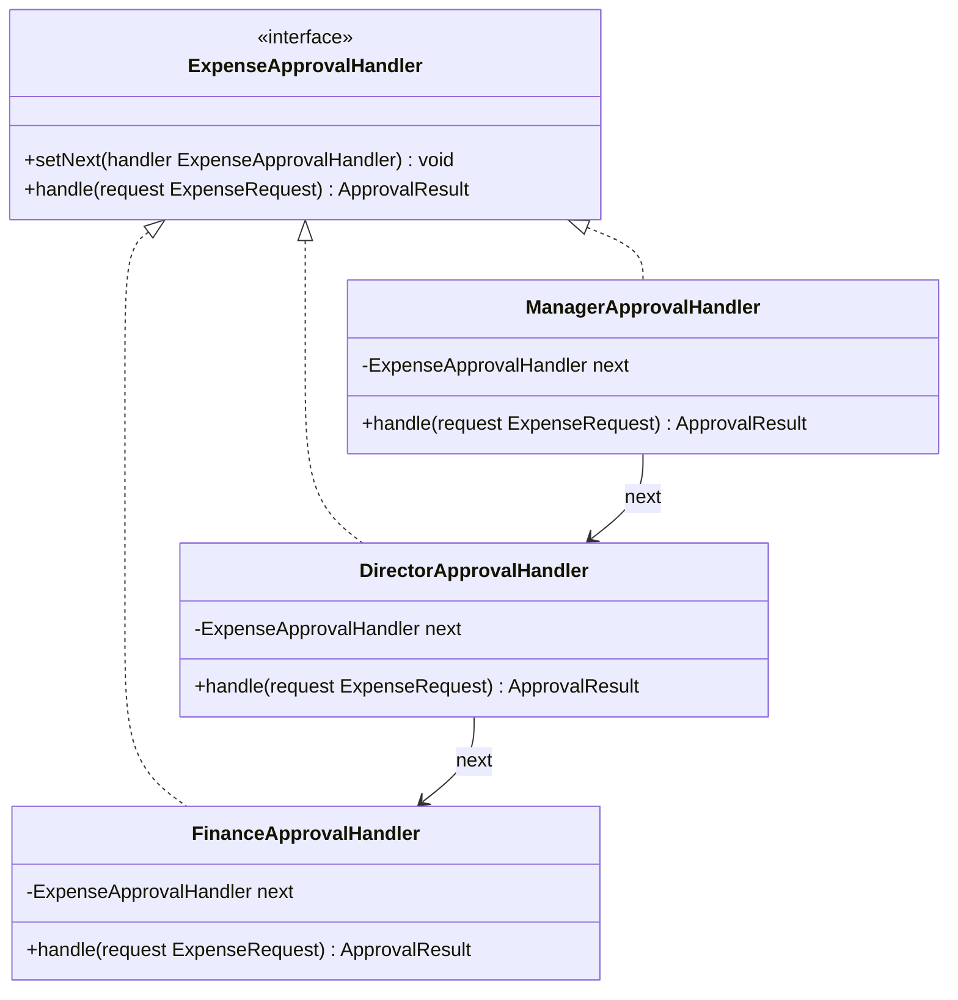

# Design Patterns Guide (GoF and POSA)

Use this guide at Stage 5 item 1 (architecture pattern selection) for POSA's architectural patterns, and at Stage 6d
(Class Diagram generation) and Step 10 (Business Rules) for GoF's design patterns, per `design/SKILL.md`. It covers two
different levels of the same idea: POSA's architectural patterns decide how a whole system (or one of its
services/layers) is structured; GoF's design patterns decide how a handful of classes collaborate to solve one recurring
object-oriented problem inside that structure. Both are catalogs of *named, proven solutions* — the value is a shared
vocabulary ("this is a Broker," "this needs a Strategy") that lets a design be communicated and evaluated in one word
instead of re-explained from scratch.

**Attribution**: GoF patterns are from *Design Patterns: Elements of Reusable Object-Oriented Software* (Gamma, Helm,
Johnson, Vlissides — 1994). POSA architectural patterns are from *Pattern-Oriented Software Architecture, Volume 1: A
System of Patterns* (Buschmann, Meunier, Rohnert, Sommerlad, Stal — 1996).

## Why this matters

- **A named solution communicates in one word what a paragraph of prose would otherwise take** — "the payment providers
  are wired through a Strategy" tells another engineer the exact shape of the code (one interface, one class per
  provider, no branching) without reading it first.
- **These patterns encode failure modes already discovered and paid for by others.** A hand-rolled ad hoc solution to
  "notify several unrelated parts of the system when an order ships" will very likely reinvent Observer, badly, after
  hitting the same coupling problem Observer already solves.
- **Misuse is the dominant real-world failure mode, not ignorance of the patterns.** Applying a pattern where the
  problem it solves doesn't exist yet — a Factory for a class with exactly one concrete type, a full layered
  architecture for a five-endpoint script — adds indirection with no corresponding benefit. This guide names, for every
  pattern, the concrete signal in *this project's* requirements or diagrams that justifies reaching for it, not "use
  this because it's a well-known pattern." This is the same discipline `references/design-principles-guide.md` applies
  to YAGNI and Open/Closed — read that guide's YAGNI section alongside this one; the two are meant to be applied
  together, not in isolation.

---

## Part 1 — POSA Architectural Patterns (Stage 5)

These describe how a whole system, or one deployable service within it, is internally structured — a different, more
granular decision than Stage 5 item 1's monolith/microservices/serverless/event-driven choice. That item picks the
system's deployment topology; the POSA pattern below picks how the code *inside* one deployable unit (or the
communication *between* units) is organized. Name the applicable pattern (s) alongside the Stage 5 item 1 justification
when one clearly applies — most systems use at least Layers internally regardless of their deployment topology.

| Pattern                                    | Structures                                                                                              | Use when                                                                                                                                                                                                                                                                                                                         |
|--------------------------------------------|---------------------------------------------------------------------------------------------------------|----------------------------------------------------------------------------------------------------------------------------------------------------------------------------------------------------------------------------------------------------------------------------------------------------------------------------------|
| **Layers**                                 | A system into stacked levels, each using only the level directly below it                               | Almost always applicable within one deployable unit — presentation/API, business logic, data access is the default internal shape for a monolith or a single microservice                                                                                                                                                        |
| **Pipes and Filters**                      | A processing pipeline of independent stages, each transforming a stream and passing it to the next      | Data or event processing that flows through a fixed sequence of independent transformation steps (ETL, log processing, event-driven pipelines)                                                                                                                                                                                   |
| **Broker**                                 | Location-transparent request/response between distributed components via an intermediary                | Microservices or distributed components that must communicate without hardcoding each other's network location — an API gateway, service mesh, or message broker acting as the Broker                                                                                                                                            |
| **Model-View-Controller (MVC)**            | Domain state (Model), its presentation (View), and user-input handling (Controller), kept separate      | Any interactive frontend or a backend framework that already imposes this shape (Rails, Django, Spring MVC, most web frameworks)                                                                                                                                                                                                 |
| **Microkernel**                            | A minimal core plus independently pluggable extensions                                                  | A system whose defining requirement is third-party or in-house plugin extensibility (IDEs, CMS platforms, rules engines)                                                                                                                                                                                                         |
| **Blackboard**                             | Multiple specialized subsystems collaborating on a shared data structure, coordinated opportunistically | An ill-structured problem with no known deterministic algorithm, solved by independent heuristic contributors (speech/image recognition, complex diagnostic systems) — rare outside AI/ML-heavy systems                                                                                                                          |
| **Presentation-Abstraction-Control (PAC)** | A hierarchy of agents, each with its own Model-View-Controller triad                                    | A complex interactive system decomposed into semi-independent, hierarchically nested UI agents — rare; MVC covers the vast majority of interactive-frontend cases this plugin designs for                                                                                                                                        |
| **Reflection**                             | A meta level that lets a system inspect and modify its own structure/behavior at runtime                | A framework or ORM that must adapt its behavior to types/schemas it doesn't know about at compile time — rarely a *whole-system* pattern for an application being designed here; more often a mechanism a chosen framework already provides (dependency-injection containers, ORMs) rather than something to design from scratch |

**Layers, in detail** (the default, applies to nearly every system this workflow designs): name the layers explicitly in
the Stage 5 write-up and keep the dependency direction one-way — presentation depends on business logic, business logic
depends on data access, never the reverse. A layer skipping over the one directly below it (a route handler calling the
database driver directly, bypassing the service layer) is the most common violation and defeats the pattern's entire
purpose: isolating each layer from changes in the ones below it. This is also what the Dependency Inversion Principle
(`references/design-principles-guide.md`) operates on *within* a layer — Layers decides the macro-structure, DIP decides
how one layer depends on the abstractions the layer below it exposes, not the concrete implementation.

**Broker, in detail**: for a microservices or event-driven architecture pattern (Stage 5 item 1), the Broker is usually
already a concrete technology choice made elsewhere in Stage 5 (an API gateway, a message broker like Kafka/RabbitMQ, a
service mesh) — this pattern is the vocabulary for *why* that component exists: it is what lets Service A call Service B
without knowing B's network address, deployment location, or instance count. Name it as such in the justification rather
than only describing the technology in isolation.

**Pipes and Filters, in detail**: applies to Stage 1–2 requirements describing a multi-stage data transformation (an
event-driven order pipeline: validate → reserve stock → charge payment → notify) — each filter should be independently
testable and replaceable, and the pipe between them (a queue, an event bus, or a simple function composition for an
in-process pipeline) should be the only thing two adjacent filters share. Do not let a downstream filter reach back into
an upstream filter's internal state — that collapses the pattern back into a single monolithic procedure with extra
steps.

**Microkernel, in detail**: only justified when Stage 1–2 explicitly names third-party or dynamically-loaded plugin
extensibility as a requirement — not merely "the system has several features," which Layers already covers. Forcing a
Microkernel's plugin-registration machinery onto a system with a fixed, known feature set is the same over-engineering
YAGNI warns against.

---

## Part 2 — GoF Design Patterns (Stage 6d / Step 10)

All 23 patterns, grouped by GoF's own three categories, with the concrete signal — in this project's Class Diagram or
Business Rules — that justifies reaching for each. Not every project needs even a handful of these; a small CRUD system
may honestly use none beyond what its framework already provides, and that is a complete, correct answer per this
guide's Why-this-matters section on misuse.

### Creational (object creation)

| Pattern              | One-line intent                                                                   | Signal to use it in this workflow                                                                                                                                                                  |
|----------------------|-----------------------------------------------------------------------------------|----------------------------------------------------------------------------------------------------------------------------------------------------------------------------------------------------|
| **Factory Method**   | A method that lets a subclass decide which concrete class to instantiate          | A Business Rule or service method creates one of several related types based on a discriminator field                                                                                              |
| **Abstract Factory** | A family of related factories, each producing a consistent set of related objects | Multiple related object families must be swapped together (e.g. a full set of UI components per theme, or per cloud-provider SDK client set) — rare in typical backend systems this plugin designs |
| **Builder**          | Constructs a complex object step by step, separate from its final representation  | An entity/DTO in the ERD or class diagram has many optional fields or a multi-step, order-dependent construction sequence                                                                          |
| **Prototype**        | Creates new objects by copying an existing instance                               | Rare in this workflow's typical backend/web systems; applies when object creation is expensive relative to cloning an existing configured instance                                                 |
| **Singleton**        | Ensures a class has exactly one instance, globally accessible                     | **Prefer dependency injection with a singleton *lifetime* (per the framework's DI container) over the classic static-instance Singleton pattern** — see the caution below                          |

**Singleton caution**: the classic GoF Singleton (a private constructor plus a static `getInstance()`) creates global
mutable state that is hard to substitute in tests and hides a class's dependencies from its constructor signature —
directly working against Dependency Inversion and the testable-code practices in `references/clean-code-guide.md`. Where
a single shared instance is genuinely needed (a connection pool, a cache client), register it as a singleton-scoped
service in the framework's DI container instead (per the Hollywood Principle/DIP handling in
`references/design-principles-guide.md`) — the *lifetime* the classic pattern wants is achieved without the static
global-access-point problem, and the instance can still be swapped for a test double.

### Structural (composing classes/objects)

| Pattern       | One-line intent                                                                        | Signal to use it in this workflow                                                                                                                                                                                                                                          |
|---------------|----------------------------------------------------------------------------------------|----------------------------------------------------------------------------------------------------------------------------------------------------------------------------------------------------------------------------------------------------------------------------|
| **Adapter**   | Converts one interface into another a client expects                                   | Integrating a third-party SDK or external API whose interface doesn't match the domain's own interface shape                                                                                                                                                               |
| **Bridge**    | Decouples an abstraction from its implementation so both can vary independently        | Rare in typical systems this plugin designs; applies when an abstraction (e.g. a "renderer") must support multiple, independently-evolving implementations (e.g. PDF vs. HTML output) chosen at runtime                                                                    |
| **Composite** | Treats individual objects and compositions of objects uniformly via a shared interface | A tree-shaped domain concept (nested categories, an organizational hierarchy, a permissions tree) where client code should treat a leaf and a branch the same way                                                                                                          |
| **Decorator** | Attaches additional behavior to an object dynamically, without altering its class      | Cross-cutting behavior (logging, caching, retry, authorization) wrapped around a service or route handler without editing the wrapped class itself                                                                                                                         |
| **Facade**    | Provides a single simplified interface to a complex subsystem                          | A service class exists specifically to give callers one simple entry point over several lower-level collaborators — check this against Single Responsibility (`references/design-principles-guide.md`): a Facade should orchestrate, not accumulate unrelated logic itself |
| **Flyweight** | Shares common state across many fine-grained objects to reduce memory footprint        | Rare outside memory-constrained or very high-object-count systems (rendering engines, large-scale simulations); not typical for the web/backend systems this plugin usually designs                                                                                        |
| **Proxy**     | Controls access to another object — lazy loading, access control, or remote invocation | An object stands in for a resource-expensive or remote object (lazy-loaded relation, an access-controlled wrapper around a sensitive service, a generated client stub for a remote service)                                                                                |

### Behavioral (object collaboration and responsibility)

| Pattern                     | One-line intent                                                                                        | Signal to use it in this workflow                                                                                                                                                                                                                                         |
|-----------------------------|--------------------------------------------------------------------------------------------------------|---------------------------------------------------------------------------------------------------------------------------------------------------------------------------------------------------------------------------------------------------------------------------|
| **Chain of Responsibility** | Passes a request along a chain of handlers until one handles it                                        | A request must be checked/processed by an ordered sequence of independent handlers (validation middleware chains, approval workflows with escalation)                                                                                                                     |
| **Command**                 | Encapsulates a request/action as an object, enabling queuing, logging, or undo                         | An action needs to be queued, retried, logged, or undone as a discrete unit (a background job, an audit-logged operation, an undoable user action)                                                                                                                        |
| **Interpreter**             | Defines a grammar and an interpreter for a small language                                              | Rare in this workflow; applies to systems that must parse and evaluate a small domain-specific expression language (rule engines with user-authored formulas)                                                                                                             |
| **Iterator**                | Provides sequential access to a collection's elements without exposing its structure                   | Usually provided directly by the language/framework (`for...of`, generators, cursors) — name this only when a custom traversal over a non-standard structure is genuinely needed                                                                                          |
| **Mediator**                | Centralizes complex communication between a set of objects so they don't reference each other directly | Several objects/components would otherwise need many-to-many references to coordinate (a complex form's field-interdependency logic, a multi-participant workflow orchestrator)                                                                                           |
| **Memento**                 | Captures and restores an object's internal state without violating encapsulation                       | A rule needs undo/rollback/snapshot semantics for an entity's state (draft/versioning features, transactional rollback of in-memory state)                                                                                                                                |
| **Observer**                | Notifies dependent objects automatically when a subject's state changes                                | One state change must trigger multiple independent, decoupled reactions — this is the pattern behind the event-driven `EventPublisher`/`EventSubscriber` shape already used in this plugin's own Class Diagram template (`references/diagrams-guide.md`)                  |
| **State**                   | Lets an object alter its behavior when its internal state changes, as if it changed class              | An entity has a state-diagram-worthy lifecycle (Stage 6d's State Diagram trigger — 3+ lifecycle states) whose behavior genuinely differs per state, not just its allowed transitions                                                                                      |
| **Strategy**                | Defines a family of interchangeable algorithms, selected at runtime                                    | Already covered in detail as the Open/Closed Principle's primary implementation mechanism — see `references/design-principles-guide.md`'s OCP section; the two are the same pattern viewed from a principle vs. a catalog-name perspective                                |
| **Template Method**         | Defines an algorithm's skeleton in a base class, letting subclasses override specific steps            | Several related operations share the same overall sequence of steps but differ in one or two steps' concrete logic (multiple import formats sharing "parse → validate → persist" but differing in the parse step)                                                         |
| **Visitor**                 | Adds new operations to a class hierarchy without modifying the classes themselves                      | Rare in this workflow; applies to a stable class hierarchy that needs frequent *new operations* added across all its types (e.g. a fixed AST needing new analysis passes) — prefer this only when the hierarchy is genuinely closed but the operation set genuinely grows |

**Misuse false-positive signals** — this guide's opening thesis is that misuse, not ignorance, is the dominant
real-world failure mode; the cautions below name the concrete false-positive signal for the patterns not already covered
by a "rare, prefer X instead" qualifier or a dedicated caution paragraph above:

- **Adapter**: only one implementation exists and no real interface-shape mismatch is being bridged — that's unnecessary
  indirection, not adaptation.
- **Composite**: the structure is a shallow, fixed two-level parent/children shape that will never grow deeper — a plain
  array field is simpler when tree depth is bounded and known in advance.
- **Decorator**: only one call site ever needs the wrapped behavior — with no cross-cutting reuse across multiple types,
  inline the behavior instead of introducing a wrapper hierarchy.
- **Facade**: the "simplified interface" class accumulates its own business logic rather than purely delegating — that's
  a Single Responsibility violation wearing a Facade label, not a Facade (see the table entry's SRP check).
- **Proxy**: the wrapped object is neither remote, resource-expensive, nor access-sensitive — wrapping a cheap local
  object "just in case" is unnecessary indirection.
- **Chain of Responsibility**: the chain has only two handlers with a fixed, always-both-checked order — a plain
  `if`/`else` or an explicit method sequence reads more clearly than a handler chain built for a variability that
  doesn't exist yet.
- **Command**: the action is never queued, logged, retried, or undone — a plain method call misidentified as needing an
  object wrapper adds indirection with no payoff.
- **Mediator**: only two or three components with a simple, stable interaction — a full mediator object is premature; it
  earns its complexity once the coordination logic itself becomes genuinely non-trivial, not before.
- **Memento**: full state-snapshotting is built for an entity whose undo need is already satisfied by an audit
  log/event-sourcing replay mechanism elsewhere in the system — that's duplicated machinery.
- **Observer**: one publisher and one subscriber with no real decoupling benefit — a direct method call is simpler and
  more debuggable than an event/pub-sub abstraction that will never have a second subscriber.
- **State**: the entity has only 1-2 lifecycle states (below this guide's own 3+ threshold for a State Diagram), or the
  per-state behavior difference is one or two `if` branches that read more clearly inline.
- **Strategy**: an algorithm that will realistically never have a second implementation — introducing an interface for a
  single concrete case is YAGNI (`references/design-principles-guide.md`), not extensibility.
- **Template Method**: forcing genuinely dissimilar processes into one shared base-class skeleton just because they
  share a name — when the actual steps diverge enough, the shared skeleton adds more complexity than it removes.

**Worked example — Chain of Responsibility vs. a monolithic `if` chain**, the diagram-level signature to look for in a
Class Diagram: a single class with a growing sequence of unrelated validation/approval checks in one method is a
candidate to split into a chain of single-purpose handlers.

Adding a new approval threshold later means adding one new handler class and re-linking the chain — no existing
handler's code changes, which is also the Open/Closed Principle in action.

---

## Applying this guide across the workflow

- **Stage 5, item 1**: after selecting the deployment-level architecture pattern (monolith/microservices/serverless/
  event-driven), name the applicable POSA architectural pattern (s) from Part 1 for the internal structure of each
  deployable unit and for inter-service communication where relevant — Layers applies to nearly every system; Broker,
  Pipes and Filters, MVC, and Microkernel apply only when their specific signal is present.
- **Stage 6d, Class Diagram generation**: after the design-principle pass `design/SKILL.md` already runs (per
  `references/design-principles-guide.md`), check the drafted classes once against Part 2's signal column — a growing
  conditional chain (Strategy or Chain of Responsibility), a multi-step optional-heavy construction (Builder), a
  third-party integration (Adapter), or cross-cutting wrapped behavior (Decorator) are the most common matches in
  typical systems this plugin designs. Name the pattern explicitly in the diagram's `rationale`/`details` field
  (`references/diagrams-guide.md`) so the choice is traceable, rather than leaving an unlabeled structure for a reader
  to guess at.
- **Step 10, Business Rules**: when a rule's `Logic` describes several related operations sharing the same overall
  sequence but differing in one step (Template Method), or an action that must be queued/logged/undone (Command), name
  the pattern in the rule's description so `architecture-implementer` generates the matching class shape rather than a
  flat procedural function.
- **`architecture-implementer`**: generate the exact class/interface shape the Class Diagram and Business Rules named —
  do not substitute a different pattern, and do not introduce a pattern that wasn't named in the design (that is scope
  creep beyond the plan, the same rule the agent already applies to every other kind of invented capability).
