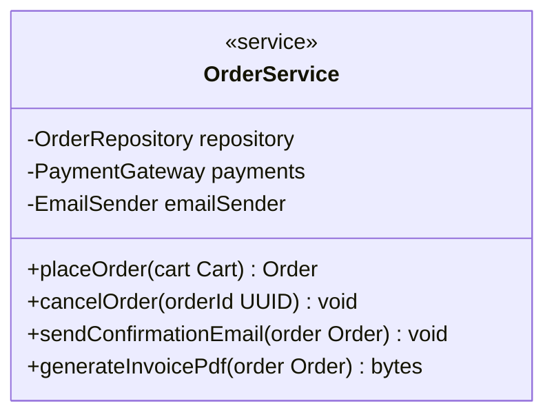
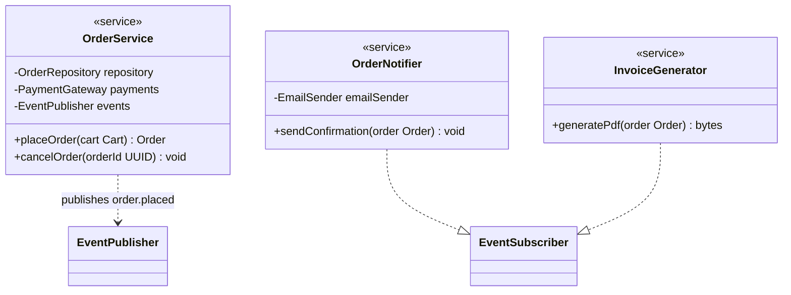
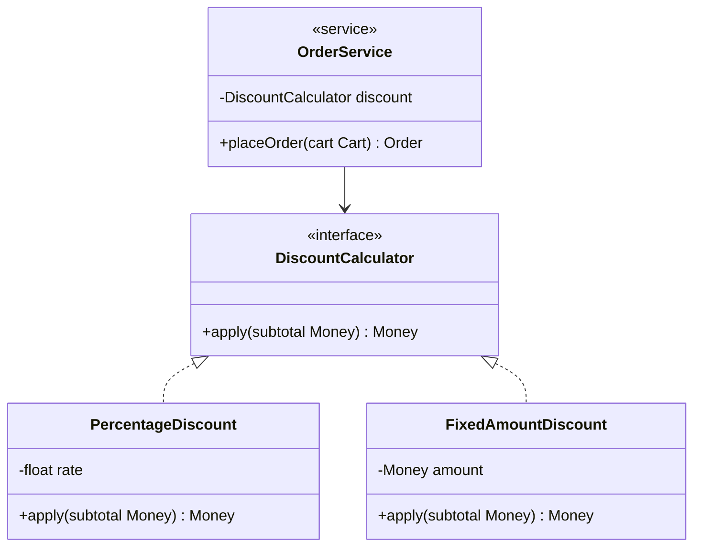

# Object-Oriented Design Principles Guide (SOLID, DRY, YAGNI, Tell Don't Ask, Hollywood Principle, Law of Demeter)

Use this guide at Stage 6d when generating the Class Diagram, at Step 10 when writing Business Rules, and by
`architecture-implementer` when writing actual service/class code, per `design/SKILL.md`. These principles govern how
classes, services, and business logic are shaped once a domain model already exists — they sit one level below DDD's
aggregate boundaries (`references/ddd-guide.md`, which decides *what the objects are*) and one level above concrete code
(which decides *how a single line executes*). They decide how those objects call each other, own their own state, and
change over time without a ripple effect through the rest of the system.

## Why this matters

A correct aggregate boundary or a syntactically valid class diagram can still decay into a maintenance liability if the
classes inside it are shaped carelessly: a service class that both validates input, applies business rules, and sends
emails becomes impossible to test or reuse in isolation; a method that reaches through three other objects' internals to
read a field breaks the moment any of those three objects' internal shape changes; a rule duplicated in two API handlers
diverges the first time only one of the two copies gets updated. These are not stylistic nitpicks — each has a concrete,
predictable failure mode described under its principle below, and each is materially cheaper to prevent while the class
diagram is still being drawn than to untangle once `architecture-implementer` has already generated code around it.

**Scope discipline**: these principles apply to how a class or service is *shaped* — its responsibilities, its
dependencies, what it exposes. They do not replace `references/ddd-guide.md` (which entities exist and where the
aggregate boundary sits) or `references/quality-driven-design-guide.md` (which quality attributes the architecture must
hit). A class diagram can honor every aggregate boundary DDD identified and still violate SRP within one of those
aggregates' service classes — the two checks are complementary, not redundant.

## Quick reference

| Principle                     | One-line rule                                                       | Primary failure mode it prevents                                              |
|-------------------------------|---------------------------------------------------------------------|-------------------------------------------------------------------------------|
| Single Responsibility (SOLID) | A class has one reason to change                                    | A class that touches unrelated concerns breaks in one when edited for another |
| Open/Closed (SOLID)           | Open for extension, closed for modification                         | Adding a variant means editing existing, already-tested code                  |
| Liskov Substitution (SOLID)   | A subtype must be usable anywhere its supertype is expected         | Callers need `instanceof` checks to work around a subtype's broken contract   |
| Interface Segregation (SOLID) | No client depends on methods it doesn't use                         | A fat interface forces irrelevant implementations and unrelated churn         |
| Dependency Inversion (SOLID)  | Depend on abstractions, not concrete implementations                | High-level logic becomes hard-wired to a specific low-level library           |
| DRY                           | Every piece of knowledge has one authoritative representation       | The same rule, duplicated, drifts out of sync when only one copy is updated   |
| YAGNI                         | Don't build for a requirement that doesn't exist yet                | Speculative flexibility adds real cost for a need that may never arrive       |
| Tell, Don't Ask               | Command an object to act; don't pull its state out to decide for it | Business logic leaks out of the object that owns the data it depends on       |
| Hollywood Principle (IoC)     | Don't call us, we'll call you                                       | High-level policy gets hard-wired to a specific low-level implementation      |
| Law of Demeter                | Talk only to your immediate collaborators, never their internals    | A method breaks whenever any object two hops away changes its own shape       |

---

## SOLID

### Single Responsibility Principle (SRP)

**Definition**: a class or module should have exactly one reason to change — one actor or one concern it answers to.

**Why it matters**: when two unrelated responsibilities live in the same class, a change driven by one concern (e.g. a
new tax rule) risks breaking the other (e.g. how the entity is persisted), because both paths share the same file, the
same tests, and the same deploy. The failure is not hypothetical — it shows up as "I changed the notification format and
the order total calculation broke," which is only surprising because the two were never supposed to be coupled in the
first place.

**How to implement**:

- At Stage 6d, when naming a service class's methods, ask whether every method serves the same actor/concern the class
  name implies. An `OrderService` with `placeOrder`, `cancelOrder`, and `sendOrderConfirmationEmail` has two
  responsibilities — split the email concern into a `NotificationService` the order service calls, rather than owns.
- At Step 10, when writing a Business Rule, if a single rule's steps mix distinct concerns (calculating a total,
  persisting state, and dispatching an event), that is a hint the rule spans more than one class — describe it as a
  sequence of calls to separate collaborators rather than one large procedure.
- In generated code (`architecture-implementer`), a controller/route handler should orchestrate — parse the request,
  call one service method, map the result to a response — not contain the business logic itself.

is four responsibilities (ordering, payment orchestration, notification, document generation) in one class. Split into:

`OrderService` now changes only when order-placement logic changes; a new notification channel touches only
`OrderNotifier`.

### Open/Closed Principle (OCP)

**Definition**: a class should be open for extension but closed for modification — new behavior is added by adding new
code, not by editing code that already works and is already tested.

**Why it matters**: every edit to already-shipped, already-tested logic is a chance to break something that used to
work. A design that requires editing a central `switch`/`if-else` chain every time a new variant is added accumulates
risk with every addition, and the blast radius of one bad edit grows with the size of that central block.

**How to implement**:

- Recognize the smell in the class diagram: a service with a growing `switch (type)` or `if (type === X) ... else if
  (type === Y)` chain over a type discriminator (payment method, notification channel, discount type) is a candidate for
  the Strategy pattern — one interface, one implementing class per variant, selected by lookup rather than a branch.
- Model this in the class diagram as an interface (`<<interface>>` stereotype) with one implementing class per variant,
  and the consuming service depending on the interface, not on the concrete classes.
- Apply this where variants are a known, recurring axis of change (payment providers, discount types, notification
  channels) — not preemptively for every class. A class with a genuinely fixed, small set of cases that doesn't grow
  does not need this pattern; forcing it on everything is a YAGNI violation (see below), not a virtue.

Adding a `BuyOneGetOneDiscount` later means adding one new class — `OrderService` and every existing discount class stay
untouched.

### Liskov Substitution Principle (LSP)

**Definition**: if `B` is a subtype of `A`, any code written against `A` must keep working correctly when given a `B`,
with no surprising behavior change.

**Why it matters**: a subtype that narrows preconditions (accepts less than its supertype promised), widens
postconditions (returns less than promised), or throws where the supertype didn't, forces every caller to add a
type-specific check to work around it — at which point the inheritance relationship is a lie, since the two types aren't
actually interchangeable. This is what "a `Square` extending `Rectangle` breaks `setWidth`/`setHeight` callers" is
warning about — an intuitive is-a relationship in the domain that does not hold at the behavioral-contract level.

**How to implement**:

- When drawing an inheritance arrow (`--|>`) in the class diagram, check the subtype against its parent's method
  contracts — same or looser preconditions, same or stricter postconditions, no new exceptions a caller of the parent
  type wouldn't expect.
- If a subtype needs to throw `NotSupportedException` for an inherited method, or a caller needs an `instanceof` check
  before calling a method safely, the hierarchy is wrong — prefer composition (the subtype holds a reference to the
  capability it actually supports) or splitting the interface (see Interface Segregation below) over forcing an
  ill-fitting inheritance relationship.

### Interface Segregation Principle (ISP)

**Definition**: no client should be forced to depend on methods it does not use — prefer several small, focused
interfaces over one large, general-purpose one.

**Why it matters**: a fat interface couples every implementer to every method, even the ones irrelevant to it. A
`Repository` interface with `save`, `delete`, `findById`, `bulkExport`, and `archive` forces a read-only reporting
consumer to depend on (and a test double to stub) write and archival methods it will never call — and any change to
those methods' signatures now risks breaking a consumer that never used them.

**How to implement**:

- When a class diagram's interface accumulates methods serving genuinely different client groups (a write-side
  repository vs. a read-only query consumer), split it into role-specific interfaces (`OrderWriter`, `OrderReader`)
  rather than one `OrderRepository` every consumer depends on in full.
- A pragmatic default for this workflow: split when two or more distinct consumers (identified in the sequence diagrams)
  use clearly disjoint subsets of an interface's methods. Don't split a two-method interface pre-emptively with no
  second consumer in sight — that's YAGNI territory again.

### Dependency Inversion Principle (DIP)

**Definition**: high-level modules should not depend on low-level modules — both should depend on abstractions; and
abstractions should not depend on details — details should depend on abstractions.

**Why it matters**: a service that directly instantiates a concrete `SendGridEmailSender` or `StripePaymentGateway`
inside its own methods is now hard-wired to that vendor — swapping providers, or substituting a fake for a test, means
editing the service's own source. Depending on an interface (`EmailSender`, `PaymentGateway`) and receiving the concrete
implementation from outside (constructor injection) means the service's own code never changes when the vendor does.

**How to implement**:

- In the class diagram, a service's dependencies (shown as `-FieldName Type` attributes, per
  `references/diagrams-guide.md`'s Class Diagram conventions) should be typed as interfaces, with a separate
  `<<interface>>`-stereotyped class and a `..|>` realization arrow from each concrete implementation — not the service
  holding a field typed as the concrete vendor class directly.
- In generated code, wire the concrete implementation at the composition root (dependency-injection container setup, or
  the framework's DI wiring in `main`/app bootstrap) — never inside the consuming class's own constructor via `new
  ConcreteVendorClass()`.
- This principle is also what makes the Hollywood Principle (below) mechanically possible: a framework can only "call
  you" through an abstraction it — and you — both depend on.

---

## DRY (Don't Repeat Yourself)

**Definition**: every piece of knowledge — a business rule, a validation constraint, a calculation — should have one
authoritative representation in the system, referenced from everywhere it's needed rather than copied.

**Why it matters**: two copies of the same rule (e.g. "orders under $10 don't qualify for free shipping," duplicated in
both the checkout API validation and the invoice-total calculation) will diverge the first time only one copy is
updated — and the divergence is often invisible until a customer notices the numbers don't match. DRY is about
knowledge, not literal text: two pieces of code that look similar but express genuinely different business concerns are
not a DRY violation, and forcing them into one shared function just because they're currently textually similar creates
an accidental coupling that breaks the moment the two concerns diverge for a legitimate reason.

**How to implement**:

- At Step 10, when writing Business Rules, check a new rule against the ones already documented — the same calculation
  or validation appearing in two rules' `Logic` sections is a signal to extract a shared, named sub-rule both reference,
  rather than restating the steps twice.
- In the class diagram, a value or calculation used by more than one service (e.g. "how tax is calculated") belongs in
  one class or method both callers depend on, not copy-pasted into each caller.
- Constants (thresholds, rates, limits) referenced in more than one Business Rule should be named once (in the Error
  Catalog's related config, or a documented configuration value) and referenced by that name everywhere, not restated as
  a bare literal in each rule.

---

## YAGNI (You Aren't Gonna Need It)

**Definition**: don't build a capability, abstraction, or generalization for a requirement that doesn't exist yet —
build what the confirmed requirements need, when they need it.

**Why it matters**: speculative flexibility (a plugin system for a single fixed set of payment providers, a generic
`AbstractProcessor<T>` hierarchy built for "future" variants that were never requested) has a real, immediate cost —
more code to read, more surface area to test, more indirection between a request and where it's actually handled — paid
up front for a future that may never materialize. This is the same discipline this plugin already applies elsewhere:
Stage 5 grounds every technology choice in stages 1–4's actual numbers rather than industry folklore, and the
Open/Closed Principle above explicitly warns against forcing a Strategy pattern where only one variant currently exists.

**How to implement**:

- When Stage 6d's class diagram or Step 10's Business Rules introduce an interface, abstract class, or configuration
  option, check it against the confirmed functional requirements (Stage 2) — if no confirmed requirement needs the
  variation point yet, model the concrete case directly and add the abstraction when a second real variant actually
  appears, not in anticipation of one.
- This does not conflict with Open/Closed: OCP says design *known, recurring* variation points (a discount type axis the
  requirements already show growing) for extension; YAGNI says don't invent a variation point that has no requirement
  behind it at all. The dividing line is whether Stage 1–2 already named more than one variant, or the system's own
  domain makes a second variant a near-certainty.
- In generated code, this means `architecture-implementer` builds exactly what the plan and document specify — the
  agent's own "Follow the plan and the document, not assumptions" rule is this principle applied to implementation.

---

## Tell, Don't Ask

**Definition**: instruct an object to perform an action using its own data, rather than querying its internal state,
making a decision externally, and then telling it what to do based on that decision. Decisions based entirely on one
object's state belong inside that object, not scattered across every caller.

**Why it matters**: when calling code repeatedly asks an object for its internals (`order.getStatus()`,
`order.getTotal()`, `order.getItems()`) and then makes a business decision from those values, that decision-making logic
is duplicated at every call site instead of being in the one class actually responsible for the object's own
invariants — the same divergence risk DRY warns about, specifically caused by leaking an object's own decisions outward.
It also breaks encapsulation: the caller now depends on the exact shape of the object's internals rather than on a
stable, intention-revealing method name.

**How to implement**:

- When a Business Rule's `Logic` section reads like "get the order's status, and if it's `PENDING`, then...", check
  whether that's really an action the `Order` (or `OrderService`) should expose directly — `order.confirm()` internally
  checks its own status and throws/rejects if the transition is invalid, rather than the caller checking status first
  and calling a setter.
- In the class diagram, prefer methods named for the action taken (`confirm()`, `cancel(reason)`, `applyDiscount(code)`)
  over exposing raw getters that let callers reconstruct the decision themselves. A getter is still appropriate for
  genuinely presentational data (formatting a value for display) — the rule targets decisions, not all reads.
- This directly supports invariant enforcement at aggregate boundaries (`references/ddd-guide.md`): an aggregate's
  invariants are far more likely to hold everywhere if the aggregate root's own methods enforce them internally, rather
  than relying on every caller remembering to check first.

---

## Hollywood Principle ("Don't call us, we'll call you") — Inversion of Control

**Definition**: high-level policy code should not call out into low-level implementation details on its own schedule;
instead, the low-level component registers itself and waits to be invoked by a framework or orchestrator that owns the
flow of control. This is the classic articulation of Inversion of Control (IoC), the broader idea — achievable via a
Template Method base class calling an overridden subclass method, event/callback registration, or a framework's own
lifecycle hooks, none of which strictly require an abstraction both sides depend on. DIP-based dependency injection (the
structural, which-types-depend-on-which statement above) is the mechanism this guide standardizes on for achieving it,
not the only way IoC can be achieved — treat DIP and Hollywood as closely related, not interchangeable.

**Why it matters**: when a high-level service directly instantiates and calls its low-level dependencies
(`new StripePaymentGateway().charge(...)` inline inside `OrderService`), the high-level class now owns both *what* to do
and *which specific implementation* does it — testing `OrderService` in isolation means dealing with the real payment
gateway, and swapping providers means editing `OrderService`'s own source. Inverting control — the gateway is handed to
`OrderService` from outside, and `OrderService` only ever calls the interface — lets the framework or composition root
decide which concrete implementation is wired in for production versus for a test.

**How to implement**:

- Model this in the class diagram as a service's dependencies being interface-typed fields, exactly as DIP describes
  above — the diagram-level check for both principles is the same: does a `-FieldName Type` attribute reference an
  interface, or a concrete vendor class?
- Framework-provided IoC containers (constructor-injection DI containers, dependency-injection decorators, a service
  locator wired at app startup) are the mechanical "who calls whom" implementation of this principle — name the
  confirmed backend framework's own convention (e.g. NestJS's `@Injectable`, Spring's `@Autowired`, ASP.NET Core's
  built-in DI container) rather than hand-rolling a bespoke registry.
- In generated code, `architecture-implementer`'s route handlers and services should receive their collaborators through
  the framework's DI mechanism (or, absent a framework-provided one, explicit constructor parameters wired once at the
  app's composition root) — never reach for a global singleton or construct a dependency inline mid-method.

---

## Law of Demeter (Principle of Least Knowledge)

**Definition**: proposed by Ian Holland at Northeastern University in 1987. An object's method should only call methods
on: itself, its own fields, objects passed as parameters to that method, and objects it creates within that method — not
on objects returned by any of those. Informally: "talk only to your immediate friends, not to strangers," and "use only
one dot" (`a.b()`, not `a.getB().getC().doSomething()`).

**Why it matters**: a method that reaches through a chain of accessors (`order.getCustomer().getAddress().getCity()`) is
coupled not just to `Order`, but to the internal shape of `Customer` and `Address` too — and it breaks the moment either
of those two unrelated classes changes its own internal structure, even though the calling code never intended to depend
on them at all. This is the most common, and most mechanically detectable, violation to watch for in generated code:
every extra `.` past the first hop is a hidden coupling to a class the caller never declared a dependency on.

**How to implement**:

- In the class diagram, a "train wreck" of chained association arrows reaching through two or more intermediate classes
  to a deeply nested one is the visual signature of a violation — the fix is usually a new method on the intermediate
  class that returns exactly what the caller needs (`order.getCustomerCity()` delegating internally), or passing the
  needed value directly as a parameter rather than the whole object chain.
- The one dot rule has a legitimate exception for fluent/builder APIs
  (`queryBuilder.where(...).orderBy(...).limit(...)`)
  where each call returns the same object (or a value object explicitly designed to be chained) rather than reaching
  into an unrelated collaborator's internals — the rule is about hopping between *different* objects' internals, not
  about method chaining in general.
- In generated code, review a service method that reaches more than one property-access hop deep into a parameter or
  dependency's return value (`req.user.profile.settings.locale`) as a signal to introduce an intermediate accessor or
  restructure what's passed in, rather than reaching through the whole chain at every call site.

---

## Applying these principles across the workflow

- **Stage 6d — Class Diagram generation**: after drafting the class diagram from `domainModel`'s aggregates (per
  `references/diagrams-guide.md`'s Class Diagram section), pass it once against this guide's Quick Reference table
  before finalizing: does each service have one responsibility (SRP), do variant-heavy services use an interface rather
  than a growing branch (OCP), are dependencies interface-typed rather than concrete (DIP/Hollywood), and does any
  association chain reach more than one hop deep (Law of Demeter)? This is a design pass on the diagram already being
  built, not a separate stage — most systems need only light adjustment, not a redesign.
- **Step 10 — Business Rules**: when a rule's `Logic` section either duplicates steps already written for another rule
  (DRY), reads external state to make a decision instead of delegating to the owning object (Tell, Don't Ask), or
  introduces a configuration axis with no second confirmed variant behind it (YAGNI), adjust the rule's phrasing or the
  class it's attributed to accordingly before moving to the next artifact group.
- **`architecture-implementer`**: when writing service classes and route handlers, keep route handlers thin
  (orchestration only, per SRP), wire dependencies through the framework's DI mechanism rather than instantiating them
  inline (DIP/Hollywood), and avoid multi-hop property chains reaching into an unrelated object's internals (Law of
  Demeter) — consistent with that agent's existing "Minimal but complete" and "Follow the plan and the document, not
  assumptions" rules, this guide describes *how* the generated classes should be shaped, not what capabilities to add
  beyond what the plan specifies.

These are judgment calls scaled to the system's actual complexity, the same spirit `references/ddd-guide.md` and
`references/quality-driven-design-guide.md` apply to their own checks — a small CRUD-heavy system with little business
logic may honestly need only SRP and DRY applied lightly; a system with real domain complexity (multiple discount types,
multiple payment providers, a growing rules engine) is where OCP, DIP, and Law of Demeter earn their cost. Do not force
every principle onto every class regardless of size — that itself violates YAGNI.
