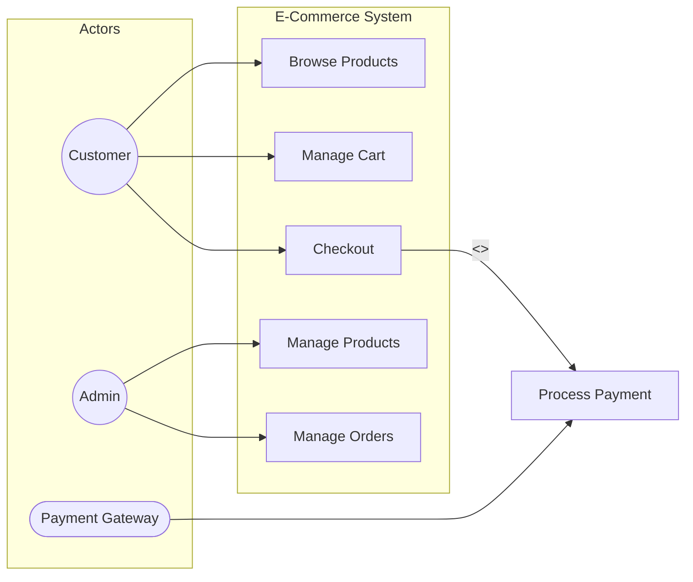
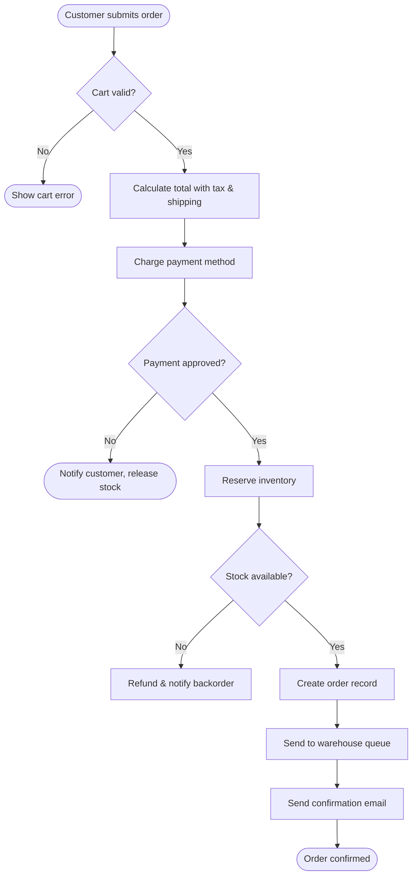
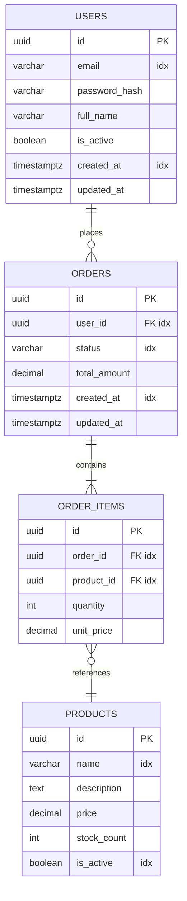
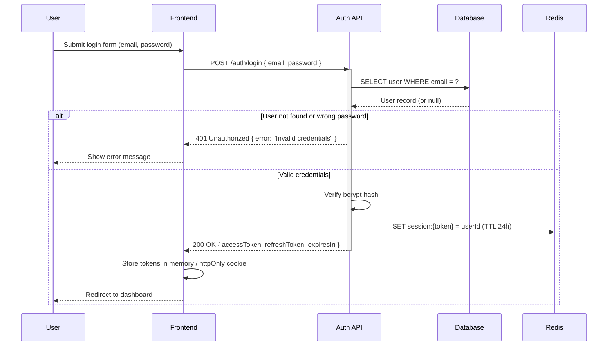
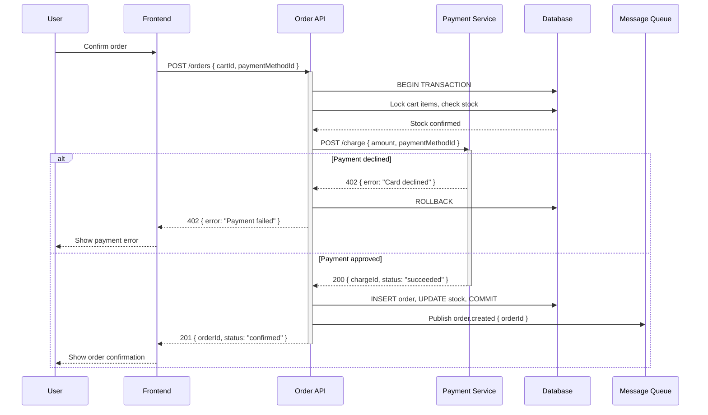
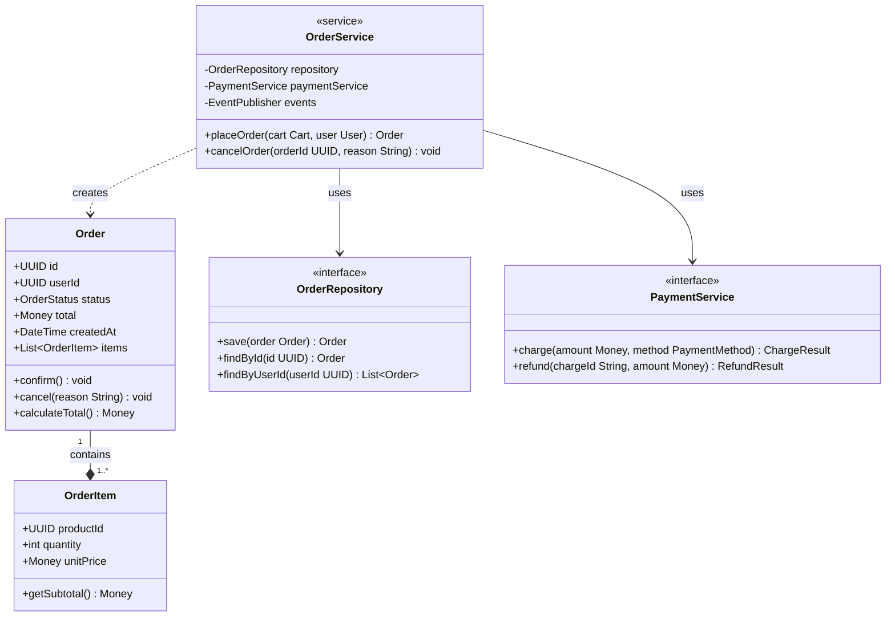
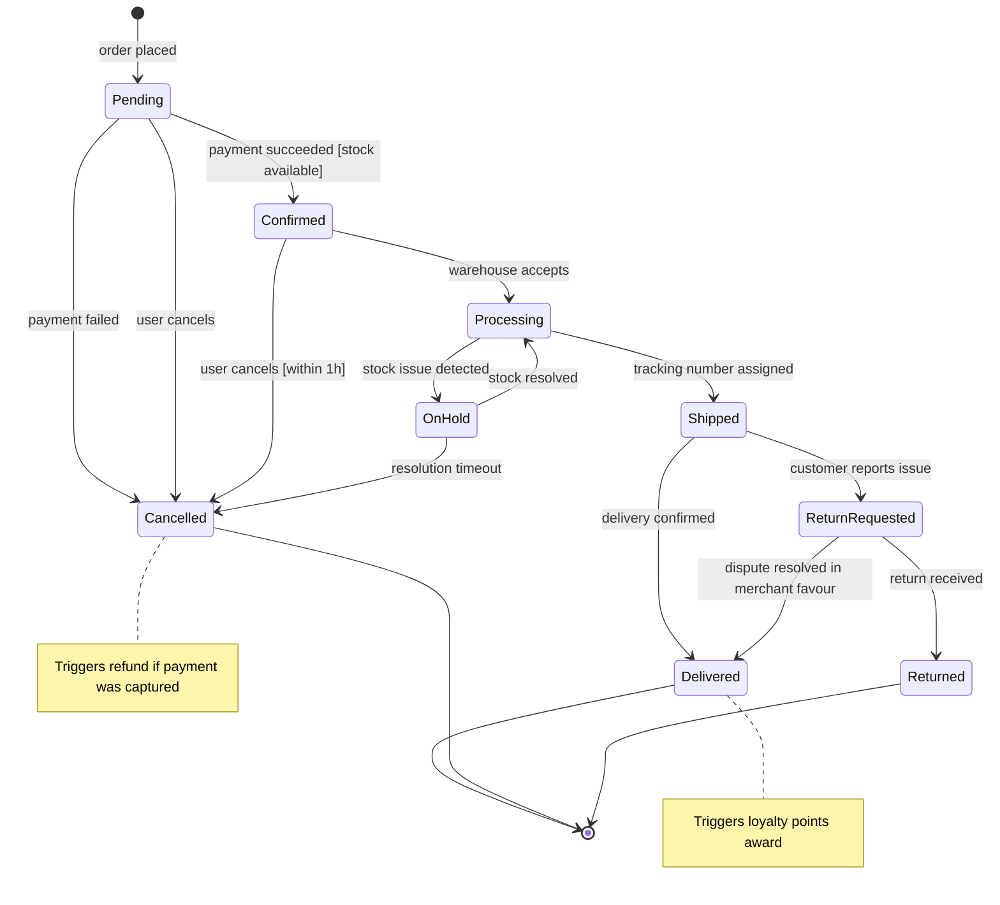
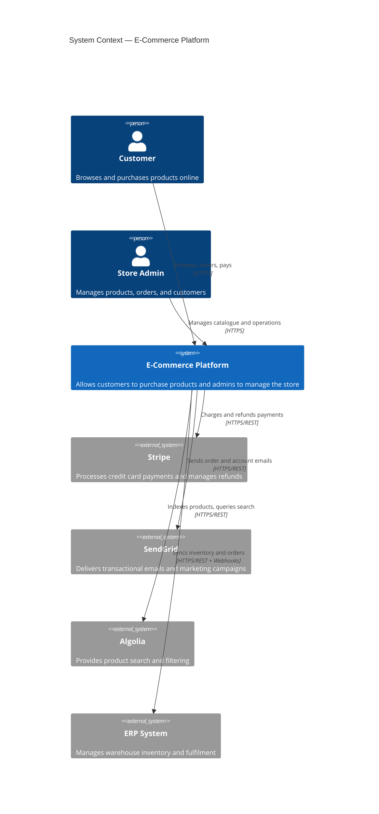
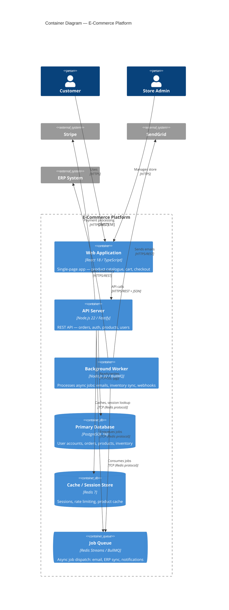
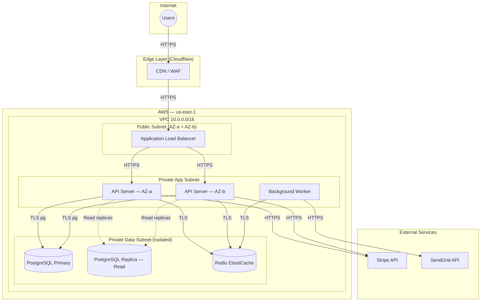

# Diagram Content Guide

Detailed specifications for each Mermaid diagram type supported by architecture-designer. Read the section for the diagram you are about to generate.

## Contents

1. [Use Case Diagram (`flowchart LR`)](#use-case-diagram-flowchart-lr)
2. [Business Process Flow (`flowchart TD`)](#business-process-flow-flowchart-td)
3. [Entity Relationship Diagram (`erDiagram`)](#entity-relationship-diagram-erdiagram)
4. [Sequence Diagram (`sequenceDiagram`)](#sequence-diagram-sequencediagram)
5. [Class Diagram (`classDiagram`)](#class-diagram-classdiagram)
6. [State Diagram (`stateDiagram-v2`)](#state-diagram-statediagram-v2)
7. [C4 Context Diagram (`C4Context`)](#c4-context-diagram-c4context)
8. [C4 Container Diagram (`C4Container`)](#c4-container-diagram-c4container)
9. [Deployment / Infrastructure Diagram (`flowchart TD` or `architecture-beta`)](#deployment--infrastructure-diagram-flowchart-td-or-architecture-beta)

---

## Use Case Diagram (`flowchart LR`)

**Purpose**: Communicates who can do what. Gives stakeholders a quick map of the system's features and which roles access them — before any technical detail is needed.

**When to create**: Any system with two or more user roles, or any system where the scope of features must be agreed with non-technical stakeholders.

**What to include**:
- Every human actor as a stadium/circle node: `Customer((Customer))`
- Every external system actor as a rounded rectangle: `PaymentGateway([Payment Gateway])`
- Every feature as a regular rectangle: `Checkout[Checkout]`
- A system boundary subgraph to separate internal features from actors
- Arrows from actors to the features they can use
- `<<include>>` relationships for sub-flows shared by multiple features (add a label: `-->|<<include>>|`)
- `<<extend>>` relationships for optional extensions

**Naming**: Feature names are verb phrases or gerunds ("Browse Products", "Manage Users", "Generate Report"). Actor names are role nouns ("Customer", "Admin", "Warehouse Picker").

**Common mistakes**:
- Putting technical components (databases, APIs) in a use case diagram — keep it feature-facing
- Including too many features — if more than ~15, group related features into subsystems using nested subgraphs
- Missing roles that appear only in admin flows

**Template**:


---

## Business Process Flow (`flowchart TD`)

**Purpose**: Models a real-world workflow — with branching decisions, parallel paths, and exception paths — at the business level. Bridges the gap between how the business thinks about a process and how the system will implement it.

**When to create**: Any process with more than two decision points, or any process where the happy path and error handling both need to be visible to stakeholders.

**What to include**:
- Start and end nodes: `([Start])` and `([End])`
- Tasks (actions) as rectangles: `[Send confirmation email]`
- Decisions as diamonds: `{Payment approved?}`
- Both Yes and No branches labelled on every diamond
- Exception/error paths leading to explicit error states or recovery flows
- Parallel steps modelled with `&` operator or parallel subgraphs
- Swimlanes (subgraphs) if multiple actors participate

**Conventions**:
- Arrow labels on decision branches: `-->|Yes|` and `-->|No|`
- Error paths as dashed arrows: `-.->` (if supported) or labeled `-->|Error|`
- Terminal error states as separate end nodes: `([Order Failed])`

**Common mistakes**:
- Leaving a decision diamond with only one output branch
- Modelling technical steps (database writes, API calls) — this is a business-level diagram
- Omitting the "what happens when it fails" path — every payment, external API call, or time-limited step needs a failure branch

**Template**:


---

## Entity Relationship Diagram (`erDiagram`)

**Purpose**: Defines the relational data model — entities, attributes, types, primary/foreign keys, cardinality — as the single source of truth for database schema design. This diagram drives migrations and ORM models.

**When to create**: Whenever the system includes any SQL database. This is the database-designer agent's primary output.

**Attribute format** (strict — do not deviate):
```
ENTITY_NAME {
    type  column_name  "comment"
}
```
- `type`: use database-accurate types (`uuid`, `varchar`, `text`, `int`, `bigint`, `decimal(10,2)`, `boolean`, `timestamptz`, `jsonb`, `date`)
- Comment must be one of: `"PK"` (primary key), `"FK"` (foreign key), `"idx"` (indexed, non-key), `"PK idx"` (primary key that is also a composite index member), or descriptive text for other notes
- Every table must have exactly one PK column
- Every FK column must also have `"FK"` or `"FK idx"` comment

**Cardinality notation**:
| Symbol | Meaning |
|---|---|
| `\|\|--\|\|` | One-to-one (mandatory both sides) |
| `\|\|--o\|` | One-to-one (optional on right) |
| `\|\|--o{` | One-to-many (zero or more on right) |
| `\|\|--\|{` | One-to-many (one or more on right) |
| `}o--o{` | Many-to-many (optional both sides) |
| `}o--\|{` | Many-to-many (mandatory on right) |

**Relationship labels**: Use verb phrases in the direction of the arrow ("places", "belongs to", "contains", "is assigned to").

**Index companion table** (required after every `erDiagram` block):

| Index Name                  | Table    | Column(s)            | Type               | Reason                       |
|-----------------------------|----------|----------------------|--------------------|------------------------------|
| `idx_users_email`           | `users`  | `email`              | UNIQUE B-TREE      | Auth login lookup            |
| `idx_orders_user_id`        | `orders` | `user_id`            | B-TREE             | List orders by user          |
| `idx_orders_status_created` | `orders` | `status, created_at` | B-TREE (composite) | Filter + sort for order list |

**Common mistakes**:
- Missing FK comments on foreign key columns (reviewer will catch this)
- Using generic `int` for IDs instead of `uuid` or `bigint`
- Not declaring junction tables for many-to-many relationships
- Leaving timestamps as `timestamp` instead of `timestamptz` — always store with timezone for production systems

**Template**:


---

## Sequence Diagram (`sequenceDiagram`)

**Purpose**: Shows the runtime conversation between components — who calls what, in what order, what data passes, and what happens on failure. Essential for implementing authentication and core transaction flows correctly.

**When to create**:
- **Authentication flow**: always, for any system with login/logout/token refresh
- **Primary transaction flow**: the most important user-facing operation (placing an order, submitting a form, processing a payment)
- Additional flows for: webhook handling, background job processing, third-party integration

**What to include**:
- `participant` declarations for every actor (user, frontend, backend service, database, external system)
- Activation boxes (`activate`/`deactivate`) to show when a component is processing
- `alt`/`else` blocks for every branch with a meaningful failure path
- `opt` blocks for optional sub-flows
- `loop` for polling or retry patterns
- `note over` or `note right of` for important state changes or data transformations
- Return values on arrows where the data shape matters (e.g., `-->>User: JWT { token, expiresIn }`)

**Arrow types**:
- `->>`  solid arrow (synchronous call, request)
- `-->>`  dashed arrow (response, asynchronous callback)
- `-x`   failed/rejected message

**Common mistakes**:
- Omitting the failure `alt` — every external call (payment, email, third-party API) must have a failure path
- Not showing token/session creation steps in auth flows
- Overcrowding with database reads — show DB interactions only for key state changes, not every SELECT

**Auth flow template**:


**Primary transaction template** (e-commerce order):


---

## Class Diagram (`classDiagram`)

**Purpose**: Captures the object-oriented domain model — classes, their attributes and methods, and how they relate to each other. Bridges the ERD (data storage) and the sequence diagram (runtime behavior) into the application's code structure.

**When to create**: Systems with a meaningful domain model — DDD aggregates, complex business rules, inheritance hierarchies. Skip for simple CRUD APIs where the ERD directly maps to flat request/response DTOs with no business logic.

**What to include**:
- Classes with `+` (public), `-` (private), `#` (protected) visibility
- Attributes with types: `+String email`, `-String passwordHash`
- Methods with return types: `+login(email, password) AuthToken`
- Relationships:
  - `-->` Association (has-a)
  - `--|>` Inheritance (is-a)
  - `--o` Aggregation (whole-part, part survives without whole)
  - `--*` Composition (whole-part, part destroyed with whole)
  - `..>` Dependency (uses)
  - `..|>` Interface implementation / realization

**Conventions**:
- Class names: PascalCase (`OrderService`, `UserRepository`)
- Attribute names: camelCase
- Method names: camelCase with `()` suffix
- Add `<<interface>>`, `<<abstract>>`, or `<<service>>` stereotypes where helpful

**Common mistakes**:
- Duplicating the ERD — class diagram shows business objects, not raw DB rows
- Including every getter/setter — show only meaningful methods
- Missing the direction of aggregation/composition arrows

**Template**:


---

## State Diagram (`stateDiagram-v2`)

**Purpose**: Models the lifecycle of an entity — the states it can be in, the events that trigger transitions between them, and the guards or conditions that control transitions. Prevents impossible state transitions from being implemented.

**When to create**: Any entity that moves through a defined sequence of statuses that matter to the business: Order (pending → paid → shipped → delivered), Subscription (trial → active → cancelled), Support Ticket (open → in-progress → resolved → closed).

**What to include**:
- `[*]` as the initial state and terminal state(s)
- Every named state the entity can be in
- Every transition labeled with the event that triggers it
- Guard conditions in square brackets: `[payment succeeded]`
- Actions on transitions: `/ send confirmation email`
- Compound states (nested states) for complex sub-lifecycles
- `note` for important invariants

**Common mistakes**:
- Missing the path from any state back to `[*]` (terminal) — every state lifecycle must have at least one terminal state reachable from every non-terminal state
- Omitting guard conditions on ambiguous transitions
- Modelling UI state instead of domain state

**Template**:


---

## C4 Context Diagram (`C4Context`)

**Purpose**: The 30,000-foot view of the system. Shows who the users are, what the system does at the highest level, and which external systems it interacts with — without any internal detail. The audience is stakeholders, product managers, and new engineers.

**When to create**: Any system with at least one external integration (payment processor, email service, third-party API, legacy system) or multiple user types.

**What to include**:
- `Person(alias, label, description)` for every human actor
- `Person_Ext(alias, label, description)` for external persons (outside the organization)
- `System(alias, label, description)` for the system being designed (the boundary)
- `System_Ext(alias, label, description)` for every external system
- `Rel(from, to, label, "technology")` for every significant relationship
- `UpdateLayoutConfig($c4ShapeInRow, $c4BoundaryInRow)` to control layout
- Boundary groupings: `Enterprise_Boundary` or `System_Boundary` as needed

**Conventions**:
- Descriptions should be one sentence from a business perspective, not technical
- Relationship labels are verb phrases: "Sends orders to", "Authenticates users via", "Receives webhooks from"
- Show direction clearly: user → system, system → external

**Common mistakes**:
- Adding internal containers (databases, services) to the context diagram — those belong in C4Container
- Missing external systems the system depends on (email provider, SMS gateway, payment processor)

**Template**:


---

## C4 Container Diagram (`C4Container`)

**Purpose**: Opens up the system boundary to show the main deployable components (containers) — web app, API, database, cache, queue — and how they communicate. The audience is developers and architects making technology decisions.

**When to create**: Any system with more than one deployable component. A single-process app with a database counts as two containers.

**What to include**:
- `Container(alias, label, technology, description)` for each deployable unit
- `ContainerDb(alias, label, technology, description)` for databases and data stores
- `ContainerQueue(alias, label, technology, description)` for message queues
- `Person` for human actors (consistent with the C4Context)
- `System_Ext` for external systems the containers depend on
- `Rel(from, to, label, "protocol/technology")` for every significant interface
- Protocols on every relationship: "HTTPS/REST", "WebSocket", "AMQP", "gRPC", "TCP/SSL"

**Conventions**:
- Container labels should match the names used in sequence and deployment diagrams
- Technology field is important: "Node.js 22 / Express", "PostgreSQL 16", "Redis 7"
- Every container should have at most 2–3 incoming relationships shown — more indicates a God component that should be split

**Template**:


---

## Deployment / Infrastructure Diagram (`flowchart TD` or `architecture-beta`)

**Purpose**: Shows where everything runs — cloud regions, VPCs, subnets, availability zones, load balancers, CDN, security groups — and how network traffic flows from the internet to the database. The audience is DevOps, cloud engineers, and security reviewers.

**When to create**: Any system deploying to cloud infrastructure or a multi-server setup. Skip for local dev or pure serverless where infrastructure is fully managed.

**What to include**:
- Internet-facing layer (CDN, DNS, WAF)
- Load balancer / API gateway layer
- Application tier (with AZ redundancy if required)
- Data tier (primary + replica if applicable)
- Security zone boundaries (VPC, subnets, security groups) as subgraphs
- Explicit labels on all connections showing protocol and whether traffic is encrypted
- Managed services clearly labeled (e.g., "Amazon RDS", "Google Cloud SQL")

**Using `flowchart TD`** (most compatible, use this unless `architecture-beta` is specified):
- Subgraphs represent zones: `subgraph Internet["Internet Zone"]`
- Nodes represent components: `LB[/"Load Balancer (ALB)"\]` for special shapes
- Arrows show traffic flow with labels

**Using `architecture-beta`** (more expressive, available in Mermaid v11):
- `service ServiceAlias[Label]` for compute services
- `database DbAlias[Label]` for data stores
- `cloud CloudAlias[Label]` for cloud provider boundaries
- `junction JunctionAlias` for traffic split points
- Edges: `ServiceAlias:R -- label --> OtherAlias:L`

**Security zones to model** (in order from public to private):
1. **Internet** — external users and traffic
2. **Edge** — CDN, WAF, DDoS protection, DNS
3. **DMZ / Public Subnet** — load balancers, API gateways, bastion hosts
4. **Application Subnet (Private)** — app servers, workers (no direct internet access)
5. **Data Subnet (Private, isolated)** — databases, caches (only accessible from App Subnet)

**Common mistakes**:
- Not showing security zone boundaries — a flat diagram that omits subnets/security groups misses half the value
- Showing only the happy path topology — also show backup/replica nodes for production systems
- Missing TLS labels on connections — every connection crossing a zone boundary should be labeled with its encryption status

**Template** (`flowchart TD`):

