# Diagram Content Guide

Detailed specifications for each Mermaid diagram type supported by architecture-designer. Read the section for the
diagram you are about to generate.

## Contents

- [Mermaid v11.16 Compatibility Rules](#mermaid-v1116-compatibility-rules)
- [`diagrams.json` Schema](#diagramsjson-schema)

1. [Use Case Diagram (`flowchart LR`)](#use-case-diagram-flowchart-lr)
2. [Business Process Flow (`flowchart TD`)](#business-process-flow-flowchart-td)
3. [Entity Relationship Diagram (`erDiagram`)](#entity-relationship-diagram-erdiagram)
4. [Sequence Diagram (`sequenceDiagram`)](#sequence-diagram-sequencediagram)
5. [Class Diagram (`classDiagram`)](#class-diagram-classdiagram)
6. [Context Map Diagram (`flowchart LR`)](#context-map-diagram-flowchart-lr)
7. [State Diagram (`stateDiagram-v2`)](#state-diagram-statediagram-v2)
8. [C4 Context Diagram (`C4Context`)](#c4-context-diagram-c4context)
9. [C4 Container Diagram (`C4Container`)](#c4-container-diagram-c4container)
10. [Deployment / Infrastructure Diagram (`flowchart TD` or
    `architecture-beta`)](#deployment--infrastructure-diagram-flowchart-td-or-architecture-beta)
11. [CI/CD Pipeline Diagram (`flowchart TD`)](#cicd-pipeline-diagram-flowchart-td)

---

## Mermaid v11.16 Compatibility Rules

- Use `flowchart` instead of `graph` for flowcharts (both work, `flowchart` is preferred)
- `stateDiagram-v2` not `stateDiagram`
- `C4Context` and `C4Container` require `securityLevel: 'loose'` — already set in the preview server
- For `architecture-beta`: node types are `service`, `group`, and `junction` only. `cloud`, `database`, `disk`,
  `internet`, `server` are built-in **icon names** used in the `(icon)` slot — e.g., `service db(database)[PostgreSQL]`,
  not `database db[PostgreSQL]`. Edge labels are not supported — put traffic descriptions in the diagram's `description`
  field instead.
- Avoid HTML tags inside node labels — use plain text only
- Do not use `%%` comments on the same line as syntax (put them on their own line)
- Keep node IDs alphanumeric with underscores — no spaces, hyphens in IDs
- For long labels, use quotes: `A["Long label text"]`

See "Preventing Node Overlap" below for layout-specific anti-overlap rules (ELK layout, `align` directives, label
length, C4 layout config).

---

## `diagrams.json` Schema

**Write incrementally, not as one batch at the end.** Diagram generation for a large project can run long, and a session
that dies mid-generation should not lose every diagram produced so far. As soon as the set of diagram types to generate
is finalized (before generating any diagram's code), write `docs/architecture-designer/diagrams.json` (create
`docs/architecture-designer/` if needed) with just the top-level fields and an empty `diagrams` array:

```json
{ "title": "<Project Title>", "topic": "<project-topic-kebab>", "generatedAt": "<ISO 8601 timestamp>", "diagrams": [] }
```

Then, for each diagram in turn: generate its code, apply the compatibility rules above and the anti-overlap rules below
to that diagram immediately (not deferred to a later batch pass), then read the file fresh, append that diagram's
completed entry to the `diagrams` array, and write the whole file back (same read-fresh-modify-write-whole discipline
`session.json` uses — see `references/session-schema.md`). By the time the last diagram is generated, the file already
holds everything; there is no separate final "write it all" step, only a final integrity check that every planned
diagram made it in before proceeding to Step 7.

Each entry appended to the `diagrams` array follows this schema:

```json
{
  "id": "<kebab-id>",
  "title": "<Human-readable title>",
  "description": "<One sentence describing what this diagram shows>",
  "details": "<Multi-paragraph explanation — see field guide below>",
  "rationale": "<Why this diagram was created — see field guide below>",
  "indexPlan": [
    { "name": "<index name>", "table": "<table name>", "columns": "<column(s)>", "type": "<index type>", "reason": "<justification>" }
  ],
  "code": "<Raw Mermaid syntax — newlines as \\n>"
}
```

`generatedAt` (top-level, written once when the skeleton is created): use the JavaScript `new Date().toISOString()`
equivalent — format as `YYYY-MM-DDTHH:MM:SS.mmmZ`. Never use shell commands.

**Field guide for `details`, `rationale`, and `indexPlan`** — all three are rendered in the browser preview directly
below the diagram:

- **`details`** (2–4 paragraphs): Explain what each major component or group represents, how data or control flows
  through the diagram, the key relationships and their significance, and what a developer needs to understand to
  implement based on this diagram. Separate paragraphs with `\n\n` in the JSON string. Rendered as a collapsible block.

- **`rationale`** (1–3 paragraphs): State why this specific diagram type was chosen for this concern, what design
  decisions are encoded in the diagram (e.g., why the ERD is normalized this way, why the sequence diagram shows this
  particular auth flow), what alternatives were considered and why they were not chosen, and which requirements or
  constraints from stages 1–5 drove the visible choices. Separate paragraphs with `\n\n` in the JSON string. Rendered as
  a collapsible block.

- **`indexPlan`** (optional, ERD diagrams only): Copy the index plan rows from the database-designer output into this
  structured array — nothing else. This is not a general-purpose "companion table" for entity descriptions or other ERD
  commentary; every entry is one database index. Each row maps to one index and must include these five keys:
  `name` is the index identifier (e.g., `idx_users_email`), `table` is the table it belongs to, `columns` is the indexed
  column (s) as a string, `type` is the index type (e.g., `UNIQUE B-TREE`, `B-TREE`, `GIN`), and `reason` is the query
  it serves. Rendered as a visible HTML table immediately below the ERD titled "Index plan" — omit this field entirely
  for all non-ERD diagrams and for ERD diagrams with no indexes to report; do not fill it with anything else.
  `validate-diagrams.mjs` checks that every row has all five keys with non-blank values (it does not reject unrecognized
  extra keys on a row) and will fail loudly if a required key is missing or blank, and separately rejects `indexPlan`/
  `companionTable` altogether on any diagram whose `code` is not `erDiagram`.

  **Legacy key**: entries written before this field was renamed may still use `companionTable` instead of `indexPlan`.
  Readers (`preview-server.mjs`, `validate-diagrams.mjs`) fall back to `companionTable` when `indexPlan` is absent, so
  old `diagrams.json` files keep working — but any agent writing to a diagram's ERD entry (`architecture-fixer`,
  `database-fixer` — the two agents that write `diagrams.json` in place; `document-fixer` only reads it, never writes
  it) must rename `companionTable` to `indexPlan` while it's already touching that entry. This is the canonical
  statement of the deprecation; other files reference it rather than restating it.

This must happen before Step 7 in the design workflow — the architecture-fixer reads and updates the file in place
during the review cycle and will fail if the file does not exist.

---

## Preventing Node Overlap

Mermaid's default layout engine (Dagre) positions nodes automatically. When diagrams are dense or deeply nested, nodes
and labels can overlap. Apply these rules before finishing any diagram.

### Rule 1 — Use ELK for complex flowcharts

ELK (Eclipse Layout Kernel) handles deeply nested subgraphs and dense single-cluster graphs far better than Dagre. Use
it for any `flowchart` diagram that has:

- 3 or more levels of nested subgraphs (e.g., cloud region → VPC → subnet → node), or
- 12 or more nodes **concentrated within one subgraph or with no subgraphs at all**

**Do not use it just because edges cross subgraph boundaries** — see Rule 7 below. ELK has a verified failure mode for
diagrams with 2+ *sibling* (non-nested) subgraphs connected by inter-subgraph edges (the common "sequential
stages/pipeline" shape): those edges can route through many unrelated nodes far outside the direct path, which is worse
than the node overlap ELK is meant to prevent. That shape should default to plain Dagre instead.

Add this as the **first line** of the diagram code:

```
%%{init: {'layout': 'elk'}}%%
flowchart TD
  ...
```

ELK is loaded by the preview server from CDN at runtime — no extra configuration needed as long as the browser has
internet access. In a fully offline/sandboxed environment, the preview server has no local ELK fallback: an
`elk`-layout diagram silently renders with Mermaid's default (Dagre) layout instead, with no error surfaced — if node
overlap appears in a diagram declared with `layout: 'elk'`, missing internet access in the preview environment is the
first thing to check.

### Rule 2 — Increase spacing for dense Dagre flowcharts

When ELK is not used, override the default spacing with an init directive:

```
%%{init: {'flowchart': {'nodeSpacing': 80, 'rankSpacing': 100}}}%%
flowchart TD
  ...
```

The preview server already sets `nodeSpacing: 60` and `rankSpacing: 80` globally, but dense diagrams may need higher
values (80–120 for each).

### Rule 3 — Keep node labels short

Long labels are the most common cause of visual overflow. Rules:

- **Maximum 28 characters per line** inside a node label
- Use `<br/>` to break long labels across two lines: `A["Long label<br/>second line"]`
- For subgraph titles: maximum 35 characters — Dagre does not resize subgraphs to fit their title

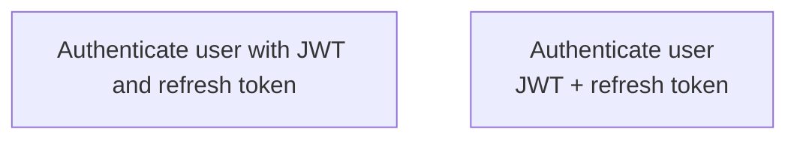
```mermaid
flowchart TD
  %% Bad — overflows into neighbors
  A[Authenticate user with JWT and refresh token]

  %% Good — two short lines
  B["Authenticate user<br/>JWT + refresh token"]
```

### Rule 4 — Use `align` directives in `architecture-beta`

`architecture-beta` has its own layout engine (not Dagre). Nodes can scatter unpredictably without explicit positioning
hints. Use `align` directives to lock nodes into a grid before edges are drawn:

```
architecture-beta
  service a(server)[API 1]
  service b(server)[API 2]
  service db(database)[Database]

  align row a b        %% a and b sit side by side on the same row
  align column a db    %% db is directly below a
```

Always define `align` statements before any edge statements. Use one `align row` per horizontal layer and one
`align column` per vertical spine.

### Rule 5 — Limit subgraph nesting depth

Dagre struggles with more than 3 levels of nesting. For the deployment diagram pattern (region → VPC → subnet →
servers):

- Keep nesting to 3 levels maximum with Dagre
- Use ELK (Rule 1) if you need 4+ levels
- Flatten the outer region subgraph if no cross-region topology is being shown

### Rule 6 — Configure C4 layout explicitly

Every `C4Context` and `C4Container` diagram must end with a `UpdateLayoutConfig` call. Without it, all shapes render in
a single row and overlap on complex diagrams:

```
UpdateLayoutConfig($c4ShapeInRow="3", $c4BoundaryInRow="1")
```

Adjust `$c4ShapeInRow` to control how many shapes appear per row. Use `"2"` for diagrams with long description text on
shapes, `"3"` or `"4"` for simpler shapes.

**`UpdateLayoutConfig` controls shape rows, not relationship labels** — a C4 diagram can have zero shape-box overlap
(every box correctly placed by `$c4ShapeInRow`/`$c4BoundaryInRow`) and still look broken because two or more `Rel()`
labels land on top of each other or on top of a shape's own description text. This is a **different, verified failure
mode** (confirmed via rendered-DOM inspection): Mermaid's C4 renderer has no automatic collision avoidance for
relationship labels — it places each one at its edge's midpoint independent of every other edge, so two unrelated
relationships whose midpoints happen to coincide produce visually merged, unreadable text (e.g. two labels rendering
as one run-on string with no space between them). This gets more likely as the number of `Rel()` lines converging
on/from one shape grows — a C4 Context diagram with 8-9 relationships is enough to trigger it.

Two tools fix this, in order of effort:

1. **Increase `c4ShapeMargin`** (default is Mermaid's own, generally too tight for dense diagrams) via a *separate*
   init directive — this is a general mermaid config value, not a `UpdateLayoutConfig` parameter:
   ```
   %%{init: {'c4': {'c4ShapeMargin': 90}}}%%
   C4Context
     ...
   ```
   This gives every relationship's label more vertical room between shape rows, reducing (but not always eliminating)
   crowding. Try 80-100 as a starting point for a dense diagram; the plain flowchart `nodeSpacing`/`rankSpacing` init
   keys (Rule 2) do not apply here — `c4ShapeMargin` is C4's own equivalent.
2. **Manually offset specific colliding labels with `UpdateRelStyle`** when margin alone isn't enough — this is
   Mermaid's own documented escape hatch for exactly this problem, confirmed functional:
   ```
   UpdateRelStyle($from="aqufil", $to="xendit", $offsetY="-40")
   ```
   `$from`/`$to` are the element aliases from the `Person()`/`System()`/`Rel()` declarations (not their display names).
   `$offsetX`/`$offsetY` nudge that one relationship's label away from whatever it's colliding with. **This requires
   visual iteration in the live preview** — there is no formula that computes the right offset from the source text
   alone; open the preview, identify which two labels overlap, add an `UpdateRelStyle` call for one of them, refresh,
   and adjust the offset until they separate. Do not guess an offset and move on without checking the preview — an
   untested offset can just as easily move a label into a *new* collision.

### Rule 7 — Avoid ELK for sibling subgraphs connected by inter-subgraph edges

**Verified failure mode** (empirically reproduced and confirmed via rendered-DOM inspection, not a theoretical
concern): when a `flowchart` has 2 or more *sibling* subgraphs — same nesting level, not one nested inside another —
connected to each other by edges that run from a node inside one subgraph to a node inside a different one (the
CI/CD Pipeline Diagram's stage-to-stage shape is the canonical example: `CI` → `CD_Dev` → `CD_Staging` → `CD_Prod`),
ELK's edge routing can send that connecting edge on a wildly indirect path — looping back through an entirely
unrelated, already-passed subgraph and several of its nodes — rather than a short, direct line to the next stage. This
is worse than the node-overlap problem ELK exists to solve, and it does not go away by adding more spacing or
switching ELK's node-count threshold; the routing itself is wrong for this cluster topology.

**Rule**: for a flowchart with 2+ sibling subgraphs joined by inter-subgraph edges, default to plain Dagre (omit the
`layout: 'elk'` init directive entirely), regardless of total node count. Reserve ELK (Rule 1) for diagrams where the
complexity is nesting depth or in-subgraph density, not inter-subgraph connections — e.g., a deployment diagram with
region → VPC → subnet nesting and no sibling-subgraph cross-edges is a legitimate Rule 1 case; a CI/CD pipeline with
sequential stage subgraphs is not.

**If node overlap appears *within* a single stage subgraph** once ELK is removed (rare — Dagre handles a handful of
nodes in a line fine), reach for Rule 2's spacing overrides first; only reintroduce ELK scoped to that specific
diagram if spacing alone doesn't resolve it, and re-verify the inter-subgraph edges still route cleanly afterward (the
failure mode above can reappear the moment ELK is back in play, even if the original reason for adding it was
unrelated to the inter-subgraph edges).

---

## Use Case Diagram (`flowchart LR`)

**Purpose**: Communicates who can do what. Gives stakeholders a quick map of the system's features and which roles
access them — before any technical detail is needed.

**When to create**: Any system with 2 or more user roles with distinct feature sets (the authoritative criterion — the
matching row in `SKILL.md`'s diagram-type table is just a quick-index pointer to this section, not a second copy of the
wording), or any single-role system where the scope of features must still be agreed with non-technical stakeholders.

**What to include**:

- Every human actor as a stadium/circle node: `Customer((Customer))`
- Every external system actor as a rounded rectangle: `PaymentGateway([Payment Gateway])`
- Every feature as a regular rectangle: `Checkout[Checkout]`
- A system boundary subgraph to separate internal features from actors
- Arrows from actors to the features they can use
- `<<include>>` relationships for sub-flows shared by multiple features (add a label: `-->|<<include>>|`)
- `<<extend>>` relationships for optional extensions

**Naming**: Feature names are verb phrases or gerunds ("Browse Products", "Manage Users", "Generate Report"). Actor
names are role nouns ("Customer", "Admin", "Warehouse Picker").

**Common mistakes**:

- Putting technical components (databases, APIs) in a use case diagram — keep it feature-facing
- Including too many features — if more than ~15, group related features into subsystems using nested subgraphs
- Missing roles that appear only in admin flows

**Template**:

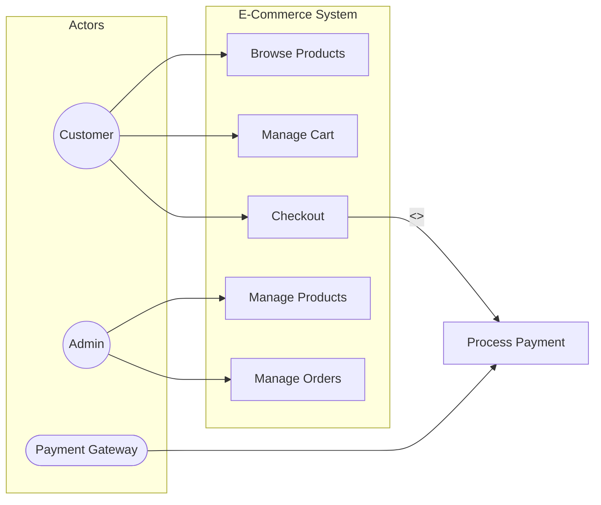
```mermaid
flowchart LR
  subgraph Actors
    Customer((Customer))
    Admin((Admin))
    PayGW([Payment Gateway])
  end

  subgraph System["E-Commerce System"]
    Browse[Browse Products]
    Cart[Manage Cart]
    Checkout[Checkout]
    ManageProducts[Manage Products]
    ManageOrders[Manage Orders]
  end

  Customer --> Browse
  Customer --> Cart
  Customer --> Checkout
  Checkout -->|<<include>>| ProcessPayment[Process Payment]
  Admin --> ManageProducts
  Admin --> ManageOrders
  PayGW --> ProcessPayment
```

---

## Business Process Flow (`flowchart TD`)

**Purpose**: Models a real-world workflow — with branching decisions, parallel paths, and exception paths — at the
business level. Bridges the gap between how the business thinks about a process and how the system will implement it.

**When to create**: Any process with 2 or more decision points (the authoritative criterion — `SKILL.md`'s diagram-type
table row is just a quick-index pointer to this section, not a second copy of the wording), or any process where the
happy path and error handling both need to be visible to stakeholders.

**What to include**:

- Start and end nodes: `([Start])` and `([End])`
- Tasks (actions) as rectangles: `[Send confirmation email]`
- Decisions as diamonds: `{Payment approved?}`
- Both Yes and No branches labelled on every diamond
- Exception/error paths leading to explicit error states or recovery flows
- Parallel steps modelled with `&` operator or parallel subgraphs
- Swimlanes (subgraphs) if multiple actors participate

**Conventions**:

- Arrow labels on decision branches: `-->|Yes|` and `-->|No|`
- Error paths as dashed arrows: `-.->` (if supported) or labeled `-->|Error|`
- Terminal error states as separate end nodes: `([Order Failed])`

**Common mistakes**:

- Leaving a decision diamond with only one output branch
- Modelling technical steps (database writes, API calls) — this is a business-level diagram
- Omitting the "what happens when it fails" path — every payment, external API call, or time-limited step needs a
  failure branch

**Template**:

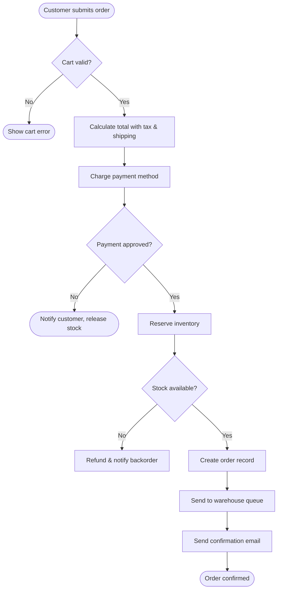
```mermaid
flowchart TD
  Start([Customer submits order]) --> ValidateCart{Cart valid?}
  ValidateCart -->|No| CartError([Show cart error])
  ValidateCart -->|Yes| CalcTotal[Calculate total with tax & shipping]
  CalcTotal --> ChargePayment[Charge payment method]
  ChargePayment --> PaymentOK{Payment approved?}
  PaymentOK -->|No| PaymentError([Notify customer, release stock])
  PaymentOK -->|Yes| ReserveStock[Reserve inventory]
  ReserveStock --> StockOK{Stock available?}
  StockOK -->|No| RefundAndNotify[Refund & notify backorder]
  StockOK -->|Yes| CreateOrder[Create order record]
  CreateOrder --> NotifyWarehouse[Send to warehouse queue]
  NotifyWarehouse --> SendConfirmation[Send confirmation email]
  SendConfirmation --> End([Order confirmed])
```

---

## Entity Relationship Diagram (`erDiagram`)

**Purpose**: Defines the relational data model — entities, attributes, types, primary/foreign keys, cardinality — as the
single source of truth for database schema design. This diagram drives migrations and ORM models.

**When to create**: Whenever the system includes any SQL database. This is the database-designer agent's primary output.

**Attribute format** (strict — do not deviate):

```
ENTITY_NAME {
    type  column_name  "comment"
}
```

- `type`: use database-accurate types (`uuid`, `varchar`, `text`, `int`, `bigint`, `decimal(10,2)`, `boolean`,
  `timestamptz`, `jsonb`, `date`)
- Comment must be one of: `"PK"` (primary key), `"FK"` (foreign key), `"idx"` (indexed, non-key), `"PK idx"` (primary
  key that is also a composite index member), or descriptive text for other notes
- Every table must have exactly one PK column
- Every FK column must also have `"FK"` or `"FK idx"` comment

**Cardinality notation**:

| Symbol       | Meaning                             |
|--------------|-------------------------------------|
| `\|\|--\|\|` | One-to-one (mandatory both sides)   |
| `\|\|--o\|`  | One-to-one (optional on right)      |
| `\|\|--o{`   | One-to-many (zero or more on right) |
| `\|\|--\|{`  | One-to-many (one or more on right)  |
| `}o--o{`     | Many-to-many (optional both sides)  |
| `}o--\|{`    | Many-to-many (mandatory on right)   |

**Relationship labels**: Use verb phrases in the direction of the arrow ("places", "belongs to", "contains", "is
assigned to").

**Index plan table** (required after every `erDiagram` block — populates the `indexPlan` field in `diagrams.json`; see
section "`diagrams.json` Schema" above). Use the exact header row `document-review-checklist.md`'s C5a item defines
(`references/document-review-checklist.md` is the single source of truth for this literal format); example rows:

| Index Name                  | Table    | Column(s)            | Type               | Reason                       |
|-----------------------------|----------|----------------------|--------------------|------------------------------|
| `idx_users_email`           | `users`  | `email`              | UNIQUE B-TREE      | Auth login lookup            |
| `idx_orders_user_id`        | `orders` | `user_id`            | B-TREE             | List orders by user          |
| `idx_orders_status_created` | `orders` | `status, created_at` | B-TREE (composite) | Filter + sort for order list |

**Common mistakes**:

- Missing FK comments on foreign key columns (reviewer will catch this)
- Using generic `int` for IDs instead of `uuid` or `bigint`
- Not declaring junction tables for many-to-many relationships
- Leaving timestamps as `timestamp` instead of `timestamptz` — always store with timezone for production systems; see
  `references/timezone-guide.md` for the UTC-storage/local-display policy this type alone doesn't express

**Template**:

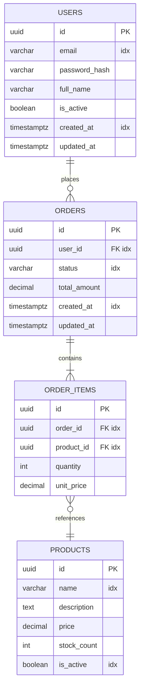
```mermaid
erDiagram
  USERS {
    uuid    id           "PK"
    varchar email        "idx"
    varchar password_hash
    varchar full_name
    boolean is_active
    timestamptz created_at "idx"
    timestamptz updated_at
  }
  ORDERS {
    uuid    id         "PK"
    uuid    user_id    "FK idx"
    varchar status     "idx"
    decimal total_amount
    timestamptz created_at "idx"
    timestamptz updated_at
  }
  ORDER_ITEMS {
    uuid    id         "PK"
    uuid    order_id   "FK idx"
    uuid    product_id "FK idx"
    int     quantity
    decimal unit_price
  }
  PRODUCTS {
    uuid    id       "PK"
    varchar name     "idx"
    text    description
    decimal price
    int     stock_count
    boolean is_active "idx"
  }

  USERS  ||--o{ ORDERS      : "places"
  ORDERS ||--|{ ORDER_ITEMS : "contains"
  ORDER_ITEMS }o--|| PRODUCTS : "references"
```

---

## Sequence Diagram (`sequenceDiagram`)

**Purpose**: Shows the runtime conversation between components — who calls what, in what order, what data passes, and
what happens on failure. Essential for implementing authentication and core transaction flows correctly.

**When to create**:

- **Authentication flow**: always, for any system with login/logout/token refresh
- **Core feature flows**: one dedicated sequence diagram per distinct core feature confirmed in Stage 2 — not just the
  single most important transaction (placing an order, submitting a form, processing a payment). See SKILL.md's "Core
  feature coverage requirement": a project with multiple distinct user-facing features needs a diagram per feature, not
  one "primary transaction" diagram covering only the most obvious one.
- Additional flows for: webhook handling, background job processing, third-party integration
- **Offline-first sync flow** (only when `session.json` has an `offlineFirst` key — see `offline-first-guide.md`
  section 5): a dedicated sync sequence diagram, or the sequence diagram for a feature the offline-first track covers,
  showing the outbox pattern — a local/optimistic write completing independently of the network, followed by a
  background `POST /sync/push` / `GET /sync/pull` exchange. Show the server assigning `updated_at` at commit time, never
  the client sending its own value (`offline-first-guide.md` section 3a) — `architecture-reviewer`'s offline-first
  dimension flags a missing sync-flow diagram as **Major** and a client-supplied timestamp as **Critical**.

**What to include**:

- `participant` declarations for every actor (user, frontend, backend service, database, external system)
- Activation boxes (`activate`/`deactivate`) to show when a component is processing
- `alt`/`else` blocks for every branch with a meaningful failure path
- `opt` blocks for optional sub-flows
- `loop` for polling or retry patterns
- `note over` or `note right of` for important state changes or data transformations
- Return values on arrows where the data shape matters (e.g., `-->>User: JWT { token, expiresIn }`)

**Arrow types**:

- `->>`  solid arrow (synchronous call, request)
- `-->>`  dashed arrow (response, asynchronous callback)
- `-x`   failed/rejected message

**Common mistakes**:

- Omitting the failure `alt` — every external call (payment, email, third-party API) must have a failure path
- Not showing token/session creation steps in auth flows
- Overcrowding with database reads — show DB interactions only for key state changes, not every SELECT

**Auth flow template**:

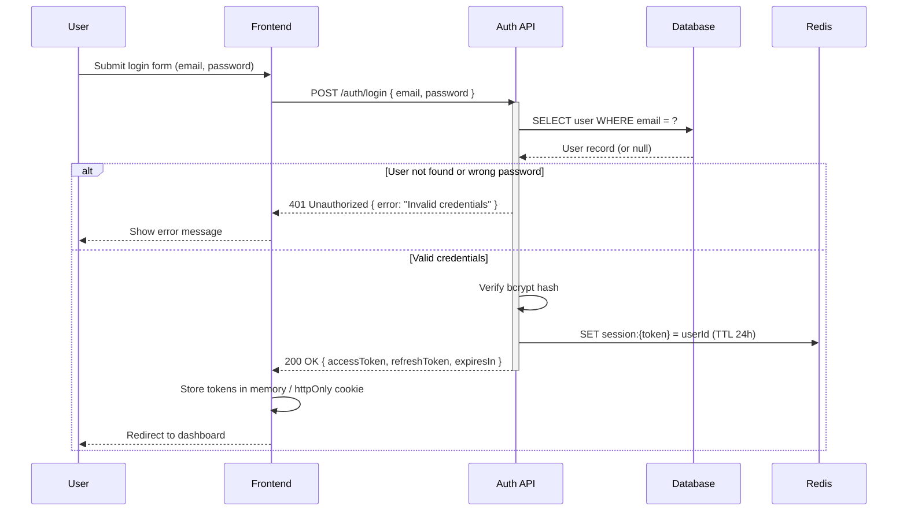
```mermaid
sequenceDiagram
  participant U as User
  participant FE as Frontend
  participant API as Auth API
  participant DB as Database
  participant Cache as Redis

  U->>FE: Submit login form (email, password)
  FE->>API: POST /auth/login { email, password }
  activate API
  API->>DB: SELECT user WHERE email = ?
  DB-->>API: User record (or null)

  alt User not found or wrong password
    API-->>FE: 401 Unauthorized { error: "Invalid credentials" }
    FE-->>U: Show error message
  else Valid credentials
    API->>API: Verify bcrypt hash
    API->>Cache: SET session:{token} = userId (TTL 24h)
    API-->>FE: 200 OK { accessToken, refreshToken, expiresIn }
    deactivate API
    FE->>FE: Store tokens in memory / httpOnly cookie
    FE-->>U: Redirect to dashboard
  end
```

**Primary transaction template** (e-commerce order):

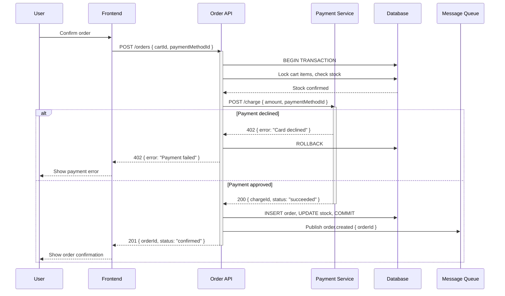
```mermaid
sequenceDiagram
  participant U as User
  participant FE as Frontend
  participant API as Order API
  participant Pay as Payment Service
  participant DB as Database
  participant Q as Message Queue

  U->>FE: Confirm order
  FE->>API: POST /orders { cartId, paymentMethodId }
  activate API
  API->>DB: BEGIN TRANSACTION
  API->>DB: Lock cart items, check stock
  DB-->>API: Stock confirmed

  API->>Pay: POST /charge { amount, paymentMethodId }
  activate Pay

  alt Payment declined
    Pay-->>API: 402 { error: "Card declined" }
    API->>DB: ROLLBACK
    API-->>FE: 402 { error: "Payment failed" }
    FE-->>U: Show payment error
  else Payment approved
    Pay-->>API: 200 { chargeId, status: "succeeded" }
    deactivate Pay
    API->>DB: INSERT order, UPDATE stock, COMMIT
    API->>Q: Publish order.created { orderId }
    API-->>FE: 201 { orderId, status: "confirmed" }
    deactivate API
    FE-->>U: Show order confirmation
  end
```

---

## Class Diagram (`classDiagram`)

**Purpose**: Captures the object-oriented domain model — classes, their attributes and methods, and how they relate to
each other. Bridges the ERD (data storage) and the sequence diagram (runtime behavior) into the application's code
structure.

**When to create**: Systems with a meaningful domain model — DDD aggregates, complex business rules, inheritance
hierarchies. Skip for simple CRUD APIs where the ERD directly maps to flat request/response DTOs with no business logic.
When `session.json` has a `domainModel` key (every project produces one, per `references/ddd-guide.md`), use its
aggregates — root entity, member entities, invariants — directly as this diagram's content rather than re-deriving the
domain model from scratch here.

**What to include**:

- Classes with `+` (public), `-` (private), `#` (protected) visibility
- Attributes with types: `+String email`, `-String passwordHash`
- Methods with return types: `+login(email, password) AuthToken`
- Relationships:
    - `-->` Association (has-a)
    - `--|>` Inheritance (is-a)
    - `--o` Aggregation (whole-part, part survives without whole)
    - `--*` Composition (whole-part, part destroyed with whole)
    - `..>` Dependency (uses)
    - `..|>` Interface implementation / realization

**Conventions**:

- Class names: PascalCase (`OrderService`, `UserRepository`)
- Attribute names: camelCase
- Method names: camelCase with `()` suffix
- Add `<<interface>>`, `<<abstract>>`, or `<<service>>` stereotypes where helpful

**Common mistakes**:

- Duplicating the ERD — class diagram shows business objects, not raw DB rows
- Including every getter/setter — show only meaningful methods
- Missing the direction of aggregation/composition arrows

**Template**:

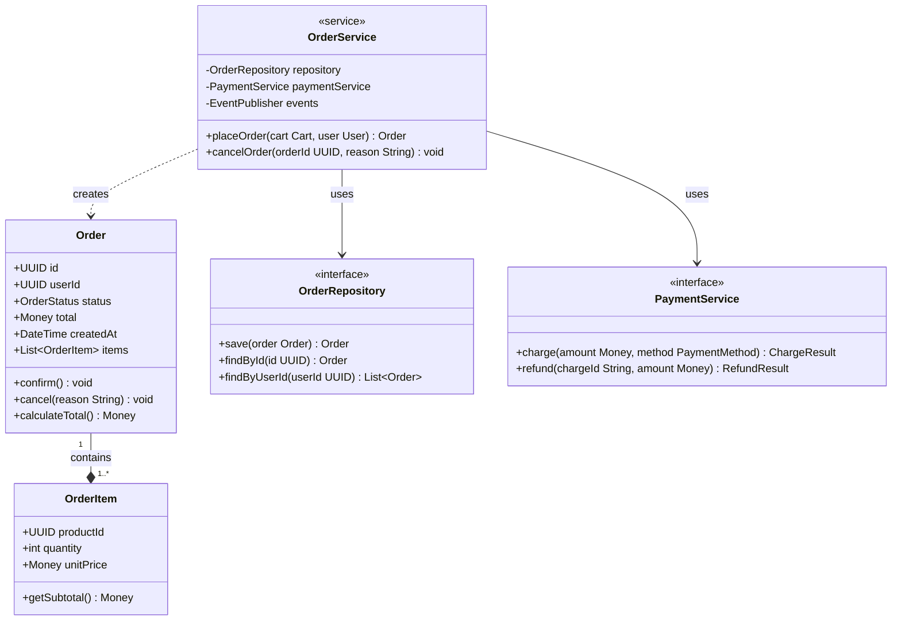
```mermaid
classDiagram
  class Order {
    +UUID id
    +UUID userId
    +OrderStatus status
    +Money total
    +DateTime createdAt
    +List~OrderItem~ items
    +confirm() void
    +cancel(reason String) void
    +calculateTotal() Money
  }

  class OrderItem {
    +UUID productId
    +int quantity
    +Money unitPrice
    +getSubtotal() Money
  }

  class OrderService {
    <<service>>
    -OrderRepository repository
    -PaymentService paymentService
    -EventPublisher events
    +placeOrder(cart Cart, user User) Order
    +cancelOrder(orderId UUID, reason String) void
  }

  class OrderRepository {
    <<interface>>
    +save(order Order) Order
    +findById(id UUID) Order
    +findByUserId(userId UUID) List~Order~
  }

  class PaymentService {
    <<interface>>
    +charge(amount Money, method PaymentMethod) ChargeResult
    +refund(chargeId String, amount Money) RefundResult
  }

  Order "1" --* "1..*" OrderItem : contains
  OrderService --> OrderRepository : uses
  OrderService --> PaymentService : uses
  OrderService ..> Order : creates
```

---

## Context Map Diagram (`flowchart LR`)

**Purpose**: Shows how the bounded contexts identified in `domainModel` (per `references/ddd-guide.md`) relate to each
other at the team/integration level — a different concern from the Class Diagram, which shows the aggregates *within*
one context, not the relationships *between* contexts. Answers "which team's model does this integration point defer to,
and how much do the two contexts trust each other's data."

**When to create**: `session.json`'s `domainModel.boundedContexts` has 2 or more entries. Skip entirely for a
single-bounded-context system — a context map with one node has nothing to map.

**What to include**: one node per bounded context (labeled with its name from `domainModel`), and one labeled edge per
relationship between two contexts, using the standard DDD integration-pattern vocabulary — never an unlabeled arrow,
since the pattern name is the entire point of this diagram:

| Pattern                        | Direction             | Meaning                                                                                                                                                                               |
|--------------------------------|-----------------------|---------------------------------------------------------------------------------------------------------------------------------------------------------------------------------------|
| **Partnership**                | bidirectional         | The two teams succeed or fail together; they coordinate development jointly                                                                                                           |
| **Shared Kernel**              | bidirectional         | The two contexts share a subset of the model and its persistence — any change to the shared part requires both teams' agreement                                                       |
| **Customer/Supplier**          | upstream → downstream | The downstream (customer) team's needs get priority in the upstream (supplier) team's planning                                                                                        |
| **Conformist**                 | upstream → downstream | The downstream context adopts the upstream model as-is, with no translation layer — used when the downstream team has no influence over upstream and translation isn't worth the cost |
| **Anticorruption Layer (ACL)** | upstream → downstream | The downstream context translates the upstream model into its own terms at the boundary, protecting its own model from the upstream's design                                          |
| **Open Host Service (OHS)**    | upstream → downstream | The upstream context exposes a well-defined protocol/API for any number of downstream consumers, rather than a one-off integration per consumer                                       |
| **Published Language**         | upstream → downstream | A shared, documented interchange format (often paired with OHS) that both sides translate to/from, decoupling either side's internal model from the wire format                       |
| **Separate Ways**              | none                  | The two contexts have no integration at all — duplicating functionality is cheaper than integrating                                                                                   |

The `(ACL)`/`(OHS)` parentheticals above are human-readable legends for this table only. The value stored in
`domainModel.relationships[].pattern` (and validated against `scripts/session-schema.json`'s enum) is the bare name —
`"Anticorruption Layer"`, `"Open Host Service"` — with no parenthetical suffix; copy the table's bolded name without its
abbreviation when writing that field.

Upstream/downstream direction matters: Open Host Service and Published Language describe the *upstream* side's
obligation; Conformist and Anticorruption Layer describe the *downstream* side's choice of how to cope. Get the arrow
direction right — reversing it misrepresents which team bears the integration cost.

**Conventions**:

- One node per bounded context, using the exact `name` from `domainModel`
- Label every edge with the pattern name (and optionally which side is upstream/downstream for the four asymmetric
  patterns) — `-->|Customer/Supplier: Orders is customer|` not a bare `-->`
- For a microservices/event-driven architecture pattern (Stage 5), a Customer/Supplier or OHS/Published Language edge
  commonly corresponds to an actual async event or API call shown in a sequence diagram — the two diagrams should agree
  on which contexts talk to which, even though this diagram doesn't show the message contents

**Common mistakes**:

- An unlabeled edge — defeats the diagram's purpose, which is naming the integration pattern, not just that two contexts
  are connected
- Reversing upstream/downstream for Conformist/ACL/OHS/Published Language
- Drawing every aggregate from every context (that's the Class Diagram's job) instead of one node per whole context

**Template**:

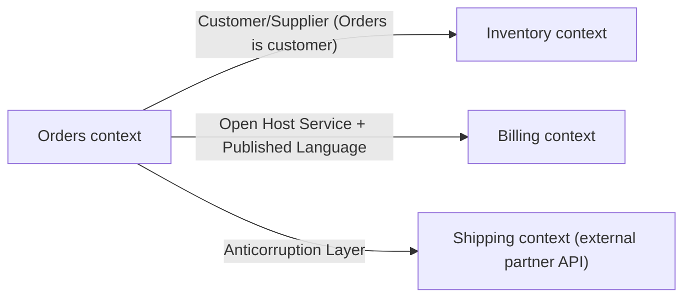
```mermaid
flowchart LR
  Orders["Orders context"]
  Inventory["Inventory context"]
  Billing["Billing context"]
  Shipping["Shipping context (external partner API)"]

  Orders -->|"Customer/Supplier (Orders is customer)"| Inventory
  Orders -->|"Open Host Service + Published Language"| Billing
  Orders -->|"Anticorruption Layer"| Shipping
```

---

## State Diagram (`stateDiagram-v2`)

**Purpose**: Models the lifecycle of an entity — the states it can be in, the events that trigger transitions between
them, and the guards or conditions that control transitions. Prevents impossible state transitions from being
implemented.

**When to create**: Any entity with 3 or more lifecycle states that matter to the business (the authoritative
criterion — `SKILL.md`'s diagram-type table row is just a quick-index pointer to this section, not a second copy of the
wording): Order (pending → paid → shipped → delivered), Subscription (trial → active → cancelled), Support Ticket
(open → in-progress → resolved → closed). A simple 2-state flag (e.g. active/inactive with no intermediate states or
business-meaningful transitions) does not meet this bar — model it as an ordinary boolean/enum column instead.

**What to include**:

- `[*]` as the initial state and terminal state (s)
- Every named state the entity can be in
- Every transition labeled with the event that triggers it
- Guard conditions in square brackets: `[payment succeeded]`
- Actions on transitions: `/ send confirmation email`
- Compound states (nested states) for complex sub-lifecycles
- `note` for important invariants

**Common mistakes**:

- Missing the path from any state back to `[*]` (terminal) — every state lifecycle must have at least one terminal state
  reachable from every non-terminal state
- Omitting guard conditions on ambiguous transitions
- Modelling UI state instead of domain state

**Template**:

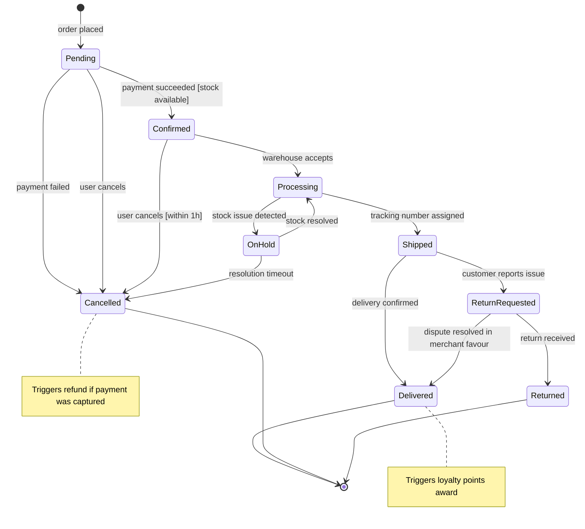
```mermaid
stateDiagram-v2
  [*] --> Pending : order placed

  Pending --> Confirmed : payment succeeded [stock available]
  Pending --> Cancelled : payment failed
  Pending --> Cancelled : user cancels

  Confirmed --> Processing : warehouse accepts
  Confirmed --> Cancelled : user cancels [within 1h]

  Processing --> Shipped : tracking number assigned
  Processing --> OnHold : stock issue detected

  OnHold --> Processing : stock resolved
  OnHold --> Cancelled : resolution timeout

  Shipped --> Delivered : delivery confirmed
  Shipped --> ReturnRequested : customer reports issue

  ReturnRequested --> Returned : return received
  ReturnRequested --> Delivered : dispute resolved in merchant favour

  Delivered --> [*]
  Cancelled --> [*]
  Returned --> [*]

  note right of Cancelled : Triggers refund if payment was captured
  note right of Delivered : Triggers loyalty points award
```

---

## C4 Context Diagram (`C4Context`)

**Purpose**: The 30,000-foot view of the system. Shows who the users are, what the system does at the highest level, and
which external systems it interacts with — without any internal detail. The audience is stakeholders, product managers,
and new engineers.

**When to create**: Any system with at least one external integration (payment processor, email service, third-party
API, legacy system) or multiple user types.

**What to include**:

- `Person(alias, label, description)` for every human actor
- `Person_Ext(alias, label, description)` for external persons (outside the organization)
- `System(alias, label, description)` for the system being designed (the boundary)
- `System_Ext(alias, label, description)` for every external system
- `Rel(from, to, label, "technology")` for every significant relationship
- `UpdateLayoutConfig($c4ShapeInRow, $c4BoundaryInRow)` to control layout
- Boundary groupings: `Enterprise_Boundary` or `System_Boundary` as needed

**Conventions**:

- Descriptions should be one sentence from a business perspective, not technical
- Relationship labels are verb phrases: "Sends orders to", "Authenticates users via", "Receives webhooks from"
- Show direction clearly: user → system, system → external

**Common mistakes**:

- Adding internal containers (databases, services) to the context diagram — those belong in C4Container
- Missing external systems the system depends on (email provider, SMS gateway, payment processor)

**Template**:

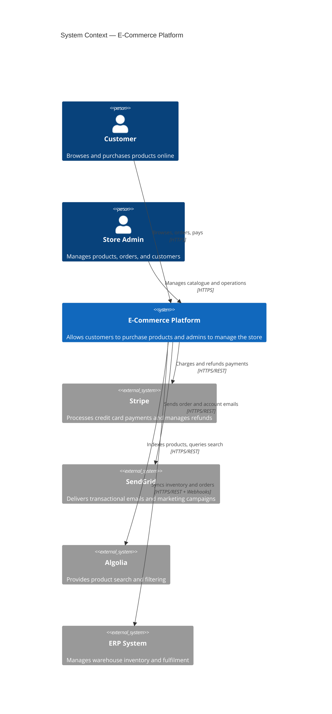
```mermaid
C4Context
  title System Context — E-Commerce Platform

  Person(customer, "Customer", "Browses and purchases products online")
  Person(admin, "Store Admin", "Manages products, orders, and customers")

  System(ecommerce, "E-Commerce Platform", "Allows customers to purchase products and admins to manage the store")

  System_Ext(stripe, "Stripe", "Processes credit card payments and manages refunds")
  System_Ext(sendgrid, "SendGrid", "Delivers transactional emails and marketing campaigns")
  System_Ext(algolia, "Algolia", "Provides product search and filtering")
  System_Ext(erp, "ERP System", "Manages warehouse inventory and fulfilment")

  Rel(customer, ecommerce, "Browses, orders, pays", "HTTPS")
  Rel(admin, ecommerce, "Manages catalogue and operations", "HTTPS")
  Rel(ecommerce, stripe, "Charges and refunds payments", "HTTPS/REST")
  Rel(ecommerce, sendgrid, "Sends order and account emails", "HTTPS/REST")
  Rel(ecommerce, algolia, "Indexes products, queries search", "HTTPS/REST")
  Rel(ecommerce, erp, "Syncs inventory and orders", "HTTPS/REST + Webhooks")

  UpdateLayoutConfig($c4ShapeInRow="3", $c4BoundaryInRow="1")
```

---

## C4 Container Diagram (`C4Container`)

**Purpose**: Opens up the system boundary to show the main deployable components (containers) — web app, API, database,
cache, queue — and how they communicate. The audience is developers and architects making technology decisions.

**When to create**: Any system with more than one deployable component. A single-process app with a database counts as
two containers.

**What to include**:

- `Container(alias, label, technology, description)` for each deployable unit
- `ContainerDb(alias, label, technology, description)` for databases and data stores
- `ContainerQueue(alias, label, technology, description)` for message queues
- `Person` for human actors (consistent with the C4Context)
- `System_Ext` for external systems the containers depend on
- `Rel(from, to, label, "protocol/technology")` for every significant interface
- Protocols on every relationship: "HTTPS/REST", "WebSocket", "AMQP", "gRPC", "TCP/SSL"

**Conventions**:

- Container labels should match the names used in sequence and deployment diagrams
- Technology field is important: "Node.js 24 / Express", "PostgreSQL 18", "Redis 8"
- Every container should have at most 2–3 incoming relationships shown — more indicates a God component that should be
  split

**Template**:

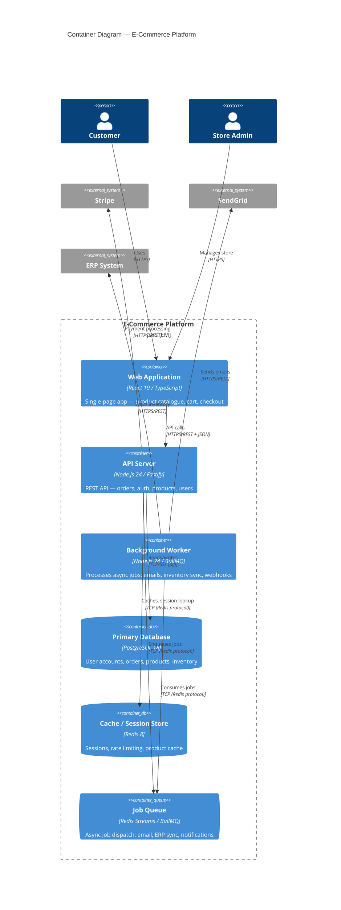
```mermaid
C4Container
  title Container Diagram — E-Commerce Platform

  Person(customer, "Customer")
  Person(admin, "Store Admin")

  System_Boundary(ecommerce, "E-Commerce Platform") {
    Container(spa, "Web Application", "React 19 / TypeScript", "Single-page app — product catalogue, cart, checkout")
    Container(api, "API Server", "Node.js 24 / Fastify", "REST API — orders, auth, products, users")
    Container(worker, "Background Worker", "Node.js 24 / BullMQ", "Processes async jobs: emails, inventory sync, webhooks")
    ContainerDb(db, "Primary Database", "PostgreSQL 18", "User accounts, orders, products, inventory")
    ContainerDb(cache, "Cache / Session Store", "Redis 8", "Sessions, rate limiting, product cache")
    ContainerQueue(queue, "Job Queue", "Redis Streams / BullMQ", "Async job dispatch: email, ERP sync, notifications")
  }

  System_Ext(stripe, "Stripe")
  System_Ext(sendgrid, "SendGrid")
  System_Ext(erp, "ERP System")

  Rel(customer, spa, "Uses", "HTTPS")
  Rel(admin, spa, "Manages store", "HTTPS")
  Rel(spa, api, "API calls", "HTTPS/REST + JSON")
  Rel(api, db, "Reads/writes", "TCP/SSL (pg)")
  Rel(api, cache, "Caches, session lookup", "TCP (Redis protocol)")
  Rel(api, queue, "Enqueues jobs", "TCP (Redis protocol)")
  Rel(api, stripe, "Payment processing", "HTTPS/REST")
  Rel(worker, queue, "Consumes jobs", "TCP (Redis protocol)")
  Rel(worker, sendgrid, "Sends emails", "HTTPS/REST")
  Rel(worker, erp, "Syncs inventory", "HTTPS/REST")
```

---

## Deployment / Infrastructure Diagram (`flowchart TD` or `architecture-beta`)

**Purpose**: Shows where everything runs — cloud regions, VPCs, subnets, availability zones, load balancers, CDN,
security groups — and how network traffic flows from the internet to the database. The audience is DevOps, cloud
engineers, and security reviewers.

**When to create**: Any system deploying to cloud infrastructure or a multi-server setup. Skip for local dev or pure
serverless where infrastructure is fully managed.

**What to include**:

- Internet-facing layer (CDN, DNS, WAF)
- Load balancer / API gateway layer
- Application tier (with AZ redundancy if required)
- Data tier (primary + replica if applicable)
- Security zone boundaries (VPC, subnets, security groups) as subgraphs
- Explicit labels on all connections showing protocol and whether traffic is encrypted
- Managed services clearly labeled (e.g., "Amazon RDS", "Google Cloud SQL")
- **When the Web3 track is active** (`session.json` has a `web3` key): an on-chain zone, visually separated from every
  off-chain zone above — see "On-chain / off-chain boundary" below

**Using `flowchart TD`** (most compatible, use this unless `architecture-beta` is specified):

- Subgraphs represent zones: `subgraph Internet["Internet Zone"]`
- Nodes represent components: `LB[/"Load Balancer (ALB)"\]` for special shapes
- Arrows show traffic flow with labels

**Using `architecture-beta`** (more expressive, available in Mermaid v11):

Node types (there are only three):

| Declaration                                  | Purpose                                             |
|----------------------------------------------|-----------------------------------------------------|
| `group {id}({icon})[{label}]`                | Zone/boundary container (VPC, subnet, cloud region) |
| `group {id}({icon})[{label}] in {parentId}`  | Nested boundary inside another group                |
| `service {id}({icon})[{label}]`              | A component or resource node                        |
| `service {id}({icon})[{label}] in {groupId}` | Component placed inside a group                     |
| `junction {id}`                              | 4-way traffic split point (no icon)                 |

Built-in icon names (for the `(icon)` slot): `cloud`, `database`, `disk`, `internet`, `server`

Edge syntax — direction letters are `T` (top), `B` (bottom), `L` (left), `R` (right):

```
{id}:B --> T:{id}          right-pointing arrow, bottom-of-A to top-of-B
{id}:R <-- L:{id}          left-pointing arrow
{id}:R -- L:{id}           line with no arrowhead
{id}{group}:B --> T:{id}{group}   cross-group edge (append {group} to every endpoint that sits inside a group)
```

**Note**: edge labels are not supported in `architecture-beta`. Use the `description` field in `diagrams.json` to
describe traffic flow patterns instead.

Overlap prevention with `align` (v11.16+):

```
align row {id1} {id2} {id3}       — force these nodes onto the same horizontal row
align column {id1} {id2}          — force these nodes onto the same vertical column
```

Use `align` directives to lock nodes into a grid layout before edges are drawn — this prevents the layout engine from
scattering them unpredictably.

**Security zones to model** (in order from public to private):

1. **Internet** — external users and traffic
2. **Edge** — CDN, WAF, DDoS protection, DNS
3. **DMZ / Public Subnet** — load balancers, API gateways, bastion hosts
4. **Application Subnet (Private)** — app servers, workers (no direct internet access)
5. **Data Subnet (Private, isolated)** — databases, caches (only accessible from App Subnet)

**On-chain / off-chain boundary** (only when `session.json` has a `web3` key — see `web3-guide.md` dimension 3): add a
distinct zone for on-chain components (deployed contracts, chain nodes the application connects to) and keep it visually
separate from every off-chain zone above — a subgraph like `subgraph OnChain["On-Chain (target network)"]` in
`flowchart TD`, or its own `group` in `architecture-beta`. Off-chain components that read chain state (indexers, RPC
gateways) belong in the Application or DMZ zone with an explicit edge into the on-chain zone, not inside it.
`architecture-reviewer`'s Web3 dimension flags this boundary as **Major** if it isn't visually distinguishable. Never
label a node with a specific-looking contract address, ABI hash, or chain identifier unless it came from the document or
user input — use the `<VERIFY against {target network}'s official docs: ...>` placeholder instead.

**Common mistakes**:

- Not showing security zone boundaries — a flat diagram that omits subnets/security groups misses half the value
- Showing only the happy path topology — also show backup/replica nodes for production systems
- Missing TLS labels on connections — every connection crossing a zone boundary should be labeled with its encryption
  status

**Template** (`architecture-beta`) — preferred for production infrastructure diagrams:

```
architecture-beta
  %% Cloud region and network boundaries
  group aws(cloud)[AWS us-east-1]
  group vpc(server)[VPC 10.0.0.0/16] in aws
  group public_sub(internet)[Public Subnet AZ-a and AZ-b] in vpc
  group app_sub(server)[Private App Subnet] in vpc
  group data_sub(database)[Private Data Subnet] in vpc

  %% Nodes
  service cdn(internet)[CDN / WAF]
  service alb(server)[Load Balancer] in public_sub
  service api1(server)[API Server AZ-a] in app_sub
  service api2(server)[API Server AZ-b] in app_sub
  service worker(server)[Background Worker] in app_sub
  service db_p(database)[PostgreSQL Primary] in data_sub
  service db_r(database)[PostgreSQL Replica] in data_sub
  service cache(disk)[Redis Cache] in data_sub
  service stripe(internet)[Stripe API]
  service sendgrid(internet)[SendGrid]

  %% Align to grid to prevent overlap
  align column cdn alb api1 db_p
  align row api1 api2 worker
  align row db_p db_r cache

  %% Traffic flow (no labels — describe flow in diagram description field)
  cdn:B --> T:alb{group}
  alb{group}:B --> T:api1{group}
  alb{group}:B --> T:api2{group}
  api1{group}:B --> T:db_p{group}
  api2{group}:B --> T:db_p{group}
  api1{group}:R --> L:db_r{group}
  api1{group}:B --> T:cache{group}
  api2{group}:B --> T:cache{group}
  worker{group}:B --> T:cache{group}
  worker{group}:R --> L:sendgrid
  api1{group}:R --> L:stripe
```

**Template** (`flowchart TD`) — use when edge labels (HTTPS, TLS, etc.) are required or when the team prefers a more
familiar diagram style:

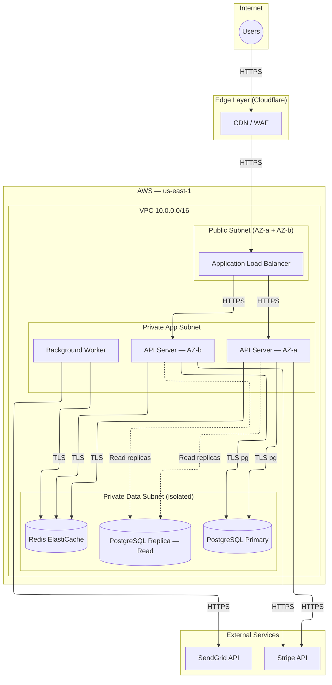
```mermaid
%%{init: {'layout': 'elk'}}%%
flowchart TD
  subgraph Internet["Internet"]
    User((Users))
  end

  subgraph Edge["Edge Layer (Cloudflare)"]
    CDN[CDN / WAF]
  end

  subgraph AWS["AWS — us-east-1"]
    subgraph VPC["VPC 10.0.0.0/16"]
      subgraph PublicSubnet["Public Subnet (AZ-a + AZ-b)"]
        ALB[Application Load Balancer]
      end

      subgraph AppSubnet["Private App Subnet"]
        API1[API Server — AZ-a]
        API2[API Server — AZ-b]
        Worker[Background Worker]
      end

      subgraph DataSubnet["Private Data Subnet (isolated)"]
        RDS_P[(PostgreSQL Primary)]
        RDS_R[(PostgreSQL Replica — Read)]
        Redis[(Redis ElastiCache)]
      end
    end
  end

  subgraph External["External Services"]
    Stripe[Stripe API]
    SendGrid[SendGrid API]
  end

  User -->|HTTPS| CDN
  CDN -->|HTTPS| ALB
  ALB -->|HTTPS| API1 & API2
  API1 & API2 -->|TLS pg| RDS_P
  API1 & API2 -->|TLS| Redis
  API1 & API2 -.->|Read replicas| RDS_R
  Worker -->|TLS| Redis
  Worker -->|HTTPS| SendGrid
  API1 & API2 -->|HTTPS| Stripe
```

---

## CI/CD Pipeline Diagram (`flowchart TD`)

**Purpose**: Shows how code moves from a developer's commit to a running production deployment — stages, gates, and
environment promotion. Makes branching strategy, test gates, and manual approval points explicit to the whole team.

**When to create**: Any project with 2 or more deployment environments (dev + staging, staging + prod) or a meaningful
staged release process with security scans or manual gates.

**What to include**:

- Trigger node (push, PR merge, tag) as the start
- Each pipeline stage as a rectangle, in order
- Decision diamonds for gates (test pass/fail, manual approval)
- Failure branches that loop back or terminate
- Each environment as a distinct stage with a deploy action followed by a smoke-test action
- Manual approval gates modelled as decision diamonds with `|Approve|` / `|Reject|` branches

**Conventions**:

- **Do not default to `%%{init: {'layout': 'elk'}}%%`** for this diagram shape — see "Preventing Node Overlap" Rule 7.
  A CI/CD pipeline is exactly the shape that rule warns about: sibling stage subgraphs (CI, dev, staging, prod)
  connected by inter-subgraph edges (`Push --> DeployDev`, `DevOK -->|Yes| DeployStaging`, ...). ELK has a verified
  failure mode here — those inter-subgraph edges can route through many unrelated nodes far outside the direct path
  (confirmed: an edge meant to go from one stage's health-check gate to the next stage's deploy step instead looped
  back through the entire CI subgraph). Default Dagre (no `layout` override) renders this shape cleanly. Only add ELK
  if a specific stage subgraph itself is deeply nested (3+ levels) or so dense internally that Dagre overlaps nodes
  *within* one subgraph — never as a default for the pipeline shape as a whole.
- Group stages into swimlane subgraphs if CI and CD run on different platforms (CI: GitHub Actions, CD: Argo CD)
- Dashed arrows (`-.->`) for rollback or failure notification paths
- Color-code environments with Mermaid `style` if useful (green for prod, orange for staging)

**Common mistakes**:

- Showing only the happy path — always add the gate failure branch
- Omitting the rollback procedure — show how a failed prod deploy is recovered
- Missing the artifact handoff step (build produces image → push to registry → deploy reads from registry)

**Template**:

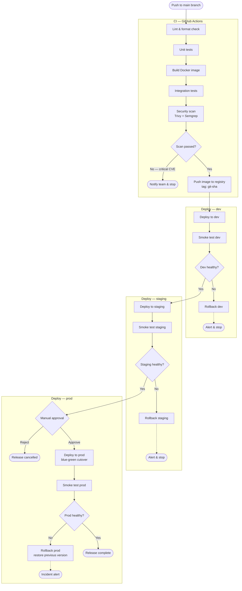
```mermaid
flowchart TD
  Trigger([Push to main branch]) --> Lint

  subgraph CI["CI — GitHub Actions"]
    Lint[Lint & format check]
    Lint --> UnitTest[Unit tests]
    UnitTest --> Build[Build Docker image]
    Build --> IntTest[Integration tests]
    IntTest --> SecScan[Security scan<br/>Trivy + Semgrep]
    SecScan --> ScanOK{Scan passed?}
    ScanOK -->|No — critical CVE| Fail1([Notify team & stop])
    ScanOK -->|Yes| Push[Push image to registry<br/>tag: git-sha]
  end

  Push --> DeployDev

  subgraph CD_Dev["Deploy — dev"]
    DeployDev[Deploy to dev]
    DeployDev --> SmokeDev[Smoke test dev]
    SmokeDev --> DevOK{Dev healthy?}
    DevOK -->|No| Rollback1[Rollback dev]
    Rollback1 -.-> Fail2([Alert & stop])
  end

  DevOK -->|Yes| DeployStaging

  subgraph CD_Staging["Deploy — staging"]
    DeployStaging[Deploy to staging]
    DeployStaging --> SmokeStaging[Smoke test staging]
    SmokeStaging --> StagingOK{Staging healthy?}
    StagingOK -->|No| Rollback2[Rollback staging]
    Rollback2 -.-> Fail3([Alert & stop])
  end

  StagingOK -->|Yes| ApprovalGate

  subgraph CD_Prod["Deploy — prod"]
    ApprovalGate{Manual approval}
    ApprovalGate -->|Reject| Fail4([Release cancelled])
    ApprovalGate -->|Approve| DeployProd[Deploy to prod<br/>blue-green cutover]
    DeployProd --> SmokeProd[Smoke test prod]
    SmokeProd --> ProdOK{Prod healthy?}
    ProdOK -->|No| Rollback3[Rollback prod<br/>restore previous version]
    Rollback3 -.-> Fail5([Incident alert])
    ProdOK -->|Yes| Done([Release complete])
  end
```
